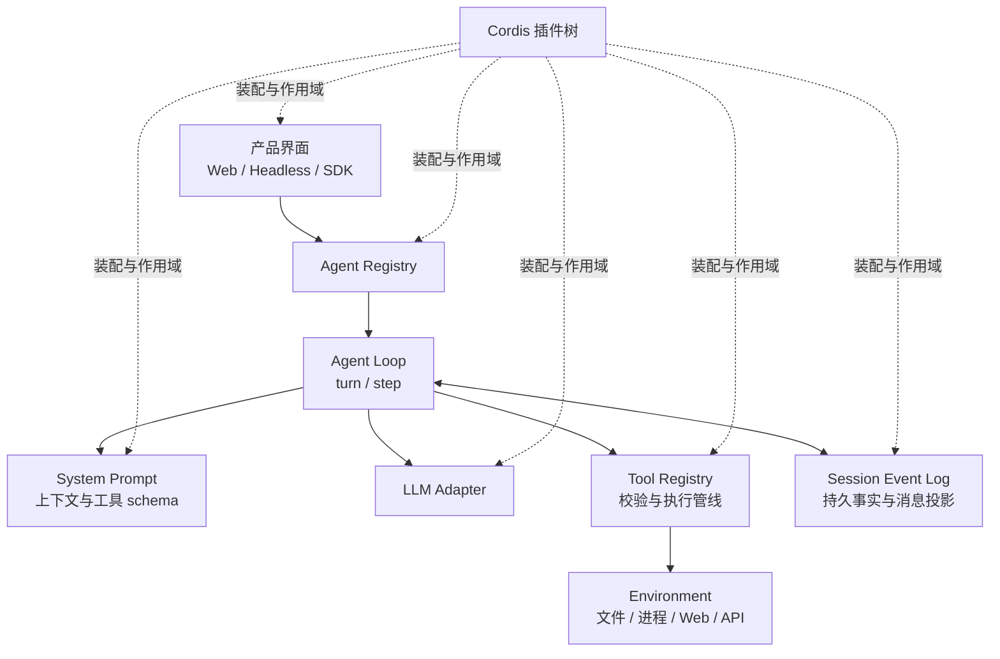
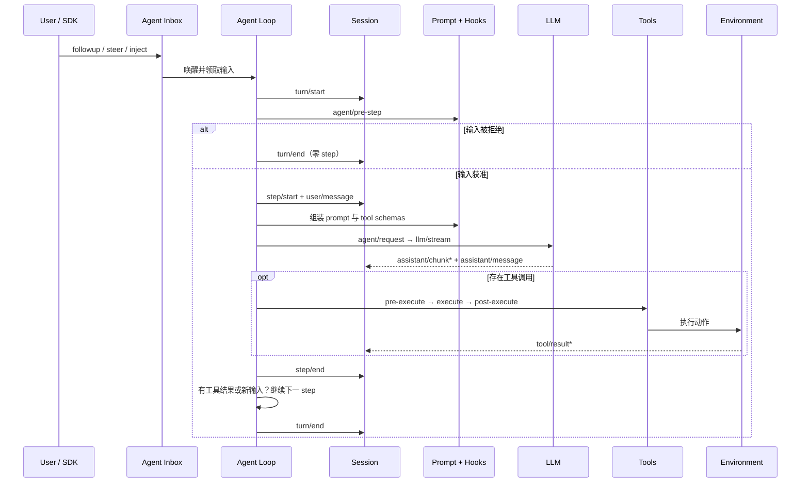
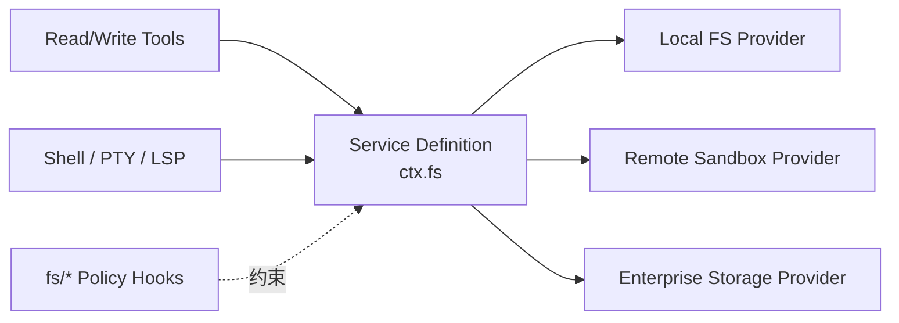
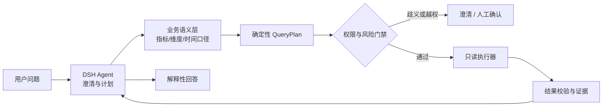

# 第 1 章　从模型到 Harness：建立 DSH 的完整心智模型

如果把一个大语言模型接到聊天框里，它可以回答问题；如果再给它文件、终端和浏览器，它就开始像一个 Agent。但“能调用一次工具”离“可以长期、可靠地完成任务”仍然很远：工具可能被错误调用，模型可能忘记已经做过的事，用户可能在执行中改变要求，网络可能中断，高风险操作还需要审批。真正把这些不确定因素组织起来的工程层，就是 Harness。

DeepSeek Harness（下文简称 DSH）值得研究，不是因为它又封装了一次模型 API，而是因为它把这层工程能力拆成了可替换、可组合、可观察的插件。读懂 DSH，实际是在学习一个更一般的问题：**怎样把概率性的模型决策，装进一个具有明确状态、权限和生命周期的软件系统。**

> **阅读提示**：本章是全书的概念地图。第一次阅读不必记住所有包名和事件名，重点是建立“边界—循环—状态—能力接缝—产品化”五个坐标。第 2～8 章会逐层拆开它们，本章配套实验则负责把概念映射到真实源码。

## 学习目标

完成本章后，你应当能够：

1. 区分 Model、Harness、Agent、Environment 与业务应用，避免把部署位置误当成架构边界；
2. 用观察、决策、行动和反馈解释一个 Agent 循环，并区分 DSH 中的 turn 与 step；
3. 解释“Everything is a Plugin”在 DSH 中具体意味着什么，以及它不意味着什么；
4. 从有效配置出发，定位一项能力的 Definition、Provider、Consumer 和持久事件；
5. 判断 DSH 已经解决了哪些运行时问题，哪些领域正确性仍必须由业务系统负责；
6. 为 Coding Agent、企业 Data Agent 或私有化 Web 应用画出合理的 DSH 边界。

## 1.1 为什么模型之外还需要 Harness

先看一个看似简单的需求：

> “读取这个仓库，修复登录超时问题，运行测试，通过后告诉我改了什么。”

模型可以理解句子，也可能知道常见的超时原因，但它并不知道当前仓库有哪些文件、测试命令是什么、命令有没有成功。若要真正完成任务，系统至少还要回答以下问题：

- 模型这一轮能看到哪些文件和历史？
- 哪些工具可以调用，参数怎样校验？
- 文件写入是否限制在工作区内？
- 测试失败后继续修复，还是立即结束？
- 用户中途补充要求时，插入当前步骤还是排到下一轮？
- 请求被取消后，正在运行的子进程怎样终止？
- 上下文太长时，哪些历史可以压缩，哪些证据必须保留？
- UI 刷新、进程重启后，怎样恢复出一致的会话？
- 模型说“测试通过”时，以自然语言为准，还是以退出码为准？

这些都不是模型参数本身能独立解决的问题。它们属于模型周围的运行与治理代码，也就是 Harness。

### 1.1.1 五个容易混用的边界

| 概念 | 负责什么 | 不负责什么 | 在 DSH 中的例子 |
|---|---|---|---|
| **Model** | 根据当前请求生成文本、推理内容或工具调用 | 不直接拥有文件、数据库和进程 | 由 `ctx.llm` 后面的模型适配器提供 |
| **Harness** | 组装上下文、暴露工具、推进循环、保存事实、实施策略 | 不等于外部世界，也不自动包含业务知识 | Cordis 插件树、Agent Loop、Session、Tools、策略插件 |
| **Agent** | 在某个会话与能力作用域内工作的行动主体 | 不是一个脱离运行时存在的“模型人格” | `ctx.agents` 中的活动 Agent 及其 agent-scoped context |
| **Environment** | 保存并改变真实状态，返回执行观察 | 不负责决定 Agent 下一步想做什么 | 工作区文件、子进程、网页、数据库、远程沙箱 |
| **Application** | 面向用户或系统提供完整产品能力 | 不应把所有领域规则都塞给模型 | DSH Web、Headless 集成、企业门户及其鉴权审计层 |

物理部署位置不能决定概念归属。一个沙箱即使与 Agent 运行在同一进程，沙箱内不断变化的文件与进程仍属于 Environment；一个远程模型适配器虽然通过网络访问，它在架构上仍是 Model 接缝的一部分。判断边界时应问“谁拥有状态和控制权”，而不是“代码部署在哪里”。

### 1.1.2 从最小演示到生产系统

可以用三层公式逐步理解：

```text
最小生成应用 = Model + Prompt

可行动的 Agent = Model + Context + Tools + Loop

可运营的 Agent 产品
  = 可行动的 Agent
  + State + Policy + Verification + Recovery + Surface
```

这里的 `Surface` 是 Web、CLI、SDK 或协议接入面；`Policy` 包括权限、审批和资源边界；`Verification` 用外部证据判断结果；`Recovery` 处理重试、取消、压缩和人工接管。DSH 的重点是后两层，而不是重新发明模型。

一个重要推论是：**同一模型放在不同 Harness 中，会表现得像不同能力等级的系统。** 如果系统 A 能搜索代码、保留工具结果并自动运行测试，系统 B 只能看到用户最后一句话，那么即使两者调用完全相同的模型，任务完成率也不会相同。模型能力决定上限，Harness 决定模型能否稳定触达这个上限。

## 1.2 Agent 不是“多调几次模型”，而是闭环控制

普通问答的结构接近一个函数：输入消息，输出文本。Agent 任务则是模型与环境反复交互的闭环。

在第 `t` 个决策点，可以用下面的教学模型表达：

```text
o_t       = observe(E_t)                         # 从环境得到观察
c_t       = assemble(P, K, H_t, o_t, T, S_t)    # 组装本次上下文
a_t       = Model(c_t)                           # 生成回答或工具行动
(E_t+1,r) = execute(a_t, E_t)                    # 环境变化并返回结果
H_t+1     = append(H_t, a_t, r)                  # 轨迹累积
```

其中：

- `E_t` 是环境真实状态；
- `P` 是系统约束，`K` 是检索或注入的知识；
- `H_t` 是截至当前的可重建历史；
- `T` 是工具定义，`S_t` 是运行状态；
- `a_t` 可能是最终回答，也可能是一组工具调用；
- `r` 是工具返回的结构化结果或错误。

这不是在声称 DSH 源码里存在同名数学变量，而是为了暴露五个工程事实：

1. 模型只能根据进入 `c_t` 的内容决策；没有进入上下文的信息，对模型等同于不存在。
2. 模型输出不是事实。只有 `execute` 后由环境返回的观察，才说明行动实际发生了什么。
3. 每一步都会改变后续上下文，因此早期错误可能沿轨迹放大。
4. 循环必须有停止条件，例如模型不再请求工具、达到预算、被取消或遇到不可恢复错误。
5. 若历史不能重建，系统就无法可靠恢复、审计或验证一次任务。

### 1.2.1 一条真实任务轨迹

以“修复登录超时”为例，理想轨迹不是模型一次性写出答案，而是：

```text
用户需求
  ↓
模型：需要定位认证与超时配置
  ↓  调用 search_files
工具：返回 auth.ts、session.ts 和相关测试
  ↓
模型：读取实现与测试
  ↓  调用 read_file（可并行读取）
工具：返回源码
  ↓
模型：提出最小修改
  ↓  调用 apply_patch
工具：返回实际 diff
  ↓
模型：运行目标测试
  ↓  调用 shell
工具：退出码 1，提示边界条件失败
  ↓
模型：根据失败证据再次修改并复测
  ↓
工具：退出码 0
  ↓
模型：引用 diff 与测试结果形成最终答复
```

这里真正提供可靠性的不是模型说了什么，而是 Harness 保留了“读了哪些文件—写入了什么差异—测试返回什么退出码”的因果链。最终回答只是对这条证据链的解释。

### 1.2.2 为什么长循环会放大风险

设单步正确执行概率为 `p`。在一个极度简化、各步独立且所有步骤都必须成功的模型里，`n` 步全部正确的概率约为 `p^n`。即使 `p = 0.98`，连续 30 步无错误的概率也只有约 54.5%。真实系统并不满足独立假设，Agent 还能根据反馈自我修复，因此这个数字不能当作性能预测；但它揭示了方向：**循环越长，仅依赖模型“每次大概做对”越危险。**

生产系统必须在每一步引入确定性机制：参数校验、权限限制、超时、结构化结果、自动测试、重试预算和人工检查点。Harness 的价值，正是在不取消模型灵活性的前提下，缩小单次错误的影响面并增加可恢复机会。

## 1.3 DSH 的最小组成：五个互相咬合的部件

本书使用下面的公式概括 DSH：

> **DSH 应用 = 插件树 + Agent Loop + 会话事件 + 能力接缝 + 产品界面**

这五项不是五个孤立目录，而是五种职责：

| 部件 | 回答的问题 | 典型实现 |
|---|---|---|
| **插件树** | 这次启动究竟装配了什么？ | Cordis Context、Service、Event、Effect、Bundle、Profile |
| **Agent Loop** | 一项任务怎样从输入推进到结束？ | turn/step 驱动、请求构造、工具调度、取消与错误恢复 |
| **会话事件** | 哪些事实必须保存并可重放？ | append-only `SessionEvent`、surface、`deriveMessages()` |
| **能力接缝** | 一项能力怎样替换实现而不改消费者？ | Definition、Provider、Consumer 与 capability events |
| **产品界面** | 人或其他系统怎样使用同一运行时？ | Web、Headless、SDK/协议集成 |



为了便于学习，还可以把它投影为五层。注意，这只是教学视图，不是官方承诺的固定分层：

| 教学层 | 主要责任 | 代表能力 |
|---|---|---|
| 表面层 | 接收任务、展示轨迹、提供集成入口 | Web、Headless、SDK |
| 控制层 | 决定何时开始、继续、停止或恢复 | Agent、Agent Loop、Goal、Plan |
| 上下文层 | 决定模型本次能看到什么 | System Prompt、Session、Compaction、Skill |
| 行动层 | 把模型决策变成受控操作 | Tools、Shell、FS、Web、MCP、Workflow |
| 组合层 | 管理依赖、作用域、加载和卸载 | Cordis Context、Service、Event、Effect |

不要用这张表反向猜源码目录。DSH 的真实边界由服务键、事件契约和插件依赖定义，一个插件可能同时参与多个教学层。

## 1.4 一次 DSH 请求内部发生了什么

DSH 官方架构用两个时间单位描述循环：

- **step（步骤）**：一次模型请求，以及该请求产生并执行的工具调用；
- **turn（轮次）**：从一批输入被领取开始，到当前不再欠任何后续步骤为止；一个 turn 可以包含零个、一个或多个 step。

“一个 turn 可以是零 step”起初很反直觉，却非常重要：输入可能在 `agent/pre-step` 被策略插件拒绝。DSH 仍然关闭并记录这个 turn，从而留下“系统确实接收并拒绝过一次尝试”的持久边界，而不是让它从历史中凭空消失。

### 1.4.1 简化时序



真实实现还处理并行工具、barrier、流式 chunk、请求错误、取消信号和 turn-stopping 等细节。此时不必背事件顺序，只需抓住三条主线：

1. **控制线**：Agent Loop 决定何时开 turn、何时开 step、何时继续。
2. **事实线**：Session 记录用户消息、模型输出和工具结果等可重放事实。
3. **扩展线**：插件通过 waterfall 或 serial 事件，在不修改 Loop 的情况下拦截、改写或观察过程。

### 1.4.2 三种输入为何不能混为一种

DSH Agent 提供统一发送原语，其常用别名具有不同语义：

| 输入 | 进入位置 | 是否唤醒 | 适合场景 |
|---|---|---:|---|
| `followup()` | 下一 turn 的 FIFO | 是 | 新任务或上一任务结束后的补充 |
| `steer()` | 下一 step 的 inbox | 是 | 用户要求当前任务立即调整方向 |
| `inject()` | 下一 step 的 inbox | 否 | 插件悄悄补充上下文，等待其他输入推动 |

如果把所有输入都当成“追加聊天消息”，就无法定义用户打断、后台上下文和任务排队的确定行为。这个细节也说明：多轮自主性不是多存几条聊天记录，而是要定义**输入何时取得控制权**。

### 1.4.3 持久事件与实时事件

DSH 把事件分成不同领域：

- `turn/*`、`step/*`、`user/message`、`assistant/*`、`tool/*` 属于持久会话事实；
- `agent/*` 主要协调运行中的 inbox、状态、请求、拦截、恢复和继续；
- `tools/*`、`fs/*` 等 capability events 用于给能力接缝附加策略或适配行为。

判断一个新事件属于哪里，可以问：

> 进程重启后，为了重建模型当时看到的内容或用户看到的轨迹，我还需要这个事实吗？

若答案是“需要”，它通常应进入 SessionEvent；若只是一次运行中的协调信号，则更适合作为实时事件。官方提出的关键不变量是：**Model-visible means logged——任何进入模型请求的内容，都必须能从日志重建。**

这个不变量解决了一个常见事故：某插件把关键事实只临时拼到请求里，当前模型看到了，但刷新页面或恢复会话后它消失了。此后的模型面对另一份历史，系统行为便不可解释。DSH 要求模型可见输入留下可重建来源，实际上是在维护“请求、回放与审计的一致性”。

## 1.5 “Everything is a Plugin”到底意味着什么

DSH 基于 Cordis 组织运行时。模型适配器、工具注册表、Session、Agent Loop 和 Web 能力都由插件贡献，没有一个要求你通过修改中央核心文件才能扩展的特权模块。

### 1.5.1 插件化的真正收益

插件并不只是“把代码放进单独 npm 包”。在 DSH 中，一项可靠的插件能力通常获得四个结构性收益：

1. **显式依赖**：插件通过 Context 上的服务表达需要什么，而不是在任意位置导入全局单例。
2. **作用域隔离**：注册可以只对某个上下文或 Agent 生效，避免所有会话共享同一能力集合。
3. **可逆副作用**：注册、监听和资源创建属于 effect，插件卸载时应按生命周期撤销。
4. **配置可组合**：Bundle 和 Profile 决定实际挂载哪些插件，使用者可以通过上层 patch 替换配置行。

因此，“Everything is a Plugin”更准确的工程翻译是：

> 系统行为由一棵具有作用域和生命周期的插件树贡献；扩展点是服务与事件契约，而不是中央分支语句。

### 1.5.2 它不意味着什么

插件化不等于没有架构约束，也不等于任意两个包可以互相调用：

- 插件仍必须遵循 Service Definition 和事件签名；
- 有状态资源仍必须正确清理，否则热重载会留下重复注册或泄漏；
- 一个配置行可以替换，不代表替换实现自动满足语义兼容；
- 插件数量增加会扩大启动拓扑、权限和供应链审查成本；
- “可插拔”解决的是组合问题，不自动解决业务正确性。

一个糟糕的插件系统只是把耦合从源码转移到了配置。DSH 的学习重点因此不是“会写 `apply()`”，而是理解服务所有权、事件方向、作用域和 disposal。

### 1.5.3 Profile、Bundle 与 Patch 的装配顺序

一个正在运行的 `dsh` 不是仓库中所有包的总和，而是启动时合成的一棵有效插件树：

```text
空配置
  → Profile 声明的 Bundles（按顺序）
  → Profile 自己的 cordis.patch.yml
  → Harness Home 级 patch
  → 命令行 --patch overlay
  → 最终有效配置树
```

Bundle 是可分发的配置行与插件代码组合；Profile 是面向运行形态的组合入口。后加载的层可以按行 ID 替换前面的整行配置，或插入新行。于是，源码里“存在某插件”不等于运行时“加载了某插件”。排查问题时，第一份证据应是：

```bash
dsh --profile web --dump-config
```

这条命令回答“这台机器这次到底启动了什么”。从 `package.json` 猜运行结构，常常会忽略用户 patch、Profile 差异或被替换的 Provider。

## 1.6 能力接缝：让替换发生在正确的层

DSH 用 capability seam（能力接缝）描述一项可替换能力。完整接缝至少包含三种角色：

| 角色 | 责任 | 示例问题 |
|---|---|---|
| **Service Definition** | 声明稳定接口与 `ctx` 服务键 | “文件系统能力应提供哪些方法？” |
| **Service Provider** | 实现接口并拥有资源生命周期 | “使用本地目录还是远程沙箱？” |
| **Consumer** | 使用服务，常常把它包装成模型可见工具 | “模型通过哪个 tool schema 读取文件？” |

只有 Provider 而没有定义和消费者，只是一个实现包；只有工具而没有可替换 Provider，能力就会与环境绑死。三者共同存在，才形成真正的接缝。



接缝的价值不是为了画更漂亮的抽象图，而是控制变化半径。例如文件系统与子进程若共享同一个 execution world，将 Provider 指向远程沙箱后，Bash、PTY、LSP 可以一起迁移，而不需要为每个模型工具复制一套“远程版”。

但这种替换成立有前提：接口语义必须足够完整。若本地 Provider 默认支持原子重命名，而远程 Provider 没有相同保证，类型兼容不代表行为兼容。生产替换必须检查错误模型、并发、超时、路径语义和审计能力。

## 1.7 上下文不是聊天记录，而是可重建的请求投影

很多初学实现把 `messages` 数组当作全部上下文。实际的一次模型请求至少还包括：

```text
模型请求
├── System Prompt sections
├── Tool schemas
├── Session prefix / call config
└── 由 Session surface 投影出的 messages
```

DSH 的 `ctx.systemPrompt` 负责组装提示段与工具 schema，`session.deriveMessages()` 则从会话 surface 增量投影模型历史。原始事件日志负责保留事实，surface 决定当前哪些事实构成有效对话表面；当压缩或替换发生时，被遮蔽的旧节点仍可留在日志中，但不再重复进入模型历史。

这一区分带来三项能力：

1. **回放**：相同持久事实可以重建一致消息历史；
2. **压缩**：长历史可以被新的摘要表面替换，而不是粗暴删除所有审计事实；
3. **归因**：模型消息可以保留 provider、model 与来源事件信息，便于解释一次请求由什么产生。

它也带来一条开发纪律：不要绕过 Session，直接向模型适配器塞入“幽灵上下文”。如果内容影响模型决策，就要为它设计可重建的来源与生命周期。

## 1.8 工作流、自主循环与混合控制

不是所有任务都应该交给自主 Agent。选择控制方式时，可以按不确定性逐级升级：

| 形态 | 路径由谁决定 | 优点 | 主要代价 | 适合场景 |
|---|---|---|---|---|
| 单次调用 | 一次 Prompt | 快、便宜、易测 | 不能根据环境反馈调整 | 分类、抽取、格式转换 |
| 确定性工作流 | 程序或图 | 顺序、权限和补偿明确 | 难覆盖开放式例外 | 审批、结算、固定报表 |
| 自主 Agent Loop | 模型根据反馈决定 | 能探索未知路径 | 成本、延迟和复合错误上升 | 编程、调研、复杂诊断 |
| 混合控制 | 外层工作流 + 局部 Agent | 关键边界确定，局部保持灵活 | 状态协议设计更复杂 | 企业 Data Agent、客服、运维 |

DSH 提供的是组织自主循环和能力接缝的基础，但不会强迫每一项业务都变成自由循环。生产系统常见的正确形态是：

```text
确定性入口与鉴权
  → Agent 澄清意图、探索信息、生成候选计划
  → 确定性策略校验与人工审批
  → 受限工具执行
  → 程序化验证
  → Agent 解释结果
```

模型擅长处理语义模糊和开放探索，程序擅长执行稳定规则。把两者放在各自擅长的位置，比争论“工作流还是 Agent”更有意义。

## 1.9 从“能做事”到“可信地做事”

一个 Harness 至少要围绕模型循环补上约束、验证和纠正：

```text
能力：Context + Tools + Loop
可信：Constrain + Verify + Correct
```

这些职责可以映射到 DSH 的扩展点，但不能误读为 DSH 已经替企业配置好了全部策略：

| 治理问题 | DSH 可承载的位置 | 生产侧仍要定义的内容 |
|---|---|---|
| 谁能看到什么上下文 | prompt sections、Agent scope、Session 投影 | 租户隔离、字段脱敏、数据分级 |
| 谁能调用什么工具 | scoped tool registry、pre-execute、审批策略 | 角色权限、参数级动态风险 |
| 调用是否成功 | tool result、post-execute、结构化事件 | 业务完成条件、对账和质量阈值 |
| 失败后怎么办 | request-error、取消、重试与 compaction 接缝 | 幂等、补偿事务、人工升级 SLA |
| 怎样审计 | SessionEvent、telemetry、可回放轨迹 | 留存周期、审计主体、合规导出 |

### 1.9.1 三条安全原则

**第一，权限不能只写在 Prompt 里。** “不要删除重要文件”只是给模型的语言建议；文件系统白名单、只读挂载和审批才是执行边界。

**第二，验证要依赖环境证据。** 模型说“SQL 没问题”不能替代解析器、只读数据库执行计划和行数上限；模型说“测试通过”不能替代退出码与报告。

**第三，纠正必须有预算。** 无限重试不是韧性，而是失控。应限制 turn、step、工具调用、时间和费用，在连续失败后熔断并保留可交接证据。

## 1.10 DSH 能解决什么，不能替代什么

DSH 的合理定位是**插件化 Agent Runtime 与应用骨架**，不是“从裸机自动长出所有成熟应用”的完整业务平台。

| DSH 擅长提供 | 仍需项目自行建设 |
|---|---|
| 模型适配与切换接缝 | 模型评测集、成本路由与供应商合同 |
| 多步 Agent Loop、插话与继续 | 具体任务的完成判据与人工流程 |
| 会话事件、回放和上下文投影 | 企业数据留存、跨租户治理与合规审计 |
| 工具注册、校验和执行管线 | 领域 API、参数级授权、幂等与补偿 |
| Profile、Bundle 和插件组合 | 制品签名、供应链准入、灰度与回滚平台 |
| Web、Headless 等产品入口 | 企业 SSO、组织权限、运营后台与 SLA |

因此，把 DSH 理解成“构建桌面端或 Web Agent 应用的最小架构底座”是合理的；把它理解成“已有所有成熟应用通用业务能力”则不合理。它提供骨骼和关节，肌肉、神经反射和行业知识仍来自具体产品。

## 1.11 三个场景中的边界设计

### 1.11.1 Coding Agent

模型负责理解 Issue、选择搜索方向和形成修改策略；DSH 负责会话、工具循环、工作区能力和取消；Environment 是仓库与测试进程；项目额外提供分支隔离、测试门禁和代码审查。

最关键的完成证据不是“生成了代码”，而是：差异位于授权目录、静态检查与目标测试通过、没有未解释的大范围改动。这里适合较高自主性，因为失败通常可通过版本控制回滚，但生产部署仍应处于独立审批工作流。

### 1.11.2 企业 Data Agent

模型适合做意图澄清、指标候选匹配和结果解释；语义层负责把“新增客户”“收入”“本月”等词映射成有版本的业务口径；查询规划器生成受约束计划；权限服务决定可访问数据；执行器只接受已校验计划。



在这个场景中，DSH 可以承载多轮会话与工具编排，却不能成为指标定义的唯一事实源。否则同一句“销售额”可能随 Prompt、模型或历史变化而生成不同 SQL，系统无法对账。

### 1.11.3 私有化 Web 应用

Profile 和能力接缝可以把本地文件、模型或沙箱 Provider 换成企业实现，Web 只是其中一种 Surface。真正的可迁移性来自：业务逻辑是否依赖稳定服务契约、配置是否可外置、状态是否可迁移，而不只是“有没有 Web UI”。

Web 形态通常更利于集中升级、统一鉴权和跨终端使用；桌面形态更容易接近本地文件与个人环境。二者可以共享同一 Headless/Agent Runtime，并用不同 Surface 和 Provider 组合，而不是复制两套业务 Agent。

## 1.12 常见失败模式与诊断顺序

| 表象 | 常见根因 | 首先检查的证据 | 不够有效的做法 |
|---|---|---|---|
| 模型反复调用同一工具 | 工具结果未进入有效历史、结果含义不清或停止条件缺失 | `tool/result`、`deriveMessages()`、step 数 | 只在 Prompt 中说“不要重复” |
| UI 显示完成，恢复后状态不同 | 只监听实时事件，未保存持久事实 | SessionEvent 与回放结果 | 在前端另存一份非权威状态 |
| 换 Profile 后能力消失 | Bundle 未加载、配置行被 patch 替换、作用域不对 | `--dump-config` 最终树 | 只搜索仓库里有没有这个包 |
| 工具偶发越权 | 权限只按工具名判断，没有校验参数和路径 | pre-execute 决策、规范化参数 | 用更强模型减少“误操作” |
| 热重载后调用两次 | effect 没有正确 disposal，监听器重复注册 | 插件生命周期与监听数量 | 重启进程掩盖泄漏 |
| 模型声称任务成功但结果错误 | 完成判据依赖自然语言，没有外部验证 | 退出码、测试、数据库状态 | 再让同一模型自我确认一次 |
| 长会话突然偏离 | 上下文溢出、压缩遮蔽关键约束、幽灵上下文 | request header、surface 代际、压缩事件 | 无限制扩大上下文窗口 |
| 远程 Provider 类型兼容但行为异常 | 路径、并发、超时或错误语义不兼容 | 接缝契约测试 | 只看 TypeScript 编译通过 |

推荐的排查顺序是：**有效配置 → 事件轨迹 → 模型实际请求 → 工具结构化结果 → Provider 环境状态**。这条顺序从确定性较强的证据逐步走向开放环境，通常比先猜 Prompt 更快。

## 1.13 如何阅读 DSH 源码而不迷路

DSH 仓库包很多，按目录从头读到尾会迅速失去主线。更有效的方法是选择一个用户可观察能力，从运行配置反向追踪：

```text
用户看到的能力
  → 最终有效配置中的 row id
  → Bundle / Profile 从哪里插入它
  → 插件包入口与配置 schema
  → Service Definition（ctx 键）
  → Provider 如何实现
  → Consumer 如何暴露为工具或界面
  → 哪些持久事件记录结果
  → 哪些实时事件允许策略介入
  → 卸载或替换时怎样清理
```

例如追踪文件读取，不要止步于找到 `read_file` 工具。还要继续回答：它使用哪个文件系统服务？本地与远程 Provider 怎样替换？路径策略在哪里生效？工具结果怎样进入 Session？取消信号怎样传到执行层？只有走完这条链，才真正理解了一项能力。

### 1.13.1 证据分级

本书后续统一区分四类陈述：

- **官方保证**：官方文档或公开类型明确描述的契约；
- **源码观察**：锁定提交中的具体实现，升级后可能改变；
- **实验结论**：在记录环境中执行并保存了可复核证据；
- **工程建议**：基于风险与维护性的设计判断，不代表官方承诺。

“仓库中有代码”只能证明实现存在，不能证明当前 Profile 加载了它；“测试文件存在”也不能证明实验已经运行。把来源层级写清楚，是技术书籍能够跟随社区迭代而不误导读者的前提。

## 1.14 哪些原则能穿越版本变化

DSH 当前仍处于 Developer Preview，包名、事件或配置可能变化。学习时需要区分“稳定问题”与“当前答案”。

| 较稳定的工程问题 | 当前 DSH 给出的答案 |
|---|---|
| 如何组合可替换能力？ | Cordis 插件树、Service 与 Effect |
| 如何区分持久事实和实时控制？ | SessionEvent 与 `agent/*` / capability events |
| 如何让模型历史可以恢复？ | append-only log、surface、`deriveMessages()` |
| 如何控制一轮自主执行？ | turn/step Agent Loop 与停止/恢复接缝 |
| 如何替换环境实现？ | Definition、Provider、Consumer 能力接缝 |
| 如何提供不同产品形态？ | Profile、Bundle 与 Web/Headless Surface |

未来即使 API 改名，这些问题仍然存在。求职或架构设计时，能解释“为什么需要这些边界”比背诵一个函数签名更有价值；插件开发时，则必须回到锁定版本核对真实接口。

## 源码路标

以下链接全部固定到本书基线提交 `47f943859bef60e4160492346772ded9b24f765a`：

- [官方架构说明：插件树、事件领域、turn flow 与能力接缝](https://github.com/deepseek-ai/deepseek-harness/blob/47f943859bef60e4160492346772ded9b24f765a/docs/architecture.md)
- [Agent 生命周期时序图](https://github.com/deepseek-ai/deepseek-harness/blob/47f943859bef60e4160492346772ded9b24f765a/docs/agent-lifecycle.md)
- [Cordis Primer](https://github.com/deepseek-ai/deepseek-harness/blob/47f943859bef60e4160492346772ded9b24f765a/docs/cordis-primer.md)
- [`packages/core/agent-loop/src/agent.ts`：turn/step 驱动主线](https://github.com/deepseek-ai/deepseek-harness/blob/47f943859bef60e4160492346772ded9b24f765a/packages/core/agent-loop/src/agent.ts)
- [`packages/core/session/src/index.ts`：Session 与 `deriveMessages()`](https://github.com/deepseek-ai/deepseek-harness/blob/47f943859bef60e4160492346772ded9b24f765a/packages/core/session/src/index.ts)
- [`packages/core/system-prompt/src/index.ts`：提示段与工具 schema 组装](https://github.com/deepseek-ai/deepseek-harness/blob/47f943859bef60e4160492346772ded9b24f765a/packages/core/system-prompt/src/index.ts)
- [`packages/core/tools`：工具注册与执行契约](https://github.com/deepseek-ai/deepseek-harness/tree/47f943859bef60e4160492346772ded9b24f765a/packages/core/tools)
- [`packages/bundle/base/cordis.patch.yml`：基础能力的实际组合](https://github.com/deepseek-ai/deepseek-harness/blob/47f943859bef60e4160492346772ded9b24f765a/packages/bundle/base/cordis.patch.yml)
- [`packages/bundle/web-app` 与 `packages/bundle/headless`：两种 Surface 组合](https://github.com/deepseek-ai/deepseek-harness/tree/47f943859bef60e4160492346772ded9b24f765a/packages/bundle)

## 配套实验

完成 [Lab 01：从产品能力到源码接缝](../labs/index.md#lab-01)。实验分三阶段：先建立可重现基线，再追踪一项能力，最后通过替换或移除配置行验证你的理解。不要把“找到了一个文件”当作完成；验收产物必须同时包含有效配置、源码证据、事件/服务关系图和反事实实验。

> **最低完成标准**：你能够不用目录列表，仅凭一张图解释“配置行如何挂载插件、插件如何提供服务、消费者如何把服务暴露给模型、结果如何成为持久事实”。

## 本章小结

Harness 是 Agent 边界内、Model 之外的运行与治理层。它把上下文、工具、循环、状态和策略组织起来，并中介 Agent 与 Environment 的交互。模型负责提出下一步，环境拥有真实状态，Harness 则负责让行动可执行、可约束、可验证、可恢复。

DSH 的核心不是某一个工具，而是一组互相咬合的架构选择：Cordis 插件树负责组合，Agent Loop 负责推进 turn 与 step，SessionEvent 负责保存并投影模型可见事实，能力接缝负责替换 Provider，Web 或 Headless 等 Surface 负责把同一运行时交给不同产品形态。

“Everything is a Plugin”不代表没有核心契约。真正稳定系统的是服务接口、事件方向、作用域和可逆生命周期。插件化降低了替换成本，但业务语义、权限模型、验证标准和运维治理仍必须由具体项目提供。

最后，Agent 的可靠性来自证据闭环，而不是更自信的自然语言。复杂任务应让模型负责不确定的语义与策略，让程序负责确定的边界、执行与验收；当二者通过可重建轨迹连接起来，Agent 才从演示走向工程系统。

## 思考题

1. ★ 如果一个系统只能调用一个只读 HTTP API，没有文件写入和 Shell，它为什么仍然需要 Harness？
2. ★★ `inject()` 不唤醒 Agent 有什么价值？如果所有后台信息都立即唤醒循环，会出现哪些并发或成本问题？
3. ★★ 为什么“模型可见内容必须可从日志重建”比“把完整 Prompt 打进普通日志”更严格，也更安全？
4. ★★ 同一个工具在参数不同时可能从低风险变为高风险，例如读取工作区文件和读取密钥目录。你会把动态风险判断放在 schema、pre-execute、Provider 还是业务审批层？为什么？
5. ★★★ 如果每个 step 都有 98% 的成功概率，`p^n` 模型为什么既有启发性又不能直接用于预测 Agent 成功率？怎样设计实验得到更可信的结论？
6. ★★ 在什么情况下，替换一个 Provider 会破坏 Consumer，即使 TypeScript 类型检查完全通过？请从错误语义、并发和一致性中举例。
7. ★★★ 设计一个 Session 压缩方案：哪些事实可以被摘要替换，哪些事实必须永久保留？如何验证压缩前后模型请求仍满足关键约束？
8. ★★ 为医院检验智能问数系统划分 Model、Harness、Environment 和 Application，并指出患者隐私与指标口径分别由哪一层负责。
9. ★★★ 如果业务既需要 Agent 自主探索，又要求所有 SQL 可复现，你会怎样设计“候选计划—确认—执行—验证”协议？
10. ★★ DSH 的具体事件名未来可能改变。若你要向面试官证明自己真正理解了框架，哪些不依赖事件名的架构原则最值得讲？

## 求职面试题

### 三分钟基础题

请解释 Model、Harness、Agent、Environment 与 Application 的区别，并用“读取文件后运行测试”说明同一模型为何会在不同 Harness 中表现不同。

### 十分钟源码题

从 `dsh --profile web --dump-config` 出发，说明你会如何定位一个模型可见工具：配置从哪个 Bundle 进入，插件提供哪个 `ctx` 服务，Consumer 怎样调用 Provider，执行结果通过什么事件进入会话，以及插件卸载时哪些资源必须清理。

### 系统设计题

设计一个企业 Data Agent。要求支持多轮澄清、指标口径版本化、行列级权限、只读执行、结果可复现和人工审批。请指出哪些能力适合放入 DSH 插件，哪些应由外部领域服务负责，并给出失败后的恢复路径。
