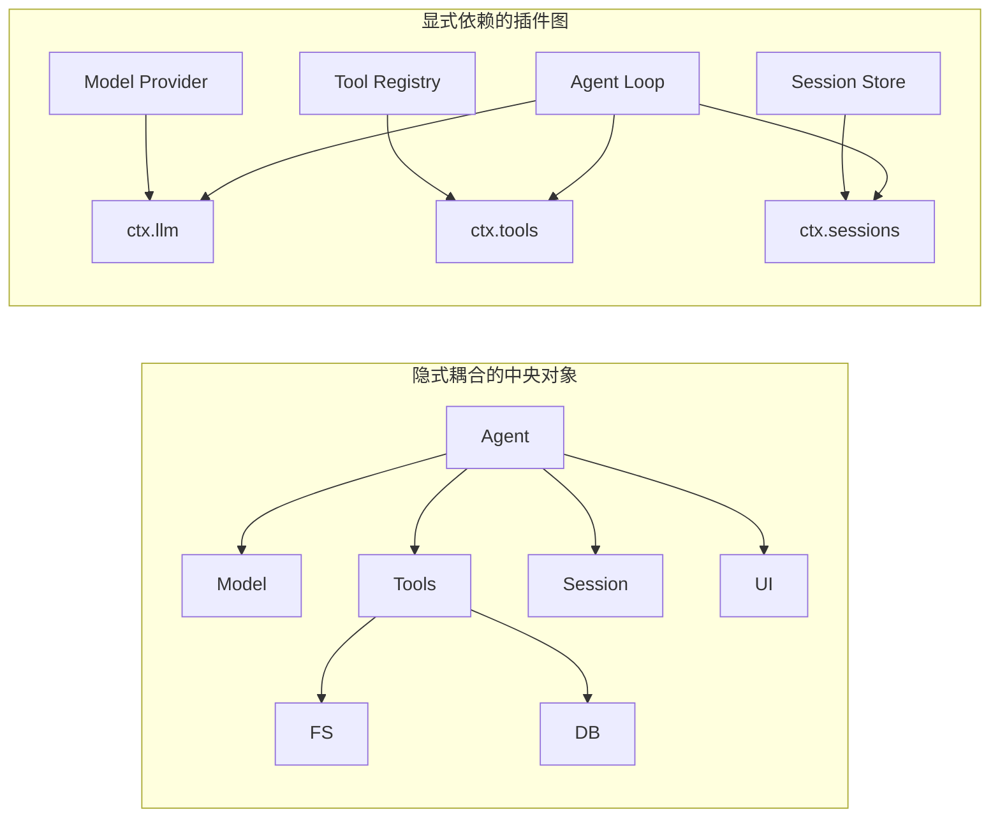
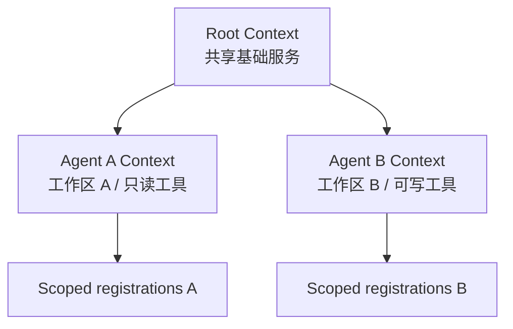
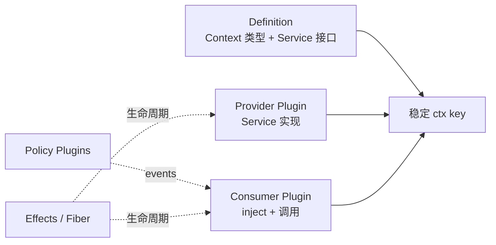

# 第 2 章　Cordis 微内核：依赖、作用域与可逆生命周期

第 1 章把 DSH 描述为一棵插件树。本章继续追问：为什么工具、模型适配器、会话甚至 Agent Loop 都能成为插件，而系统不会退化成一堆互相覆盖的脚本？答案不在“插件”这个文件组织形式，而在 Cordis 为插件规定的三种纪律：**依赖必须显式，能力必须有作用域，副作用必须可撤销。**

> **阅读提示**：本章关注 DSH 的组合基础，不急着讨论模型怎样循环。建议把 Cordis 想成 Agent Runtime 的微内核：它不实现所有能力，而是定义能力怎样被提供、发现、通信和卸载。

## 学习目标

完成本章后，你应当能够：

1. 解释为什么“共享 Context”不等于“全局变量容器”；
2. 区分 Plugin、Service、Event、Effect、Fiber 和 Registry；
3. 画出一个插件从 PENDING 到 ACTIVE 再到 DISPOSED 的状态变化；
4. 为服务直调、广播事件、waterfall 拦截和注册表扩展选择正确机制；
5. 解释服务消失时依赖插件为什么也要卸载；
6. 诊断重复工具、幽灵监听器、插件静默不加载和作用域泄漏。

## 2.1 从“万能 Agent 类”开始的架构债务

一个 Agent 原型很容易写成下面这样：

```ts
class Agent {
  model = new DeepSeekClient()
  tools = new ToolRegistry()
  database = openDatabase()
  browser = launchBrowser()

  async run(input: string) {
    // 构造上下文、请求模型、执行工具、写日志、推送 UI……
  }
}
```

它在第一周通常很高效，但需求增加后会出现连锁问题：

- 测试一个工具也要启动模型、数据库和浏览器；
- 本地文件系统换成远程沙箱，需要修改多个消费者；
- Web 与 Headless 为启动顺序各维护一份代码；
- 热更新工具时，旧监听器和定时器仍然存活；
- 同一进程无法让两个 Agent 使用不同权限或 Provider；
- 第三方扩展只能修改中央类，升级时不断产生冲突。

真正的问题不是类太长，而是**能力发现、依赖顺序、资源所有权和替换边界都隐含在普通代码里**。Cordis 把这些关系提升为运行时可管理的结构。



右图仍然有依赖，但依赖面向稳定服务键，且归 Cordis 生命周期管理。微内核并没有消灭复杂度；它让复杂度从不可见的引用关系，变成可以检查和替换的图。

## 2.2 六个核心概念

| 概念 | 一句话定义 | 典型问题 |
|---|---|---|
| **Plugin** | 向当前 Context 贡献行为的装载单元 | “这段能力何时挂载？” |
| **Context** | 带作用域的服务与事件视图 | “这个插件能看到哪些能力？” |
| **Service** | 其他插件通过稳定 `ctx.<key>` 调用的具名能力 | “谁拥有这项直接调用接口？” |
| **Event** | 生产方与未知监听者之间的类型化通信契约 | “谁需要观察或拦截这个动作？” |
| **Effect** | 与插件生命周期绑定、卸载时可回卷的副作用 | “资源由谁负责释放？” |
| **Fiber** | 一个已挂载插件实例的运行时句柄与状态机 | “插件为何还在等待或已经失败？” |

这些概念不是同义词。一个 Service 类本身可以作为 Plugin 挂载；它在挂载后向 Context 提供一个服务；服务又可能发出 Event；注册服务、监听事件和打开连接都属于 Effect；这一整个插件实例由 Fiber 表示。

### 2.2.1 插件的最小形态

函数或带 `apply(ctx)` 的对象都可以成为插件。DSH 插件常见写法是：

```ts
import type { Context } from '@deepseek-ai/cordis'

export const name = 'example-consumer'
export const inject = ['tools']

export function apply(ctx: Context) {
  // 进入这里时，required service 已经可用。
}
```

`inject` 不是给 TypeScript 看的一句文档，而是运行时依赖声明。所需服务不存在时，插件保持 PENDING；服务出现后它才加载。插件已经 ACTIVE 后，如果必需服务消失，它也会被卸载，并在服务恢复时重新加载。

这一点与常见的“启动时检查一次依赖”不同。Cordis 维护的是**持续成立的依赖关系**，不是一次性初始化顺序。

## 2.3 Context：能力视图，而不是万能全局对象

`ctx.tools`、`ctx.llm`、`ctx.sessions` 看起来像全局属性，容易产生误解：“既然所有插件都拿同一个 ctx，那不还是 Service Locator？”关键差异是 Context 可以派生、隔离和限定注册范围。

可以把 Context 理解成一副“能力眼镜”：插件只能通过自己拿到的 Context 看见当前作用域允许的服务、事件和 effect 所有权。两个 Agent 即使位于同一进程，也可以因上下文不同而拥有不同工具集或 Provider。

### 2.3.1 三个需要同时回答的问题

每次在 Context 上注册能力前，应同时回答：

1. **名字是什么？** 例如 `tools`、`fs`、`sessions`；服务名位于扁平命名空间，应避免冲突。
2. **谁能看见？** 是根 Context、某个 isolate realm，还是单个 Agent scope？
3. **谁拥有生命周期？** 注册应随哪个插件或 Fiber 卸载？

只回答第一个问题，会得到“能跑但会泄漏”的插件；只回答前两个问题，会在热重载时残留资源；只考虑生命周期而忽略作用域，则可能把敏感工具暴露给错误 Agent。

### 2.3.2 根作用域与 Agent 作用域

根作用域适合全局基础设施，例如公共配置服务或进程级遥测；Agent 作用域适合每会话能力，例如特定工作区、权限集和工具注册。若一个工具只应对某个 Agent 可见，却注册在根 Context，它可能进入其他会话的工具 schema。



作用域不是简单的对象拷贝。DSH 的 scope 子系统还要确保事件分发和注册归属与 Agent 对齐，因此“从根 ctx 缓存一个服务引用，再带进子 Agent”可能绕过预期隔离。正确做法是让消费者通过自己的作用域获取能力。

## 2.4 Service：稳定接口与动态依赖

Service 适合“一个消费者明确调用一个能力所有者”的关系，例如 Agent Loop 调用 LLM 注册表，文件工具调用 `ctx.fs`。

```ts
import { Service, type Context } from '@deepseek-ai/cordis'

declare module '@deepseek-ai/cordis' {
  interface Context {
    greeter: GreeterService
  }
}

export class GreeterService extends Service {
  constructor(ctx: Context) {
    super(ctx, 'greeter')
  }

  greet(name: string) {
    return `Hello, ${name}`
  }
}
```

这里有两个不同层面的动作：

- `declare module` 通过 TypeScript 声明合并提供编译期类型，不生成运行时代码；
- `super(ctx, 'greeter')` 在运行时占据服务键，并把注册绑定到生命周期。

如果只有声明合并，没有 Provider，消费者仍会 PENDING；如果只有运行时注册，没有类型声明，服务可能工作，但跨包调用失去类型保护。

### 2.4.1 `inject` 是依赖图，不是加载顺序

假设消费者声明 `inject = ['greeter']`。无论配置文件中消费者写在 Provider 前面还是后面，只要 Provider 最终出现，Cordis 都可以按依赖使其进入 ACTIVE。若 Provider 被 HMR 替换：

```text
旧 Provider 卸载
  → greeter 服务消失
  → 依赖 greeter 的 Consumer 卸载
  → 旧 Consumer effects 回卷
  → 新 Provider 注册 greeter
  → Consumer 重新加载并绑定新实现
```

这比让 Consumer 永久持有旧对象引用安全，因为服务消失时，依赖者不会继续对一个已释放资源发请求。

### 2.4.2 必需依赖与可选依赖

必需依赖放进 `inject`；缺失后功能仍有意义的能力应在使用点探测，例如 `ctx.get('optionalService')`。不要把真正必需的依赖伪装成 optional，再在深层代码抛出“undefined”；也不要把可选的展示增强写成 required，导致核心能力永远 PENDING。

## 2.5 Fiber：插件实例的状态机

每个挂载实例由一个 Fiber 表示：

```text
PENDING → LOADING → ACTIVE → UNLOADING → DISPOSED
                 ↘ FAILED
```

| 状态 | 含义 | 常见诊断方向 |
|---|---|---|
| PENDING | 已声明，但必需服务尚未满足 | 检查 `inject`、Provider、isolate 和配置层 |
| LOADING | 正在执行 `apply` 和建立 effects | 检查长时间初始化与未决 Promise |
| ACTIVE | 插件及其 effects 已生效 | 检查注册的作用域和数量 |
| FAILED | 配置校验或加载抛错 | 检查错误链和部分资源是否由 effect 承担 |
| UNLOADING | 正在运行 disposer | 检查异步清理、超时和依赖顺序 |
| DISPOSED | 已完成拆除 | 确认没有外部孤儿资源 |

PENDING 是合法状态，不一定记录成错误。Provider 可能稍后挂载；若进程中也没有其他活跃资源，程序甚至可能以状态码 0 静默退出。因此“插件没有任何输出”时，先看 Fiber 状态，而不是立刻怀疑 `apply()` 没被调用。

### 2.5.1 为什么静默 PENDING 是合理设计

在动态组合系统中，依赖暂时缺失并不总是异常。配置热更新可能先卸载旧 Provider，再挂载新 Provider；若 PENDING 直接抛错，合法替换会变成故障。代价是运维侧必须提供诊断视图，区分“有意等待”与“长期缺失”。

生产监控可以设置宽限期：短暂 PENDING 只记录状态，超过阈值仍未满足则告警，并列出缺失服务及配置来源。

## 2.6 Effect：把资源所有权写进代码

插件会产生两类副作用：

- Cordis 已管理的注册，如 `ctx.on()`、`ctx.plugin()`、Service 注册以及 DSH 注册表返回的 disposer；
- 框架不知道的外部资源，如定时器、文件 watcher、数据库连接、端口和子进程。

第二类必须包装在 `ctx.effect()` 中：

```ts
export function apply(ctx: Context) {
  ctx.effect(() => {
    const timer = setInterval(refresh, 5_000)
    return () => clearInterval(timer)
  })
}
```

effect 主体在加载时取得资源，返回的 disposer 在卸载时释放资源。通常不应由业务代码手动调用这个 disposer；资源所有权属于插件生命周期。

### 2.6.1 拆除顺序的陷阱

disposer 按 effect 注册顺序的逆序启动，但多个异步 disposer 可能并发。如果“先停止接收请求，再等待在途任务，最后关闭数据库”必须严格排序，应把三步放在同一个 disposer 中并依次 `await`，不能寄希望于多个独立 effect 自然按顺序完成。

### 2.6.2 失败加载也需要回卷

`apply()` 执行到一半后抛错，前面已经建立的 effects 也不能残留。把资源获取放进 effect，可以让失败路径和正常卸载共享清理逻辑。否则开发时偶发的一次配置错误，可能留下端口占用、重复 watcher 或未关闭连接。

## 2.7 Event：广播事实还是共同决策

Service 适合明确调用；Event 适合生产方不知道所有消费者，或需要多个插件共同观察、包装和决策的场景。Cordis 的分发模式是事件契约的一部分：

| 模式 | 调用方式 | 是否等待 | 返回语义 | 适合场景 |
|---|---|---:|---|---|
| `emit` | `ctx.emit()` | 否 | 无 | 已提交事实广播 |
| `parallel` | `await ctx.parallel()` | 是 | 等全部完成 | 并行 flush、多个独立检查 |
| `serial` | `await ctx.serial()` | 是 | 首个有效结果胜出 | 有序候选决策 |
| `bail` | `ctx.bail()` | 否 | serial 的同步版本 | 同步短路查询 |
| `waterfall` | `ctx.waterfall()` | 依契约 | 层层包装或短路 | 请求、审批、工具策略 |

### 2.7.1 为什么 `session/event` 应是广播

会话事件已经提交到日志后，观察者可以更新 UI、遥测或持久化缓冲，但不应由某个监听器“否决事实曾发生”。因此它采用 post-commit、fire-and-forget 的观察语义；监听器失败应被隔离，不能把已经提交的 append 回滚成未知状态。

### 2.7.2 Waterfall 的控制权

waterfall 监听器会收到 `next()`：

```ts
ctx.on('demo/transform', async (request, next) => {
  if (mustReject(request)) return { kind: 'reject' }
  const result = await next()
  return annotate(result)
})
```

调用 `next()` 是委托给下游；不调用并直接返回是有意短路。只做日志或标注的监听器如果忘记 `next()`，可能悄无声息地吞掉默认执行。这是 Cordis 插件最危险、也最常见的逻辑错误之一。

### 2.7.3 如何选择 Service、Event 或 Registry

| 需求 | 推荐机制 | 原因 |
|---|---|---|
| 调用一个明确能力所有者 | Service | 接口直接、返回值清楚 |
| 通知多个未知观察者 | emit Event | 生产方无需知道订阅者 |
| 多策略共同包装一次动作 | waterfall Event | 支持委托、改写和否决 |
| 多个同类实现供调用者选择 | Registry Service | 需要枚举、作用域和稳定注册 |
| 保存可重放事实 | SessionEvent | 需要序列、持久化和投影契约 |

不要为了“解耦”把所有调用都改成 Event。若调用者需要一个明确返回值和错误语义，Service 往往更可读；若一个 Service 内部需要可扩展策略，再在服务边界发出事件。

## 2.8 Isolate 与作用域：同名服务如何共存

Cordis 的服务名位于扁平命名空间，但 isolate realm 可以让不同子树各自拥有同名服务实例。例如两个 Agent 组可以分别配置本地 Shell 与远程 Shell，而消费者都注入 `shell`。

```text
Root
├── Group A [isolate: shell]
│   ├── LocalShell Provider
│   └── Bash Tool Consumer → Group A shell
└── Group B [isolate: shell]
    ├── RemoteShell Provider
    └── Bash Tool Consumer → Group B shell
```

隔离的目的不是复制一切，而是隔离需要变化的服务名。隔离层次过粗会制造重复基础设施，过细则让一个能力所需的 Provider 不在同一 realm，导致插件长期 PENDING。

DSH 的 Agent preset 需要为每会话组合能力时，服务行通常还要处在合适的 isolate realm。判断错误的典型症状是：根 Context 明明存在 Provider，但 Agent-scoped Consumer 仍看不到它，或者多个 Agent 意外共享同一个有状态实例。

## 2.9 HMR：热替换是生命周期测试，不只是开发体验

配置项有稳定 `id` 时，Loader 可以区分“修改现有行”与“删除旧行再新增一行”。HMR 的核心流程是：

```text
检测文件或配置变化
  → 找到受影响的配置行
  → 卸载旧 Fiber 与子插件
  → 回卷全部 effects
  → 重新校验配置
  → 按依赖加载新 Fiber
```

如果配置项没有稳定 `id`，每次读取可能获得新 ID，导致无关编辑也触发不必要的重新挂载。若 disposer 不完整，HMR 会迅速暴露重复工具、重复事件和内存增长。

这使热重载成为很好的架构测试：能被连续重载十次且注册数量保持恒定，说明资源所有权大概率清晰；只能靠重启进程恢复，通常意味着生命周期没有闭合。

## 2.10 能力接缝在 Cordis 中如何落地

第 1 章介绍了 Definition、Provider、Consumer。Cordis 为三者提供具体机制：



以远程代码执行为例：

- Definition 声明 `ctx.fs`、`ctx.subprocess` 或更高层执行接口；
- 本地 Provider 使用宿主文件和进程；远程 Provider 使用沙箱 API；
- Bash、PTY、LSP 和文件工具是 Consumer；
- policy 事件限制路径、命令和资源；
- effects 确保沙箱会话、连接和注册随作用域释放。

一个好的接缝让替换发生在共享 execution world，而不是给每个工具写一个远程分支。一个不完整接缝则会让文件在远程、Shell 在本地，模型看到两个互不一致的世界。

## 2.11 设计新能力的决策流程

遇到新需求时，可以依次判断：

1. 这是模型可调用动作吗？若是，可能需要 Tool Consumer，但继续追问底层能力是否应抽成 Service。
2. 是否存在多个可替换实现？若是，定义稳定 Service 接口与 Provider。
3. 是否允许其他插件观察或拦截？若是，在能力所有者边界定义正确模式的 Event。
4. 是否产生外部资源？若是，明确 effect 和 disposer。
5. 能力对谁可见？选择根、isolate 或 Agent scope。
6. 事实是否必须跨重启存在？若是，不能只发实时 Event，需要持久事件或外部存储。
7. 是否需要以组合形式交付？运行插件之外再设计 Bundle 与配置行。

### 2.11.1 反例：把数据库连接直接塞进工具

若每个查询工具都自行读取环境变量、建立数据库连接并执行 SQL，会导致连接池重复、凭据策略分散、测试困难。更合理的拆分是：

```text
Database Service Definition
  ← Local/Cloud/Test Providers
  ← Query Tool Consumers
  ← Health/Telemetry Consumers
```

工具负责模型接口和业务参数，Provider 负责连接、凭据、超时和资源生命周期。这样测试工具时可以替换为内存 Provider，生产部署也能统一轮换凭据。

## 2.12 失败模式与诊断矩阵

| 表象 | 可能根因 | 首先检查 | 修复方向 |
|---|---|---|---|
| 插件完全没输出，进程正常退出 | required service 缺失，Fiber 长期 PENDING | Fiber state、`inject`、有效配置 | 加载 Provider 或修正 realm |
| HMR 后工具出现两份 | 注册未绑定 effect，或 disposer 未执行 | 注册数量、Fiber 卸载日志 | 使用框架注册 API 或 `ctx.effect()` |
| Provider 卸载后消费者仍调用旧对象 | 直接导入/缓存实现，绕过 `inject` | import 与长期闭包引用 | 面向 Context 服务并让依赖重载 |
| 日志插件装上后模型请求消失 | waterfall 监听器忘记 `next()` | 监听器返回路径 | 观察型监听器始终委托 |
| 两个 Agent 看见彼此工具 | 注册落在根 Context，缺少 scope/isolate | tool schema 与注册所属 Fiber | 在 Agent scope 注册并写隔离测试 |
| 卸载一直卡住 | disposer 未完成、等待已无法结束的任务 | UNLOADING Fiber、开放句柄 | 传播取消并给清理设置边界 |
| 服务类型匹配但替换后行为错误 | 契约只描述类型，未约定语义 | Provider 契约测试 | 补充错误、并发、取消和一致性约定 |
| 配置改一行引发大面积重载 | 缺少稳定配置 ID | Loader diff 与 row id | 为长期配置项设置稳定 ID |

推荐调试顺序是：**有效配置 → Fiber 状态 → 服务可见性 → 作用域 → effect 数量 → 事件控制流**。这比一开始在业务代码中加日志更容易定位组合问题。

## 2.13 初学者容易形成的三个误解

**误解一：插件越小越解耦。** 文件小不代表边界好。若十个小插件共享一个隐式全局 Map，它们仍高度耦合。解耦来自稳定契约和明确所有权。

**误解二：事件比直接调用更灵活。** 事件会隐藏调用路径和控制权。只有确实需要未知观察者或协作拦截时才使用事件。

**误解三：卸载只是开发功能。** 在 Profile 切换、Agent scope 结束、Provider 故障恢复和长期 Web 服务中，正确拆除都是生产能力。无法卸载的插件也很难安全升级。

## 源码路标

以下证据固定到本书上游提交 `47f943859bef60e4160492346772ded9b24f765a`：

- [Cordis Primer：五个核心概念与分发模式](https://github.com/deepseek-ai/deepseek-harness/blob/47f943859bef60e4160492346772ded9b24f765a/docs/cordis-primer.md)
- [生命周期与 Effect 教程](https://github.com/deepseek-ai/deepseek-harness/blob/47f943859bef60e4160492346772ded9b24f765a/docs/cordis-tutorial/02-lifecycle-and-effects.md)
- [Service 与动态依赖教程](https://github.com/deepseek-ai/deepseek-harness/blob/47f943859bef60e4160492346772ded9b24f765a/docs/cordis-tutorial/03-services.md)
- [Event 与 waterfall 教程](https://github.com/deepseek-ai/deepseek-harness/blob/47f943859bef60e4160492346772ded9b24f765a/docs/cordis-tutorial/04-events.md)
- [组合、isolate 与 HMR 教程](https://github.com/deepseek-ai/deepseek-harness/blob/47f943859bef60e4160492346772ded9b24f765a/docs/cordis-tutorial/06-composition-and-hmr.md)
- [能力接缝与服务图](https://github.com/deepseek-ai/deepseek-harness/blob/47f943859bef60e4160492346772ded9b24f765a/docs/capability-seams.md)
- [Agent scope 子系统](https://github.com/deepseek-ai/deepseek-harness/blob/47f943859bef60e4160492346772ded9b24f765a/docs/subsystems/scope.md)
- [Cordis Context API](https://github.com/deepseek-ai/deepseek-harness/blob/47f943859bef60e4160492346772ded9b24f765a/docs/cordis-api/context.md)

## 配套实验

完成 [Lab 02：可配置问候工具](../labs/index.md#lab-02)。深度版本不只要求工具返回问候语，还要验证：

1. 配置 schema 在加载前拒绝非法值；
2. Consumer 缺少必需服务时处于 PENDING；
3. 修改配置后旧工具注册得到释放；
4. 连续重载不会增加工具与监听器数量；
5. 将 Provider 替换为测试实现后，Consumer 无需改代码。

## 本章小结

Cordis 的价值不是“允许写插件”，而是把运行时关系结构化。Context 给出带作用域的能力视图，Service 表达稳定直接调用，Event 表达广播或协作决策，Effect 绑定资源所有权，Fiber 则让插件的等待、加载、失败和卸载成为可诊断状态。

依赖声明持续有效：Provider 消失时 Consumer 也要卸载，Provider 恢复后再重新装配。这个机制与可逆 effect 共同构成 HMR 和 Provider 替换的基础。

成熟扩展必须同时说明“依赖什么、贡献什么、对谁可见、怎样通信、如何撤销”。只会实现 `apply(ctx)`，还没有真正掌握插件架构。

## 思考题

1. ★ 数据库连接为什么适合成为 Service Provider，而“查询某订单”为什么更适合成为 Tool Consumer？
2. ★★ 一个仅用于记录耗时的 waterfall 监听器忘记调用 `next()` 会产生什么现象？怎样写测试捕获它？
3. ★★ PENDING 为什么不是异常？生产环境怎样区分短暂等待和配置错误？
4. ★★ 两个异步 disposer 具有先后依赖时，为什么注册逆序仍不足以保证安全拆除？
5. ★★★ 设计一个允许本地和远程沙箱切换的 execution world，哪些服务必须一起替换才能避免“文件在 A、进程在 B”？
6. ★★ 一个插件通过根 Context 读取服务后，把引用传给 Agent-scoped 子插件，可能破坏什么隔离假设？
7. ★★★ Service 的 TypeScript 接口完全一致时，Provider 仍可能在哪些行为语义上不兼容？如何建立契约测试？
8. ★★ 如果所有功能都做成 Event 而不使用 Service，调试、类型和错误处理会遇到什么问题？

## 求职面试题

### 基础题

请用一个实际例子解释 Plugin、Service、Event、Effect 与 Fiber 的区别，并说明 `inject` 不只是启动顺序。

### 源码题

某插件在配置中存在却没有加载。请给出从 `--dump-config`、Fiber state、服务 realm、`inject` 到加载错误链的完整诊断过程。

### 系统设计题

设计一个可在本机、Docker 和远程沙箱之间切换的代码执行能力。说明 Definition、Provider、Consumer、策略事件、Agent scope、资源 disposal 和契约测试怎样分工。
