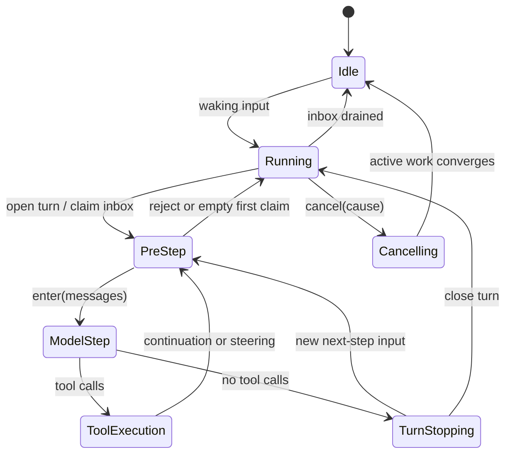
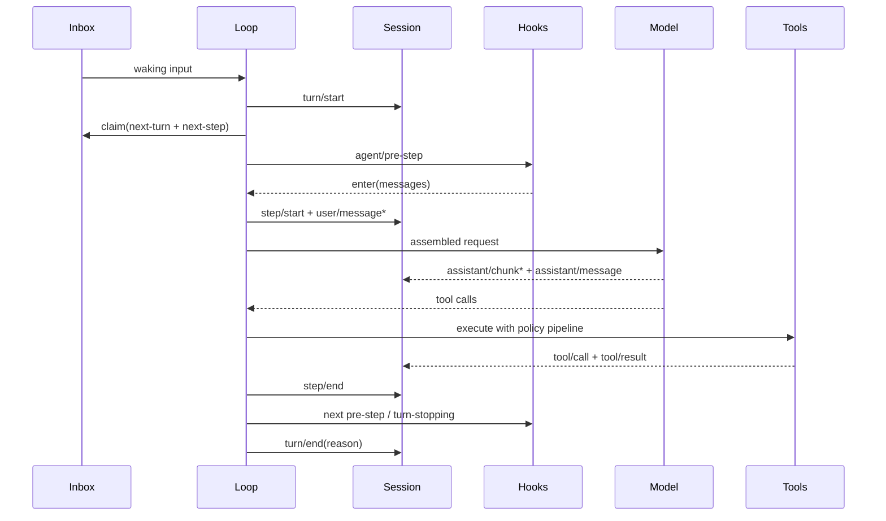
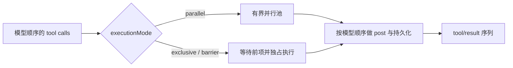

# 第 3 章　Agent Loop：一轮任务如何取得、保持并交还控制权

最小 Agent 循环常被写成十几行：请求模型；如果模型调用工具，就执行并把结果追加回消息；否则返回答案。这段伪代码可以解释 ReAct，却解释不了生产系统里最难的部分：用户何时可以插话、哪些输入已经被消费、取消后新消息会不会丢失、工具并行怎样保持结果顺序、请求失败由谁重试，以及进程恢复后怎样判断上一轮是否完整结束。

DSH 的 Agent Loop 与其说是一条 `while`，不如说是一台**拥有输入队列、持久边界和取消权限的状态推进器**。本章沿着一轮真实任务逐段拆解它。

## 学习目标

完成本章后，你应当能够：

1. 区分 Agent、AgentHandle、driver、turn、step、inbox 和 Session；
2. 解释 `followup()`、`steer()` 与 `inject()` 对控制权的不同影响；
3. 从 `turn/start` 追踪到 `turn/end`，指出每个失败边界由谁拥有；
4. 解释模型请求、流式 chunk、完成锚点和工具结果怎样进入持久日志；
5. 分析取消、重试、并行工具和用户插话之间的竞态；
6. 使用事件轨迹而不是最终文本诊断 Agent 失控、重复或假完成。

## 3.1 为什么循环必须成为独立子系统

考虑一个正在修改代码的 Agent。Shell 工具执行测试时，用户发送“先别改，告诉我原因”；同时模型 API 因限流返回错误，Web 页面又被刷新。如果循环只是一个局部函数，它很难回答：

- 用户补充是在当前步骤生效，还是开启下一轮？
- 已经发给模型的消息能否撤回？
- 当前工具应被取消，还是允许完成并记录结果？
- API 限流重试属于原 step，还是新 turn？
- 页面恢复应读取内存 Promise，还是持久事件？
- Agent 最终 idle 是否代表这条用户消息已经得到答复？

这些问题共同指向一个事实：Agent Loop 不只负责“重复请求模型”，还拥有**任务推进期间的控制权与时间边界**。



这张图是教学抽象。DSH 对外只暴露 `idle` 与 `running` 两种 Agent status；PreStep、ModelStep 和 Cancelling 是理解内部控制过程的阶段，不是公开状态枚举。

## 3.2 七个基本对象

| 对象 | 所有权 | 责任 |
|---|---|---|
| **AgentRegistry (`ctx.agents`)** | Agent 服务 | 创建、恢复、查找 Agent，并隐藏具体 Loop 实现 |
| **Agent** | 运行时公开句柄 | 暴露会话、inbox、状态、作用域、发送与取消 |
| **AgentHandle** | 创建方 | 持有 `dispose()` 能力；销毁 Agent 及其作用域世界 |
| **Driver** | Agent Loop | 在一次 running 区间内排空可运行工作 |
| **Inbox** | Agent | 保存 next-turn 与 next-step 两条持久待处理队列 |
| **Session** | 会话子系统 | 记录仅追加事件，提供模型历史投影 |
| **AbortSignal** | 当前活动 | 把一次 turn 或维护任务的取消传到请求和工具 |

`ctx.agents` 而不是 `ctx.agentLoop` 是消费者应依赖的入口。Registry 背后注册具体工厂，使默认 Loop 可以替换；UI、Subagent Provider 和业务编排无需导入内部 driver。

### 3.2.1 AgentHandle 为什么是一项 Capability

`ctx.agents.create()` 或 `resume()` 返回 Agent 与 disposer。只有持有 Handle 的创建者能够主动拆除这个 Agent；`ctx.agents.get(id)` 只返回裸 Agent，不附带销毁权限。

这是一种 capability-based ownership：销毁权由对象持有关系表达，而不是任何拿到 ID 的代码都能删除 Agent。Provider 自身也是结构性所有者——Provider 卸载时必须停止并排空它创建的所有 Handle。

正确的 `dispose()` 不只是从 Map 删除对象，而应：

```text
停止并取消活动 Loop
→ 等待在途工作收敛
→ 注销 Agent
→ 从 Session Store 移除实时会话
→ 回卷 Agent-scoped 插件与资源
```

如果先移除会话监听，再让 Loop 写 `turn/end`，最后事件可能丢失。因此创建和拆除要作为有顺序的生命周期事务。

## 3.3 Inbox：输入不是一条无结构消息流

DSH 的 Inbox 有两个有序列表：

```text
next-turn：普通 follow-up，按 FIFO 每轮领取一条
next-step：steering 与 injected context，在最近的步骤边界批量领取
```

| 方法 | 目标 | 唤醒 driver | 语义 |
|---|---|---:|---|
| `followup(message)` | next-turn | 是 | 排队一个普通后续轮次 |
| `steer(message)` | next-step | 是 | 尽快改变当前任务方向；空闲时也能开 turn |
| `inject(message)` | next-step | 否 | 添加模型上下文，但不独立启动工作 |
| `send(message,target,wakeup)` | 显式选择 | 可选 | 上述行为的统一底层原语 |

### 3.3.1 Claim 与“已经消费”

Loop 在 turn 边界先打开 `turn/start`，再原子领取全部 next-step 输入和一条 next-turn 消息；step 之间只领取 next-step。Claim 会从 Inbox 删除消息，并另行发出 claimed 通知。

这让系统能区分：

- **pending**：仍可被替换、移除或取消；
- **claimed**：已经交给 pre-step 决策，不能再假装仍在队列；
- **entered**：已作为 `user/message` 写入步骤，成为模型历史；
- **discarded**：明确被清理，没有进入模型请求。

如果 UI 只显示一份本地消息数组，就无法准确表达这些状态。用户看到“消息已发送”并不等于模型已经看见；消息进入 Inbox、被 claim、通过 pre-step 和写入 Session 是四个不同边界。

### 3.3.2 Steering 不是硬中断

用户在工具执行期间发送 steering，它通常等待下一个 step 边界进入，而不会穿越正在执行的函数直接改写局部变量。如果业务要求“立即停止写入”，必须同时调用 `cancel()` 或让工具本身支持审批/取消；单纯发一句“不要继续”不能成为安全控制。

## 3.4 Turn 与 Step：两个不同的事务边界

一个 step 包含一次模型请求及其触发的工具执行；一个 turn 包含零个或多个 step，直到没有工具 continuation 和 next-step 输入。



### 3.4.1 零 Step Turn

以下情况可能打开 turn 却不发送模型请求：

- `agent/pre-step` 返回 reject；
- 唤醒消息在 claim 前后被清理，首批进入消息为空；
- pre-step 有意把第一批改写为空。

DSH 仍关闭这个 turn，并记录 `blocked` 或 `completed` 等原因。这样监控能区分“系统从未被唤醒”和“系统接收了一次活动但没有花费模型 step”。

### 3.4.2 一个 Turn 为什么会有多个 Step

模型调用工具后，结果必须进入历史并再次请求模型，才能让它判断任务是否完成；用户 steering 也可能要求下一 step。只要系统仍欠后续模型请求，turn 就保持打开。

这意味着“用户消息数”不能用来估算模型调用数。一个开放式 Coding turn 可能包含几十个 step，每一步都会重新发送系统 Prompt、工具 schema 和累计历史，成本和延迟会随轨迹增长。

## 3.5 Pre-step：模型请求前唯一的准入门

`agent/pre-step` 接收已经 claim 的 `UserMessage[]`、拟议 turn/step 坐标和当前取消信号，并返回：

```ts
type PreStepDecision =
  | { kind: 'reject' }
  | { kind: 'enter'; messages: UserMessage[] }
```

返回值具有权威性：`enter.messages` 才是实际进入步骤的完整批次。监听器可以补充上下文、改写消息或拒绝，但必须保留消息 ID 与来源语义。被最终决策省略的 claimed 消息不会自动回到 Inbox。

### 3.5.1 适合放在 pre-step 的能力

- 上下文压力检测和压缩触发；
- SessionStart 或 Hook 注入的持久上下文；
- 任务级准入策略；
- 把 Agent runtime context 转成模型可见消息；
- 在真正花费模型调用前阻断无效或被取消请求。

不适合在这里执行长时间、不可取消的外部任务。pre-step 已经处于 running 活动中，阻塞会推迟整个 Agent 的收敛。

## 3.6 一个 Step 的内部结构

进入 step 后，Loop 依次完成：

```text
step/start
→ 把进入消息记录为 user/message
→ render system prompt 与 tool schemas
→ 从 Session surface 派生 messages
→ agent/request waterfall
→ 选择并锁定精确 LLM adapter registration
→ 写 request/header
→ llm/stream
→ assistant/chunk*
→ assistant/message 完成锚点
→ 工具调度（如果有）
→ step/end
```

### 3.6.1 流式 Chunk 与完成锚点

每个成功 Provider 调用都会恰好产生一个 `assistant/message`，即使它没有文本内容或以 `max-tokens` 结束。原始 `assistant/chunk` 用于保真回放和 UI 流式展示；完成消息列出自己的来源 chunk 序号，并保存 provider、model、usage 和适配器私有 replay state 等信息。

空的 assistant 内容可以不进入派生模型历史，但完成锚点仍然保留“这次调用确实发生过”。这避免把“没有文本”误判成“请求从未完成”。

### 3.6.2 为什么请求要绑定精确 Adapter

Loop 在准备模型调用时解析 provider/model、默认 reasoning effort 和 max tokens，并持有当时命中的适配器注册。若 HMR 恰好在准备和分派之间替换 Provider，当前请求仍使用同一份能力解析与执行实现，下一 step 再重新解析。

否则可能出现“旧适配器计算默认值，新适配器执行请求”的撕裂状态，调试时看到的 request header 与真实调用不一致。

## 3.7 工具调度：并行不是 `Promise.all`

模型一次响应可以包含多个工具调用。DSH 根据每个工具的 `executionMode` 分类：可并行调用进入有界滚动池，独占调用形成 barrier；调用在真正开始前还会重新分类，以反映最新策略或状态。



关键约束是：**调用本体可以重叠，策略决策、持久结果和返回模型的结果上下文仍保持模型顺序。** 这样既利用只读工具并行，又避免 UI 和历史因完成速度不同而随机重排。

并行安全不能只看工具名。两个“读取”调用可能争用同一不可重入资源；一个看似独立的写操作也可能影响后续参数。分类若需要比较调用之间的资源冲突，简单的一元 executionMode 就不够，保守做法是保持独占。

## 3.8 完成、继续与 Turn-stopping

模型不再返回工具调用时，step 给出 completed 候选；工具调用全部结束且没有要求 continuation 时，也可能自然结束。此时 Loop 不是立即写 `turn/end`，而是先检查 next-step Inbox，并调用 `agent/turn-stopping` 串行检查点。

该检查点适合：

- Goal 驱动器判断目标是否真正完成；
- 验证器发现仍欠测试或证据，注入下一步；
- 预算策略在关闭前记录状态；
- 外层协议完成最终同步。

监听器不应无条件继续 turn，否则模型会在没有新证据时自我循环。任何自动 continuation 都应说明“欠什么工作”以及自己的停止预算。

### 3.8.1 结束原因不是一个布尔值

持久 `turn/end` 可以区分：

| 原因 | 含义 |
|---|---|
| `completed` | 自然完成 |
| `blocked` | pre-step 拒绝 |
| `aborted` | 活动被取消，并带稳定原因分类 |
| `error` | 结构化模型或其他失败 |
| `max-tokens` | 至少一个 step 达到输出上限 |
| `interrupted` | 持久化恢复发现崩溃遗留开放 turn |

`max-tokens` 是 sticky：一旦某 step 截断，即使插件后来继续并自然结束，turn 也不应伪装成完全正常完成。`interrupted` 由恢复逻辑合成，而不是实时 Loop 主动发出。

## 3.9 取消：发出信号不等于工作已经停止

`agent.cancel(cause)` 会清理待处理 Inbox（除非 `keepInbox`），并中止当前 turn 或 maintenance task 的信号。取消原因包括用户、父 Agent、Hook 和 dispose 等。

### 3.9.1 协作式取消的现实

AbortSignal 只能通知下游停止。如果一个工具忽略信号，Loop 不能安全假装它已经结束；dispose 仍需等待该工作完成，避免资源在执行中被拆除。因此每个长时 Provider 和工具都要显式传播 signal，并在外部 API 支持时发送取消请求。

### 3.9.2 取消收敛窗口

取消发出后到 driver 真正回到 idle 之间存在窗口。此时若收到新的 waking input，DSH 会锁存唤醒请求，并在旧活动收敛后重新驱动；否则用户必须再发一次消息才能唤醒，造成“消息明明在队列却不执行”。dispose 原因不会锁存，因为该 Agent 正在永久拆除。

### 3.9.3 未分发工具调用也要闭合

模型已经产出多个工具调用，但取消阻止后续调用开始时，日志不能只保留孤立 `tool/call`。Loop 为未分发调用写入合成的 `ABORTED_BEFORE_DISPATCH` 结果，使模型历史和工具配对保持完整。

## 3.10 错误恢复：谁有权重试

模型请求失败会在失败 step 关闭后、turn 关闭前进入 `agent/request-error` waterfall。监听器若拥有恢复策略，可以记录必要状态、等待退避，然后返回 `{ kind: 'retry' }`；否则失败成为终态。

这一区分很重要：

- 模型 Provider 的限流、临时网络错误可能适合按精确策略重试；
- 工具业务拒绝通常应成为模型可见结果，由模型调整；
- schema 违规表示调用不合法，不应盲目重复同一参数；
- 权限拒绝不能被另一个“宽松重试器”覆盖；
- 未知中间件异常应结束 turn，保留错误边界。

重试应绑定准备调用时捕获的 Provider 事实，而不是失败后再读取可能已被 HMR 改变的全局配置。否则一次请求会跨 Provider 策略漂移。

## 3.11 预算不是默认 Loop 的内建完成标准

锁定版本的默认 Agent Loop 没有内置 turn 最大 step 数。工具 continuation 或 steering 可以持续延长当前 turn。生产部署必须通过现有扩展点增加：

- 最大 step 与最大工具调用数；
- wall-clock 超时；
- 模型 token 与费用预算；
- 同一工具/参数重复检测；
- 连续失败熔断；
- 高风险动作次数与审批次数；
- 达到限制后的结构化结束原因和人工接管信息。

预算不能只在 UI 计数。真正的限制要位于 Loop 或工具执行边界，确保后台调用者和 Headless 入口同样受约束。

## 3.12 用轨迹进行故障归因

### 3.12.1 最短诊断路径

```text
1. inbox 是否记录 inserted？
2. Agent 是否转为 running？
3. 是否存在 turn/start？
4. pre-step 后是否有 step/start？
5. 是否有 request/header 与 assistant 完成锚点？
6. tool/call 与 tool/result 是否配对？
7. step/end 与 turn/end 原因是什么？
8. Agent 是否回到 idle，Inbox 是否仍有 pending？
```

### 3.12.2 表象与根因矩阵

| 表象 | 可能根因 | 关键证据 |
|---|---|---|
| 发消息后完全无 turn | 没有 wake、Agent 已 dispose、输入未进入正确实例 | inbox inserted、agent/status、registry |
| 有 turn 无 step | pre-step reject、首批消息被改为空 | pre-step 决策、`turn/end.reason` |
| 有 step 无 assistant/message | 请求错误、流中止、适配器缺失 | request header、chunk、request-error |
| tool/call 无 tool/result | 调度器故障、进程崩溃、旧实现未闭合 | tool pipeline、turn error、恢复修复 |
| 同一工具反复调用 | 结果未被理解、工具描述含糊、验证器无限 continuation | 派生历史、参数差异、step 预算 |
| 用户 steering 未生效 | pre-step 已 claim、工具仍在执行、消息进错队列 | inbox target、claimed 时刻、下一 step |
| cancel 后仍产生副作用 | 工具忽略 signal、外部 API 不支持取消 | cancel cause、外部审计、完成时刻 |
| UI 显示 idle 但消息未回答 | idle 是整机静止，不是单消息回执 | message lifecycle、turn 归属 |

### 3.12.3 为什么 `whenIdle()` 不是消息完成 Promise

`whenIdle()` 等待整个 Agent 活动达到静止，并会跟随观察期间启动的替代工作。它不标识某一条 followup 的结算。若调用方需要“一次请求—一次完成”的业务语义，应在会话事件中建立消息、turn 或外层 job 的关联，而不是把全局 idle 当作单消息回执。

## 3.13 测试 Loop 应覆盖哪些竞态

只测试“模型调用一次工具并回答”远远不够。至少应包含：

1. 首次 pre-step 被拒绝，产生零-step blocked turn；
2. 工具 continuation 产生同一 turn 的第二 step；
3. 工具执行期间 steering，在下一 step 被领取；
4. 空闲 `inject()` 不唤醒，后续 followup 一并带入；
5. cancel 清理 Inbox 与 `keepInbox` 保留路径；
6. 取消收敛窗口到达的新 waking input 不丢失；
7. 并行工具乱序完成，但持久结果保持模型顺序；
8. barrier 工具等待前序并阻止后项越过；
9. Provider 请求失败后按策略重试，非重试错误正确结束；
10. 崩溃恢复把开放 turn 标为 interrupted，且不虚构缺失结果。

这些测试大多可以使用 mock adapter 和内存工具完成，不必消耗真实模型额度。真实模型测试用于验证策略表现，状态机契约应尽量保持确定性。

## 源码路标

以下链接固定到提交 `47f943859bef60e4160492346772ded9b24f765a`：

- [Agent 生命周期完整时序图](https://github.com/deepseek-ai/deepseek-harness/blob/47f943859bef60e4160492346772ded9b24f765a/docs/agent-lifecycle.md)
- [核心子系统：Agent 句柄、Inbox、取消和拦截契约](https://github.com/deepseek-ai/deepseek-harness/blob/47f943859bef60e4160492346772ded9b24f765a/docs/subsystems/core.md)
- [`agent-loop/src/agent.ts`：turn 与 step 主状态机](https://github.com/deepseek-ai/deepseek-harness/blob/47f943859bef60e4160492346772ded9b24f765a/packages/core/agent-loop/src/agent.ts)
- [`agent-loop/src/tool-calls.ts`：并行池、barrier 与结果排序](https://github.com/deepseek-ai/deepseek-harness/blob/47f943859bef60e4160492346772ded9b24f765a/packages/core/agent-loop/src/tool-calls.ts)
- [`agent/src/inbox.ts`：双队列与 splice/claim](https://github.com/deepseek-ai/deepseek-harness/blob/47f943859bef60e4160492346772ded9b24f765a/packages/core/agent/src/inbox.ts)
- [`agent/src/types.ts`：公开 Agent 与 Handle 契约](https://github.com/deepseek-ai/deepseek-harness/blob/47f943859bef60e4160492346772ded9b24f765a/packages/core/agent/src/types.ts)
- [LLM streaming 与请求词汇](https://github.com/deepseek-ai/deepseek-harness/blob/47f943859bef60e4160492346772ded9b24f765a/docs/subsystems/llm-streaming.md)
- [工具执行流水线](https://github.com/deepseek-ai/deepseek-harness/blob/47f943859bef60e4160492346772ded9b24f765a/docs/tool-execution-pipeline.md)

## 配套实验

完成 [Lab 03：会话事件观察器](../labs/index.md#lab-03)。深度验收需要执行至少四条轨迹：自然完成、一次工具 continuation、pre-step 拒绝和主动取消。每条轨迹都要检查 turn/step 嵌套、工具配对、结束原因和 Agent status，而不是只输出事件名称。

建议再做一个反事实实验：让观察器错误地把 `agent/status=idle` 当作消息回执，然后排入两条连续 followup，观察为什么无法可靠关联；再改为用消息 ID、claimed 事件和 turn 边界建立投影。

## 本章小结

DSH Agent Loop 是控制权状态机。Inbox 决定输入在下一 turn 还是下一 step 生效，pre-step 决定哪些消息真正进入请求，Session 保存持久边界，AbortSignal 贯穿活动，turn-stopping 给插件最后一次继续或关闭的机会。

工具调用可以并行执行，但策略与持久结果保持模型顺序；取消是协作式收敛，不是瞬间抹除；请求重试由明确的恢复监听器拥有，而不是所有错误统一重跑。

调试 Agent 时，最终回答是最弱的证据。真正有用的是 Inbox 生命周期、turn/step 嵌套、请求完成锚点、工具配对和结构化结束原因。

## 思考题

1. ★ 为什么一个 turn 允许零个 step？这对审计和成本统计有什么帮助？
2. ★★ 用户在写工具执行期间发送 steering，为什么 steering 本身不能保证写入立即停止？
3. ★★ `whenIdle()` 为什么不能天然充当某一条消息的完成 Promise？怎样设计可靠回执？
4. ★★★ 并行工具按完成时间写结果会破坏哪些模型历史和回放假设？
5. ★★ 为什么 Provider 重试策略要绑定失败请求当时的适配器注册，而不是实时读取全局配置？
6. ★★★ 设计一个重复调用熔断器：它如何区分合理分页、参数逐步修正和真正死循环？
7. ★★ `max-tokens` 为什么要在 turn 级保持 sticky，而不能被后续 completed step 覆盖？
8. ★★★ 如果工具不支持取消但具有外部副作用，Agent 和业务系统分别应做什么以避免重复执行？
9. ★★ 空闲 `inject()` 不唤醒有哪些好处？它可能因时序错过哪一次请求？
10. ★★★ 如何用 mock adapter 对取消收敛窗口做确定性测试，而不依赖真实网络时间？

## 求职面试题

### 基础题

请解释 turn、step、followup、steer 和 inject，并画出一次工具调用为什么会在同一 turn 中产生第二个 step。

### 故障题

给定“用户取消后工具仍写入成功，紧接着的新消息一直未处理”的现象，请列出需要检查的事件、取消传播和 wake latch 路径。

### 系统设计题

为一个可执行长时间数据分析任务的 Agent 设计 Loop 治理：包含消息回执、进度、取消、重试、预算、并行工具、人工接管和崩溃恢复。
