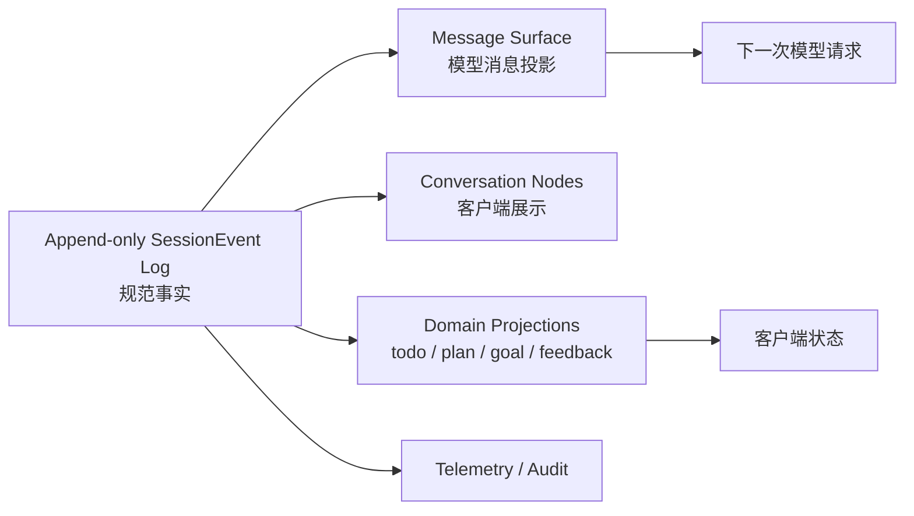
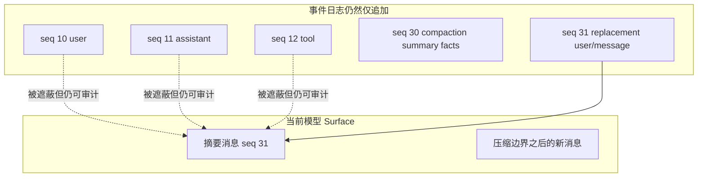

# 第 4 章　会话与上下文：从事件事实到模型可见世界

Agent 的“记忆”经常被简化成一组聊天消息。但真正运行过一次工具任务后，系统还要记住 turn 和 step 边界、流式输出、工具调用与结果、模型路由、用量、压缩替换、取消原因以及插件自己的领域状态。若只保存最终聊天气泡，页面也许还能展示，模型却无法可靠恢复当时的决策世界。

DSH 把 Session 设计为仅追加事件日志，再从日志派生模型历史、客户端对话和领域投影。这个选择的核心不是“事件溯源很高级”，而是满足一个严格不变量：**任何影响模型决策的内容，都必须具有可重建来源。**

## 学习目标

完成本章后，你应当能够：

1. 区分规范事件日志、模型消息 surface、客户端 transcript 和业务投影；
2. 解释“Model-visible means logged”对插件开发的具体约束；
3. 说明 `deriveMessages()` 为什么是投影，而不是另一份独立消息存储；
4. 设计持久化 flush、崩溃恢复、fork、resume 和 compaction 的边界；
5. 判断哪些状态属于 Session，哪些属于外部业务系统或长期记忆；
6. 为敏感数据、超大工具结果和版本演进建立存储策略。

## 4.1 为什么聊天 Transcript 不是会话真相

一次最小工具任务可能产生：

```text
turn/start
step/start
user/message
request/header
assistant/chunk × N
assistant/message
tool/call
tool/result
step/end
step/start
assistant/chunk × M
assistant/message
step/end
turn/end
```

UI 通常只显示用户气泡、助手文本和几张工具卡片，但以下问题不能从气泡回答：

- 助手文本由哪个 provider/model 产生？
- 流式响应是否完整，还是达到 `max-tokens`？
- 一个工具结果对应哪次调用？
- 用户 steering 在哪个 step 生效？
- 恢复后当前上下文是否与原请求一致？
- 压缩隐藏了哪些旧消息，摘要由什么模型产生？
- 一轮是自然完成、被拒绝、取消、失败还是崩溃中断？

因此，Transcript 是面向人类的读模型，不应反过来成为规范状态。



同一日志可以产生多个用途不同的投影。把投影与真相分开，才能在不篡改历史的情况下改变 UI、压缩模型上下文或新增领域读模型。

## 4.2 SessionEvent：事件信封与仅追加纪律

每个 SessionEvent 至少具有单调连续的 `seq`、时间、事件 `type` 和对应 `data`。Surface 事件还可以携带 `surfaceOp` 以及 `sourceEventSeqs`，表达它如何进入当前模型表面、引用了哪些原始事件。

### 4.2.1 为什么序号比时间更重要

时间戳可能重复、漂移或来自不同系统；`seq` 给单个会话提供权威顺序。工具调用与结果、turn/step 嵌套、投影水位线和持久化增量读取都应以 seq 为边界，而不是按毫秒时间猜顺序。

### 4.2.2 事件必须是无损 JSON

`event.data` 必须可无损序列化为 JSON。函数、AbortSignal、数据库连接和循环引用不能进入日志；它们属于实时控制或外部资源。Session 在 append 源头拒绝不可序列化数据，以避免“内存里有一个事件，持久化后却变成另一种形状”。

### 4.2.3 仅追加不等于永不修复

正常运行不修改已提交事件。持久化恢复可以识别崩溃遗留的开放 turn/step/tool 边界并进行受控修复，例如把未闭合 turn 标记为 interrupted；这种修复必须由后端契约明确拥有，不能由 UI 静默补一条“看起来完成”的消息。

## 4.3 三类状态必须分开

| 状态域 | 示例 | 权威保存位置 | 生命周期 |
|---|---|---|---|
| **会话持久事实** | 用户消息、模型完成锚点、工具结果、压缩事件 | SessionEvent + Persistence | 单会话，可恢复/分支 |
| **实时控制** | AbortSignal、当前 driver、在途 Promise、临时锁 | Agent/Provider 内存与实时事件 | 当前进程活动 |
| **外部世界** | 文件、数据库记录、邮件、远程 Job | 对应系统及其审计日志 | 独立于会话 |
| **跨会话领域状态** | 用户偏好、指标定义、组织权限 | 专用存储/语义服务 | 多会话、可版本化 |

删除 Session 不会撤销已经发出的邮件；回放工具调用事件也不应再次真实发送邮件。事件日志记录“Agent 观察到什么”，不是外部系统的事务日志。

### 4.3.1 会话事件与业务事务如何关联

高风险工具应把业务操作 ID、幂等键或可查询状态写入结构化结果。会话保存引用与观察，外部系统保存权威事务。恢复时若无法确定操作是否成功，应先按业务 ID 查询，而不是重新执行。

```text
tool/call: send_invoice(idempotency_key=K)
  → 外部账单系统按 K 执行或返回既有结果
  → tool/result: {operation_id, status, version}
  → Session 记录观察
```

这样 Session 与外部事实可以对账，却不会互相冒充。

## 4.4 Surface：从事件历史投影出模型消息

`session.deriveMessages()` 不是读取另一张 messages 表，而是沿当前 surface 投影规范事件。模型真正需要的是用户、助手、工具调用与结果等消息；turn 边界、原始流 chunk 和许多领域事件只用于回放、诊断或客户端状态，不必进入模型 token。

### 4.4.1 Append 与 Replace

普通消息以 append 进入 surface。压缩摘要等操作可以用 replace 遮蔽一段旧 surface 节点，并在该位置放入新的摘要消息。



“替换”改变的是当前模型读到的表面，不是回头编辑旧事件。由此可同时满足：模型上下文缩短、历史事实仍存在、压缩操作本身可审计。

### 4.4.2 工具调用与结果必须成对

模型协议通常要求每个 assistant tool-call 在后续历史中有对应结果。若投影因过滤或修复留下孤立调用，后续 Provider 可能拒绝请求，模型也会误判工具仍在执行。Session 不变量和恢复逻辑因此必须维护配对与执行封闭。

### 4.4.3 增量派生与不可变返回

锁定实现会增量处理新的 surface 条目，并返回带标识、冻结的完整消息数组。普通追加无需每次从 seq 0 重算；surface rewrite 则触发投影重建。消费者不应原地修改返回消息，否则会破坏重放一致性和共享缓存。

## 4.5 一次完整模型请求由什么组成

模型看到的不只是 `deriveMessages()`：

```text
Request Context
├── System Prompt sections
├── Tool schemas
├── Prompt variables / call config / session prefix
├── Dynamic runtime context snapshots
└── Session.deriveMessages()
```

### 4.5.1 Prompt Section

`ctx.systemPrompt.section()` 注册有序系统段，例如 Harness 身份、部署 persona 与工具指导。作用域段可以遮蔽同名全局段；`complete` 段表示独占完整系统 Prompt，多个有效 complete 段会使组装失败。

### 4.5.2 Tool Schema

工具 Provider 在每次组装时返回当前作用域可见 schema 与已知名称全集。工具可能存在却因权限或 Agent preset 被隐藏，系统应区分“配置拼错名字”和“已知工具当前不可见”。

### 4.5.3 Dynamic Prompt Context

动态上下文可以来自工作区状态、权限说明或 Skill 目录。DSH 将生效快照物化为持久用户角色消息；只有完整快照变化时才追加新版本。这样恢复时不会用“今天的工作区说明”替换模型昨天真实看到的内容。

### 4.5.4 请求头

生效 provider、model、reasoning effort、max tokens 和适配器默认来源等应进入可重建请求 header，但不会重复成为消息历史正文。它们回答“这次请求如何路由”，而不是“模型对话里说了什么”。

## 4.6 “Model-visible means logged”的严格含义

这个原则不是要求把最终 Prompt 字符串原样写进普通应用日志。后者可能泄露系统指令、患者信息和密钥，而且很难区分各段来源。

更严格也更有用的要求是：

> 模型请求中的每项语义材料，都能由规范事件、注册快照和版本化代码重新构造，并能解释其来源与作用域。

它意味着：

- 插件不能在 `llm.stream()` 前偷偷拼入无法追踪的文本；
- 动态上下文变化应产生持久快照或等价来源；
- 工具结果如果影响下一步，必须成为模型 surface 的一部分；
- 压缩要记录遮蔽范围、摘要与生成元数据；
- Provider 路由与调用配置需要请求级归因；
- 回放工具可以重建观察，但不重新执行副作用。

### 4.6.1 可重建不等于无限保存明文

医疗、金融等场景可能不允许长期保存所有原始内容。可采用字段加密、独立附件存储、敏感引用、保留期和可验证删除，但必须明确：删除后哪些请求将不再完全可重建。不能一边清除证据，一边继续宣称“完整审计可复现”。

## 4.7 会话投影：让客户端获得领域状态

事件日志适合写入，客户端不应下载全部日志后自行折叠 Todo、Plan、Goal 或审批状态。DSH 的 session projection seam 允许领域插件注册纯同步投影单元：

```text
state_0 = init()
state_n = apply(state_n-1, event_n)
wire    = view(state_n)
```

每个单元声明 key、schema、`init/apply/view` 和 `stateVersion`。注册表统一订阅一次 `session/event`，驱动所有单元；领域不自行维护重复订阅，客户端只接收 schema 校验后的完整当前值。

### 4.7.1 为什么投影函数必须同步且纯

快照需要在一个一致的 `asOfSeq` 水位线上读取所有领域值。若某单元异步查询数据库，快照期间日志可能继续增长，各值将反映不同时间切面。外部数据应先通过事件或明确同步点进入领域状态，再做纯投影。

### 4.7.2 同一引用表示无变化

投影单元不关心某事件时，应返回原 state 引用。注册表通过 `Object.is` 判断是否产生下游变化；每次都创建新对象会导致无意义的客户端推送和缓存写入。

### 4.7.3 `stateVersion` 是投影缓存契约

当内部状态字段或折叠语义改变时必须提升版本，使旧缓存失效并从日志重建。只改 TypeScript 类型却复用旧缓存，会把旧状态继续向前折叠成不可解释结果。

## 4.8 持久化与 Flush：写入日志不等于已经落盘

内存 Session append 后会广播事件，持久化插件安排写入；需要明确持久性屏障的调用者使用 `ctx.sessions.flush(session)`，等待所有持久化监听者完成。

### 4.8.1 哪些位置需要 Flush

- 向用户确认“高风险操作记录已保存”之前；
- Agent 交接给另一个进程或节点之前；
- 手动 compaction 完成、后续请求将依赖新 surface 之前；
- 关闭会话或发布可恢复 checkpoint 时；
- 测试需要证明重启后可读取时。

每条 token chunk 都同步 fsync 会严重拖慢流式体验；完全依赖进程退出再写则会扩大丢失窗口。持久化策略需要在延迟、吞吐与恢复点目标之间平衡。

### 4.8.2 JSONL 与 SQLite 不是简单性能二选一

锁定版本提供 JSONL 与 SQLite Provider。前者每会话拥有独立逻辑日志与原始工件能力，便于导出和逐会话检查；后者将事件逐行映射到表，适合集中查询和事务管理。选择时还要比较：并发写入、备份、压缩、原始字节保真、损坏隔离和运维工具，而不是只跑一次吞吐基准。

### 4.8.3 格式版本与未知事件

持久化日志包含格式版本。当前构建遇到更新版本或无法升级的旧版本，应明确拒绝，而不是尝试“尽量读取”。未知必需事件也不能静默跳过，因为它可能改变后续日志的解释；只有显式标记为 ignorable 的事件才可安全忽略。

## 4.9 崩溃恢复与执行封闭

进程可能在 `tool/call` 之后、结果之前崩溃，或在 `turn/start` 后尚未关闭。恢复不能编造工具已经失败或成功，只能保留已提交事实，并对可确定的开放边界做结构化修复。

```text
崩溃前日志：turn/start → step/start → tool/call
恢复后：保留上述事实 → 关闭开放边界 → turn/end(interrupted)
```

外部工具是否产生副作用仍需通过业务幂等键或状态查询确认。Session 的 interrupted 只说明 Harness 没有观察到完整闭环。

### 4.9.1 `session/end-seed`

恢复、fork 或 replay 创建的 Session 会标记种子历史与本生命周期实时写入的边界。它帮助插件判断一个未匹配的领域 start 事件来自已经结束的旧生命周期，还是当前正在进行的工作。没有这条边界，压缩等自有锁事件在字节上无法区分“崩溃遗留”和“此刻仍活跃”。

## 4.10 Compaction：替换表面，不篡改历史

上下文压力大时，简单删除最旧消息会造成三类问题：工具调用失配、关键约束消失、无法解释模型为何改变行为。DSH 把压缩设计为可选能力接缝，并记录完整尝试生命周期：

```text
compaction/start
→ 选择 surface 范围
→ 生成摘要
→ compaction/summary（记录摘要与遮蔽证据）
→ user/message + surface replace
→ compaction/end
→ 必要时 flush
```

### 4.10.1 压缩必须回答的六个问题

1. 为什么触发：压力、规范上下文溢出还是人工命令？
2. 选择了哪个 surface 位置范围，而不是简单 seq 数值区间？
3. 哪些节点被遮蔽、估算多少 token？
4. 摘要由哪个 provider/model 和配置生成？
5. 摘要失败或提交部分成功时，会话表面处于什么状态？
6. 新消息在摘要期间到达时，是否仍被保留？

锁覆盖完整操作，未匹配 `compaction/start` 是可检测的遗留尝试。摘要本身通过一条 replace user/message 进入模型 surface；`compaction/*` 事件记录审计事实但不直接成为模型消息。

### 4.10.2 Tool Result Pruning 与摘要不同

大型工具结果可以先做模型无关剪枝，例如保留头尾、错误码和引用，把完整内容放入 spill/附件存储。摘要则需要模型理解语义，成本更高且可能引入失真。合理策略通常是先精确剪枝，再对较老语义历史摘要。

### 4.10.3 压缩质量如何验证

不能只比较 token 下降。还应检查：

- 关键业务约束和用户纠正是否保留；
- 未完成任务与下一步是否保留；
- 工具成功/失败和外部操作 ID 是否保留；
- 压缩后相同问题的行为是否显著漂移；
- 摘要是否引入原历史没有的事实；
- 敏感内容是否因摘要反而扩大暴露范围。

## 4.11 Fork、Resume、Replay 与 Memory

四个词经常被混用：

| 能力 | 输入 | 产生什么 | 是否继续写原会话 |
|---|---|---|---:|
| **Resume** | 持久化完整会话 | 同一 Session ID 的活跃 Agent | 是 |
| **Fork** | 某会话稳定事件前缀 | 带父谱系的新 Session | 否 |
| **Replay** | 事件历史 | 重建观察或测试行为 | 通常不对外部世界重执行 |
| **Long-term Memory** | 跨会话选择的信息 | 用户/组织级知识或偏好 | 独立生命周期 |

Fork 边界不能落在开放 turn 内，否则子会话继承一半工具事务。省略边界时使用源会话当前稳定尾部；产品还应保存 parentSession、seedLength 和 delegationDepth 等谱系信息。

长期记忆不是把所有旧 Session 拼接进 Prompt。它需要提取、授权、更新、遗忘与冲突解决策略；Session 只提供来源证据之一。

## 4.12 业务状态：语言证据不能替代领域真相

智能问数、客服和审批应用通常需要结构化状态：

```json
{
  "goal": "比较门诊检验量同比",
  "metric": {
    "id": "reported_test_item_count",
    "definition_version": "2026-07",
    "status": "confirmed",
    "source_turn": 3
  },
  "filters": {
    "patient_type": "outpatient"
  },
  "time": {
    "calendar": "natural_year",
    "mode": "year_over_year"
  },
  "ambiguities": [],
  "plan_hash": null,
  "approval": "pending"
}
```

Transcript 保存用户怎样表达，结构化状态保存系统当前承诺按什么口径执行。每个关键字段应记录来源、版本和确认状态。用户修改指标或范围后，旧 QueryPlan 与审批必须失效。

领域状态可以通过 SessionEvent 投影给 UI，但企业的指标定义和权限事实仍应来自独立版本化服务。否则恢复旧会话时只能拿到“当时选了某指标”，却无法解释该指标当时的正式定义。

## 4.13 敏感数据与存储治理

会话日志的可回放性会放大隐私责任。生产设计至少要确定：

- 哪些字段允许进入 Session，哪些只保存不可逆引用；
- Prompt、工具结果、原始 chunk 和附件分别保存多久；
- 谁能读取原始日志、投影和脱敏 Transcript；
- 加密密钥怎样按租户或部署隔离和轮换；
- 导出、删除和法定留存发生冲突时怎样处理；
- 调试日志是否重复泄露 Session 内容；
- Fork 和 Subagent 是否复制敏感历史及权限上下文。

“为了审计全保存”和“为了隐私全不保存”都不是架构答案。需要按数据类别建立可重建等级，并让用户与合规方知道每一等级的能力损失。

## 4.14 失败模式与诊断矩阵

| 表象 | 根因候选 | 首先检查的证据 |
|---|---|---|
| 恢复后模型忘记关键约束 | 动态上下文未持久化、压缩遗漏或作用域变化 | surface、PromptContext 快照、compaction 事件 |
| UI 与模型历史内容不同 | 客户端自行折叠日志、watermark 落后或 schema 版本不一致 | projection `asOfSeq`、`deriveMessages()` |
| 工具调用协议错误 | call/result 被过滤、顺序破坏或崩溃尾未修复 | surface 配对、不变量、turn 原因 |
| “消息已保存”但重启后丢失 | 只 append 内存，关键点未 flush | `session/flush` 与后端错误 |
| 会话列表频繁全量读日志 | 缺少投影缓存或低成本快照 | projection cache、水位线、stateVersion |
| 压缩后 Agent 重复已完成操作 | 摘要遗漏操作 ID/结果或错误遮蔽范围 | summary、shadowedSeqs、外部审计 |
| Fork 后权限异常 | 只复制历史，未按新 Agent 重新组合作用域 | SessionHeader、agentPreset、权限 Provider |
| 删除聊天后外部副作用仍存在 | 把 Session 误当业务事务 | 外部 operation ID 与补偿状态 |
| 新版本打不开旧日志 | 格式版本无升级路径或未知必需事件 | header version、事件目录、迁移工具 |

推荐顺序：**持久原始事件 → surface → request header/Prompt 组装 → 领域投影水位线 → 客户端渲染**。先确定事实层正确，再排查读模型。

## 源码路标

以下链接固定到提交 `47f943859bef60e4160492346772ded9b24f765a`：

- [Session 子系统：事件信封、turn 原因与执行封闭](https://github.com/deepseek-ai/deepseek-harness/blob/47f943859bef60e4160492346772ded9b24f765a/docs/subsystems/session.md)
- [`session/src/index.ts`：append 与 `deriveMessages()`](https://github.com/deepseek-ai/deepseek-harness/blob/47f943859bef60e4160492346772ded9b24f765a/packages/core/session/src/index.ts)
- [`session/src/surface.ts`：消息 surface 投影](https://github.com/deepseek-ai/deepseek-harness/blob/47f943859bef60e4160492346772ded9b24f765a/packages/core/session/src/surface.ts)
- [System Prompt 组装：sections、contexts、tools 与 variables](https://github.com/deepseek-ai/deepseek-harness/blob/47f943859bef60e4160492346772ded9b24f765a/docs/subsystems/system-prompt.md)
- [Session Projection：纯折叠单元与一致快照](https://github.com/deepseek-ai/deepseek-harness/blob/47f943859bef60e4160492346772ded9b24f765a/docs/subsystems/session-projection.md)
- [Session Persistence：flush、恢复、格式版本和 Provider](https://github.com/deepseek-ai/deepseek-harness/blob/47f943859bef60e4160492346772ded9b24f765a/docs/subsystems/persistence.md)
- [Compaction：审计事件、surface replace 与失败语义](https://github.com/deepseek-ai/deepseek-harness/blob/47f943859bef60e4160492346772ded9b24f765a/docs/subsystems/compaction.md)
- [持久事件目录](https://github.com/deepseek-ai/deepseek-harness/blob/47f943859bef60e4160492346772ded9b24f765a/docs/persistence-catalog.md)

## 配套实验

继续扩展 [Lab 03：会话事件观察器](../labs/index.md#lab-03)：

1. 保存一次两 step 工具任务的完整事件类型、seq、turn 和 step；
2. 用同一日志调用 `deriveMessages()`，列出哪些事件进入模型历史、哪些被排除；
3. 创建一份纯投影，统计 turn 状态与工具配对，验证 replay 前后一致；
4. 在测试副本中截断开放 turn，执行持久化恢复并观察 interrupted；
5. 若环境支持 compaction，比较压缩前后的 surface、原始事件数和模型 token 估算。

实验报告不得记录消息正文，可使用合成文本和结构化摘要，重点证明顺序、来源与可重建性。

## 本章小结

SessionEvent 日志是会话规范事实；模型消息、UI Transcript、领域状态和遥测都是面向不同消费者的投影。`deriveMessages()` 从当前 surface 生成模型历史，Prompt sections、工具 schema、动态上下文和请求配置再与之组装成完整请求。

可回放的核心不变量是“模型可见内容具有可重建来源”，而不是无限保存一份明文 Prompt。持久化需要明确 flush 边界和格式版本；崩溃恢复只能闭合可证明的执行边界，不能虚构外部结果。

Compaction 用新摘要遮蔽旧 surface，却保留原始事件与压缩证据。Fork、Resume、Replay 和长期记忆有不同身份与生命周期，不能混为“保存聊天”。企业应用还需要结构化业务状态和外部领域服务，保证语义与权限不随对话漂移。

## 思考题

1. ★ 为什么 UI Transcript 不适合作为下一次模型请求的唯一来源？
2. ★★ “可重建请求”与“保存完整 Prompt 字符串”有什么差别？后者有哪些安全问题？
3. ★★ 工具返回十万行数据时，Session、模型 surface、附件存储和 UI 各应保存什么？
4. ★★★ 设计一个投影单元时，为什么异步 `apply()` 会破坏一致水位线？
5. ★★ 哪些操作必须等待 `session.flush()`，哪些可以接受延迟写入？
6. ★★★ 压缩摘要遗漏一次已成功付款的 operation ID 会产生什么风险？怎样设计保留规则？
7. ★★ Fork 为什么不能选择开放 turn 中间的事件边界？
8. ★★★ 日志遇到未知事件时，什么条件下可以跳过，什么条件下必须拒绝加载？
9. ★★ 用户要求删除会话时，怎样区分聊天数据删除、外部业务撤销和法定审计留存？
10. ★★★ 如何评估一套 compaction 策略不仅节省 token，而且没有破坏任务完成率和安全约束？

## 求职面试题

### 基础题

解释 Event Log、Surface、`deriveMessages()`、Transcript 与 Projection 的区别，并说明各自面向哪个消费者。

### 故障题

一个 Agent 在压缩后重复发送了已发送过的通知。请从压缩范围、摘要保留、工具结果、外部幂等和恢复流程进行归因。

### 系统设计题

设计一个支持多租户、崩溃恢复、会话分支、上下文压缩和隐私删除的 Agent 会话存储。请给出事件格式、投影、水位线、flush、版本迁移和外部副作用关联方案。
