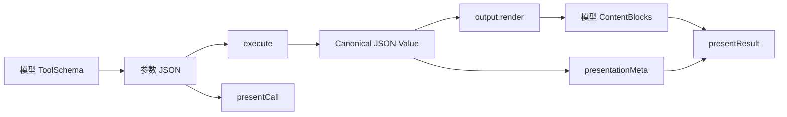
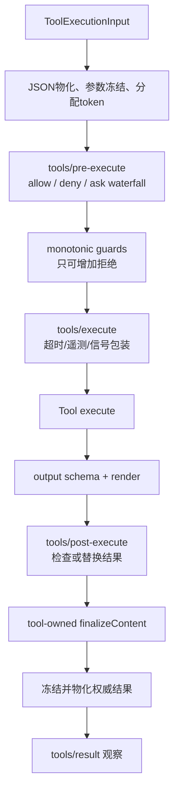
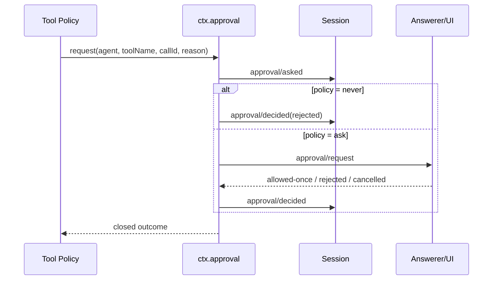

# 第 5 章　工具工程：从函数调用到受治理的行动接口

模型能否调用工具，决定 Agent 能否改变外部世界；工具是否被正确设计，决定一次模型错误会造成多大损害。一个 Demo 工具只需要名称、参数和 `execute()`，生产工具还必须处理作用域、审批、取消、超时、并发、幂等、结构化结果、模型内容、UI 展示和审计。

本章的核心观点是：**工具不是给模型的一段函数代码，而是 Agent 与 Environment 之间的一份受治理协议。**

## 学习目标

完成本章后，你应当能够：

1. 区分模型 schema、规范输出、模型可见内容和 UI presentation；
2. 设计语义清晰、参数受限且可组合的 Tool Definition；
3. 解释 DSH 从 pre-execute 到 result 的完整执行流水线；
4. 使用单调 guard、审批与沙箱建立 fail-closed 策略；
5. 正确处理取消、超时、重试、幂等和并行安全；
6. 为高风险企业工具建立测试矩阵和审计证据。

## 5.1 为什么“函数调用成功”不是工具成功

假设模型调用：

```json
{
  "name": "send_report",
  "arguments": {
    "recipient": "科室主任",
    "report_id": "R-1024"
  }
}
```

即使函数返回 200，还存在很多未回答的问题：

- “科室主任”映射到哪个真实身份？
- 当前用户是否有权发送这份报告？
- 报告是否包含患者敏感信息？
- 模型是否看过最终收件人和附件摘要？
- 网络超时后邮件究竟发出没有？
- 用户点两次重试会不会发送两封？
- UI 展示的是模型请求参数，还是业务系统最终采用的值？
- 会话恢复后能否关联外部发送记录？

工具完成必须同时满足四层契约：

```text
调用契约：参数合法且语义明确
策略契约：调用者、作用域和风险允许执行
执行契约：副作用达到确定终态或可查询状态
结果契约：模型、用户和审计看到一致且适量的证据
```

只实现第一层，Agent 仍然只是一个高风险自动化脚本。

## 5.2 Tool Definition 的四个视图

DSH 的工具定义可以拆成四个不同消费者看到的视图：

| 视图 | 消费者 | 包含内容 | 不应包含 |
|---|---|---|---|
| **ToolSchema** | 模型 | name、description、parameters | 执行回调、超时、内部策略 |
| **Canonical Value** | Harness/组合工具 | 经过 output schema 校验的 JSON 值 | UI 组件、任意类实例 |
| **ContentBlock[]** | 模型历史 | 从规范值渲染出的文本/结构内容 | 不受控巨量原始数据 |
| **Presentation** | UI/回放 | pending/completed 卡片意图与元数据 | 运行时对象和不可重放状态 |



### 5.2.1 一个类型化最小工具

```ts
import { defineTool } from '@deepseek-ai/dsh-tools'

export const greet = defineTool({
  name: 'greet',
  description: 'Greet one person after the user asks for a greeting.',
  parameters: {
    name: { type: 'string', required: true },
  },
  output: {
    schema: { type: 'string' },
    render: (_args, value) => [{ type: 'text', text: value }],
  },
  async execute(args) {
    return `Hello, ${args.name}!`
  },
})
```

`defineTool` 从同一份 schema 推导 TypeScript 参数，运行时仍会完整校验。类型推导防止作者写错代码，运行时校验防止模型或外部调用者发送非法 JSON；两者不能互相替代。

## 5.3 参数设计：为模型构建 ACI

传统 API 面向确定性程序员，Agent-Computer Interface（ACI）面向概率模型。模型会根据名称、描述、参数和历史示例决定是否调用，因此接口要减少歧义和错误自由度。

### 5.3.1 好参数表达业务意图

以智能问数为例：

```json
// 较好
{
  "metric_id": "reported_test_item_count",
  "time_range": {"start": "2026-01-01", "end": "2026-06-30"},
  "filters": {"patient_type": "outpatient"}
}
```

```json
// 高风险
{
  "sql": "SELECT ...",
  "database": "prod",
  "timeout": 0
}
```

第一种把模型限制在业务语义空间，确定性服务负责解析口径和编译 SQL；第二种让模型同时决定物理表、连接、成本和安全边界。

### 5.3.2 Schema 需要表达什么

- 必填与可选字段；
- 标量类型、枚举和常量；
- 数组元素与对象属性；
- 是否允许额外字段；
- `oneOf` 互斥形态；
- 输入大小和业务范围（必要时在执行前进一步校验）。

DSH 只接受其实际强制执行的 JSON Schema 子集；不支持的关键字会被拒绝，而不是“写在 schema 里但不生效”。这是一项重要安全原则：**声明的约束必须等于真实执行的约束。**

### 5.3.3 Description 应写决策边界

坏描述：“查询数据。”

较好描述应说明：

- 什么时候使用；
- 什么时候不要使用；
- 参数采用哪种业务 ID；
- 返回的是完整结果、候选还是摘要；
- 是否只读、是否需要确认；
- 常见失败如何解释。

但不要把强制权限规则只写进描述。Description 影响模型策略，不构成执行授权。

## 5.4 规范值、模型内容与 UI 展示为什么要分开

假设搜索工具得到：

```json
{
  "query": "DSH tool pipeline",
  "hits": [...],
  "total": 1032,
  "truncated": true,
  "artifact_id": "search-82"
}
```

规范值保留机器可组合字段；模型内容可以只呈现前 10 条、总数与 artifact 引用；UI 则渲染搜索卡片和“结果已截断”标记。若 `execute()` 直接返回一段漂亮 Markdown：

- 组合工具无法可靠读取 `total`；
- UI 只能重新解析文本；
- 截断状态可能被遗漏；
- 测试只能做脆弱字符串比较；
- 后续版本难以保持兼容。

### 5.4.1 `output.schema` 是成功值契约

工具函数返回值先通过 output schema。无效参数产生 `INVALID_ARGS`，函数或后置策略给出非法成功值产生 `INVALID_TOOL_OUTPUT`。一个返回 200 但结构不符合契约的 Provider 不能被包装成成功结果。

### 5.4.2 `render()` 必须是纯投影

`render(args,value)` 从已校验值生成模型 ContentBlocks，不应再次查询网络、读取当前时间或依赖可变全局状态。否则回放同一工具结果会产生不同模型内容。

### 5.4.3 Presentation 也是协议

`presentCall()` 和 `presentResult()` 可以表达 terminal、diff、search、read、web 或 generic 等展示意图。它们必须可从持久参数与结果重放。审批文件修改时，用户应看到准确 diff；结果被截断或部分失败时，UI 必须明确显示，不能把部分数据伪装成完整结果。

## 5.5 DSH 工具执行流水线

一次工具执行不是注册表中的直接函数调用：



### 5.5.1 输入物化与身份

注册表把调用参数跨一次无损 JSON 边界并深度冻结，分配不可伪造的执行 token。callId 用于会话和 UI 关联，rootCallId 关联嵌套调用树，parent token 标识组合/Code Mode 子分派。插件不应通过修改参数对象在策略之后偷换调用含义。

### 5.5.2 `tools/pre-execute`

这是可扩展策略 waterfall，可以根据工具、参数、Agent、会话和当前权限返回 allow、deny 或 ask。它适合组合通用策略，但监听器顺序可能影响可扩展决策，因此后面还有单调 guard 兜底。

### 5.5.3 Monotonic Guard

Guard 只能返回拒绝原因或 `undefined`，没有 allow 返回值。它在所有 pre-execute 监听器之后运行，任何 guard 的拒绝都不能被后续宽松插件改回允许。

这个设计适合所有者级硬边界，例如：

- 工作区路径越界；
- 只读会话尝试写操作；
- 租户不匹配；
- 计划哈希与审批不一致；
- 明确禁止的命令或资源。

### 5.5.4 `tools/execute`

这是环绕真实分派的 waterfall，适合超时、追踪、指标和熔断器。包装器可以为下游替换 signal，但不能移除调用方取消；注册表会融合原始 signal，防止中间件通过换信号绕过上游取消。

### 5.5.5 `tools/post-execute` 与 `finalizeContent`

post-execute 可以检查、阻断或替换执行结果，例如敏感字段脱敏和外部证据校验。`finalizeContent` 属于工具定义本身，是每种规范化结果最后一次模型内容投影机会，即使某些外层失败绕过 post 也会运行；它必须是 total function，不应抛错。

### 5.5.6 `tools/result`

最终观察者拿到冻结的权威结果，用于遥测和审计，不再拥有修改权。把审计放在 pre 阶段会记录“准备执行”，不等于“实际最终结果”；两者应分别统计。

## 5.6 策略要按风险与参数动态计算

仅按工具名分为“安全/危险”通常不够：

| 工具调用 | 风险可能变化的参数 |
|---|---|
| `read_file` | 路径、文件类型、大小、租户目录 |
| `shell` | 命令、cwd、网络、sandbox mode |
| `query_data` | 指标敏感级别、时间范围、预计扫描量 |
| `send_message` | 收件人、是否外部、附件、批量数量 |
| `update_record` | 对象状态、字段、版本、可逆性 |

一个实用风险函数可以考虑：

```text
risk = f(tool, normalized_args, user, tenant, agent_scope,
         environment, data_classification, reversibility, blast_radius)
```

它不一定由模型计算。参数归一化、目录边界、数据分类和权限匹配应尽量确定性完成；模型可以解释风险，但不能成为唯一裁决者。

### 5.6.1 五级策略示例

| 等级 | 示例 | 默认处置 |
|---|---|---|
| 低风险只读 | 读取公开小文件 | 自动允许，限制大小 |
| 敏感只读 | 查询患者明细 | 身份/用途校验、脱敏、审计 |
| 可逆写入 | 创建草稿或新分支 | 展示差异，允许撤销 |
| 外部影响 | 发消息、提交工单、付款 | 一次性审批、幂等、限额 |
| 高危不可逆 | 删除生产数据、修改权限 | 默认拒绝或独立人工流程 |

## 5.7 审批：一项有日志边界的决策，不是弹窗

DSH 审批服务把一次询问关联到具体 Agent、工具名和 callId，并在开放 turn 内记录 `approval/asked` 与 `approval/decided`。可能结果包括允许一次、拒绝、取消和不可用。

### 5.7.1 Fail-closed 行为

会话策略为 `ask` 时，问题交给应答者链；没有应答者、应答者抛错或返回非法值时，结果是 unavailable，而不是默认允许。策略为 `never` 时，在应答者 waterfall 之前确定性拒绝，即使某个 prepend 插件也不能绕过。



审批审计事件本身不直接进入模型 transcript；模型通过工具结果和当前权限上下文理解决策。

### 5.7.2 审批必须绑定什么

对企业操作，通用“同意继续”不够。审批凭证至少应绑定：

- user 与 tenant；
- conversation/session；
- tool 与规范化参数摘要；
- plan hash 或资源版本；
- 风险说明与预览；
- 有效期；
- 一次性消费状态。

用户批准 A 计划后参数变化，旧审批必须失效。允许一次不能被缓存成永久 allow。

## 5.8 沙箱：权限边界必须由执行环境强制

Prompt 中“只能写工作区”不是安全边界。DSH 的 sandbox seam 为进程 argv 应用逐调用文件效果策略：

| 模式 | 文件效果 |
|---|---|
| `read-only` | 拒绝写入，只开放运行所需最小 sink |
| `workspace-write` | 允许工作区与后端承诺的临时区域写入 |
| `danger-full-access` | 绕过隔离，必须被显式视为提权 |

网络和进程可见性不属于这组模式的承诺，不能看到 `read-only` 就推断“无法联网”。沙箱能力应按文件、网络、进程、系统调用和密钥分别描述。

### 5.8.1 Full 与 Partial Enforcement

Provider 会报告 `full` 或 `partial`。partial 表示平台或内核无法管控承诺的全部文件效果；要求强隔离的产品必须拒绝或显著上报，不能把“尽力限制”展示成安全保证。

### 5.8.2 Runner Failure 与 Policy Denial

命令失败有两种完全不同的含义：

- sandbox runner 自己未能启动，命令根本没有执行；
- sandbox 正常工作，并拒绝命令的越界效果。

Provider 返回后端特定诊断规则，Consumer 结合退出码和 stderr 分类。只看非零退出码会把基础设施故障误报成“安全策略成功阻断”。受限模式找不到可用后端时必须 fail closed，禁止静默无隔离透传。

## 5.9 取消、超时与静止

工具 `execute(args, exec)` 必须观察或转发 `exec.signal`，并且 Promise 只在自己拥有的工作达到 quiescence 后 settle。注册表不会因为超时就放弃同进程 Promise；它只能发出取消并等待协作结束。

### 5.9.1 超时不是后台继续许可

如果工具超时后仍在后台写数据库，Agent 可能收到错误并重试，造成双重副作用。正确实现需要：

- 传递取消到数据库/HTTP/子进程；
- 若无法取消，返回可查询 operation ID；
- 重试前查询既有状态；
- 明确区分“请求超时”和“业务操作失败”；
- 在关闭资源前等待在途动作收敛。

### 5.9.2 谁拥有 Timeout

工具定义的 `timeoutMs` 是宿主调度元数据，不发送给模型。超时 policy 通过 `tools/execute` 包装执行。业务 API 自身可能有更短超时，两者要分别记录：Harness 超时说明等待预算耗尽，Provider 超时说明下游契约失败。

## 5.10 重试与幂等

可以安全自动重试的通常是：

- 在发送前明确失败；
- 只读、无外部副作用且成本可控；
- 带幂等键且 Provider 保证同键不重复执行；
- 可通过 operation ID 查询并续接。

不应自动重试：权限拒绝、参数非法、业务冲突、未知终态的非幂等写入，以及已经达到资源上限的高成本查询。

### 5.10.1 幂等键应由谁产生

随机重试一次就生成新键会失去幂等意义。键应与一次业务意图或批准计划稳定绑定，例如：

```text
idempotency_key = hash(tenant, user, operation_type,
                       normalized_payload, approval_id)
```

同时要防止不同合法操作因键过粗被误合并。Provider 保存键、请求摘要、最终状态和版本，Agent 只消费结果。

## 5.11 并行安全：只有明确 `true` 才能重叠

工具可以通过纯同步分类器声明某组参数并行安全。省略、抛错或返回非 `true` 都按 exclusive 处理。

可并行工具必须满足：

- 不修改父级共享状态；
- 共享资源支持并发或结果可交换；
- 取消一个调用不会错误终止兄弟调用；
- 记录器竞争要么可交换，要么 fail closed；
- 输出顺序由调度器恢复，不依赖完成时间。

“都是 GET 请求”并不自动安全：下游可能有速率限制、共享游标或非线程安全客户端。应从资源语义验证，而不是从 HTTP 方法猜测。

## 5.12 组合工具、延迟上下文与 Turn 终结

组合工具可能在一次外层执行中分派多个原生工具。`deferContext()` 把子调用产生的模型上下文附着到外层最终结果，避免外层尚未结束时向 Agent Loop 注入半成品；`concludeTurn()` 只能由成功权威结果标记当前 turn 终结，并通过组合层显式传播。

这解决两个问题：

1. 嵌套工具的上下文与外层工具结果保持提交顺序；
2. 任意失败或中间调用不能假冒“任务已经完成”。

Code Mode 还使用 parent token 区分模型直接调用与代码内部子分派，在配置为 code transport 时阻止模型绕过外层直接调用原生工具。

## 5.13 工具测试的四层金字塔

### 第一层：Schema 与纯投影

- 有效/无效参数；
- output schema；
- render、presentation 在同输入上确定；
- 大值、空值、Unicode 和边界长度。

### 第二层：执行与策略

- allow、deny、ask 和多个 guard；
- 缺少审批应答者时 fail closed；
- signal 取消与 timeout；
- Provider 错误归类；
- post-execute 脱敏和非法输出阻断。

### 第三层：Loop/Session 集成

- tool/call 与 result 配对；
- 模型看到的 content 与 UI presentation 一致；
- 并行完成乱序但持久顺序稳定；
- 恢复与 replay 不重新执行副作用。

### 第四层：真实环境契约

- 沙箱越界被真实拒绝；
- 数据库只读、成本与行列权限；
- 幂等重试；
- API 超时后的 operation 查询；
- 审计日志与业务系统对账。

真实模型不应承担前两层测试。确定性策略用确定性测试，模型测试用于验证“是否会在正确时机选择工具”。

## 5.14 常见失败模式

| 表象 | 根因 | 首先检查 |
|---|---|---|
| 模型经常选错工具 | 命名/描述重叠、参数过于通用 | schemas、轨迹中的候选工具 |
| 参数看似合法却执行业务错误 | schema 只有类型，没有语义归一化 | 规范参数、领域校验 |
| 策略插件顺序变化后越权 | allow 可覆盖 deny，缺少单调 guard | pre-execute 链与 guard |
| Headless 中 ask 自动通过 | 审批没有 fail closed | approval outcome 应为 unavailable/rejected |
| UI 展示成功但模型收到错误 | presentation 与权威结果使用不同来源 | frozen result、presentResult |
| 超时后出现重复写入 | 下游未取消、重试无幂等 | operation ID、时间线 |
| 沙箱受限命令仍在宿主执行 | Provider unavailable 时静默透传 | enforcement、runner failure |
| 并行调用造成随机结果 | 错误声明 concurrency safe | 共享资源和模型顺序日志 |
| 工具结果撑爆上下文 | render 无截断/引用策略 | canonical value、spill、ContentBlocks |
| 回放页面时展示变化 | presentation 读取当前外部状态 | 纯投影依赖检查 |

## 源码路标

以下链接固定到提交 `47f943859bef60e4160492346772ded9b24f765a`：

- [Tools 子系统：ToolDefinition、schema、限制和执行类型](https://github.com/deepseek-ai/deepseek-harness/blob/47f943859bef60e4160492346772ded9b24f765a/docs/subsystems/tools.md)
- [完整工具执行流水线](https://github.com/deepseek-ai/deepseek-harness/blob/47f943859bef60e4160492346772ded9b24f765a/docs/tool-execution-pipeline.md)
- [`tools/src/index.ts`：注册、执行与策略主线](https://github.com/deepseek-ai/deepseek-harness/blob/47f943859bef60e4160492346772ded9b24f765a/packages/core/tools/src/index.ts)
- [`tools/src/schema.ts`：统一 JSON schema DSL](https://github.com/deepseek-ai/deepseek-harness/blob/47f943859bef60e4160492346772ded9b24f765a/packages/core/tools/src/schema.ts)
- [`tools/src/presentation.ts`：UI 展示词汇](https://github.com/deepseek-ai/deepseek-harness/blob/47f943859bef60e4160492346772ded9b24f765a/packages/core/tools/src/presentation.ts)
- [用户审批：策略、请求和审计事件](https://github.com/deepseek-ai/deepseek-harness/blob/47f943859bef60e4160492346772ded9b24f765a/docs/subsystems/approval.md)
- [权限预设](https://github.com/deepseek-ai/deepseek-harness/blob/47f943859bef60e4160492346772ded9b24f765a/docs/subsystems/permission-presets.md)
- [进程沙箱：逐调用策略与强制执行](https://github.com/deepseek-ai/deepseek-harness/blob/47f943859bef60e4160492346772ded9b24f765a/docs/subsystems/sandbox.md)
- [官方工具开发教程](https://github.com/deepseek-ai/deepseek-harness/blob/47f943859bef60e4160492346772ded9b24f765a/docs/user/develop/basic/tool.md)

## 配套实验

先完成 [Lab 02：可配置问候工具](../labs/index.md#lab-02)，验证 schema、规范值、ContentBlock、HMR 和 disposal。随后完成 [Lab 04：受控 Data Agent](../labs/index.md#lab-04)，重点比较：

- 任意 SQL 工具与 QuerySpec 工具的错误空间；
- 只读账号与业务权限的差异；
- 计划变化后旧审批是否失效；
- 同一审批能否被重复消费；
- 结果是否包含口径、数据新鲜度与限制。

## 本章小结

工具工程有四个视图：给模型的 schema、给系统的规范 JSON 值、给下一步模型的 ContentBlocks，以及给 UI 的可重放 presentation。把它们混成一段文本，会失去组合、验证和审计能力。

DSH 工具流水线先物化身份和参数，再经过可扩展 pre 策略、不可放宽的单调 guard、执行包装、输出验证、post 检查、最终内容投影和只读结果观察。审批是一项 fail-closed 且成对记录的决策；沙箱必须由 Provider 实际强制，并区分 partial enforcement、runner failure 和真实 policy denial。

取消、超时、重试和并行都需要工具作者承担契约。一个成熟工具的完成标准不是 Promise resolve，而是副作用达到可证明终态、结果通过 schema、策略证据闭合、模型与用户看到一致含义。

## 思考题

1. ★ 为什么工具规范值不应直接等于一段给模型看的 Markdown？
2. ★★ 只读数据库账号为什么仍不能替代指标口径、行列权限和成本限制？
3. ★★ pre-execute 已经可以 deny，为什么还需要没有 allow 返回值的 monotonic guard？
4. ★★★ 一个审批凭证应绑定哪些字段，才能防止“批准 A、执行 B”？
5. ★★ `read-only` sandbox 为什么不能推导出“该进程无法联网”？
6. ★★★ 工具超时但下游不支持取消时，怎样避免自动重试造成双重副作用？
7. ★★ 什么样的工具结果适合并行，为什么“无写操作”仍不足以证明安全？
8. ★★★ 设计一个搜索工具的 canonical value、模型 render 与 UI presentation，并说明截断证据放在哪里。
9. ★★ 为什么回放时 `presentResult()` 不能再次读取外部系统当前状态？
10. ★★★ 一个组合工具如何安全传播子调用的延迟上下文与 `concludeTurn`？

## 求职面试题

### 基础题

解释 ToolSchema、Canonical Value、ContentBlock 和 Presentation 的区别，并说明每层如何测试。

### 安全题

为“发送企业微信患者随访通知”设计参数、动态风险、审批绑定、敏感数据处理、幂等、取消、重试、审计和 UI 预览。

### 架构题

设计一个可在本机与远程沙箱执行 Shell 的工具体系。要求说明 Provider seam、逐调用 sandbox policy、partial enforcement、并行分类、取消传播和失败归因。
