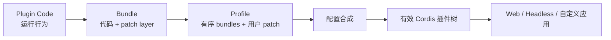
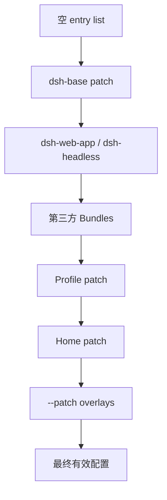

# 第 6 章　Plugin、Bundle 与 Profile：把运行能力变成可交付产品

一个本地插件能通过绝对路径加载，并不意味着它已经可以交付给别人。用户还需要知道安装哪些依赖、启用哪些配置行、怎样覆盖默认值、凭据放在哪里、升级失败如何回滚，以及 Web 与 Headless 为什么能共享同一基础能力。

DSH 用 Plugin、Bundle 和 Profile 分别表达运行行为、分发组合和具体装配。本章讨论的不是“怎样打一个 npm 包”这么简单，而是**怎样让一棵插件树具有可重复安装、可解释覆盖和可撤销升级的产品边界。**

## 学习目标

完成本章后，你应当能够：

1. 区分 Plugin、Bundle、Profile、Surface Bundle 与普通依赖包；
2. 按真实顺序解释配置层怎样合成为最终插件树；
3. 说明 row id、整行 config 替换、`!!js` 与 HMR 的风险；
4. 为插件配置设计类型、schema、默认值与 fail-loud 启动行为；
5. 比较 npm、tarball、Git 和内部镜像四种交付信任模型；
6. 设计企业插件准入、升级、灰度、回滚和退出流程。

## 6.1 三个名字回答三个不同问题

| 概念 | 回答的问题 | 存在位置 | 谁主要维护 |
|---|---|---|---|
| **Plugin** | 运行时做什么？ | JS/TS 模块及其 `apply(ctx)` | 插件作者 |
| **Bundle** | 安装后贡献哪些配置层？ | npm 包 + `dsh.bundle` manifest + patch | 能力/产品组合作者 |
| **Profile** | 这台机器以什么组合启动？ | `$DSH_HOME/profiles/<name>` | 使用者或部署系统 |

Bundle 是作者分发的东西，Profile 是用户启动的东西；一个 manifest 不能同时既声明 Bundle 又声明 Profile。普通库包即使被安装，也不会自动成为配置层，除非声明 `dsh.bundle`。



### 6.1.1 Surface Bundle

`dsh-web-app` 和 `dsh-headless` 都叠加在 `dsh-base` 之上。Base 提供模型、工具、持久化、沙箱、审批、settings、credentials 与宿主级 Subagent Provider；Surface Bundle 再加入 Web Server、API Gateway、客户端模块或一次性运行器。

这说明 Web 与 Headless 不是两套 Harness，而是**同一基础组合的两个上层产品面**。

## 6.2 一个 Bundle 的最小结构

```text
dsh-example-plugin/
├── package.json
├── cordis.patch.yml
└── index.js
```

```json
{
  "name": "dsh-example-plugin",
  "version": "0.1.0",
  "type": "module",
  "main": "index.js",
  "files": ["index.js", "cordis.patch.yml"],
  "dsh": {
    "bundle": {
      "patch": "./cordis.patch.yml"
    }
  }
}
```

patch 按包名引用插件，使 Node 能从 Profile 安装依赖中解析：

```yaml
- insert:
    - id: example-main
      name: dsh-example-plugin
      config:
        timeoutMs: 30000
```

Bundle 不需要运行时 API；Profile 组合器读取 manifest 中的 patch 路径。代码包负责行为，manifest 和 patch 负责“怎样进入树”。

## 6.3 Profile 是用户拥有的部署装配

Profile 目录包含：

```text
$DSH_HOME/profiles/demo/
├── package.json       # dependencies + dsh.profile.bundles
└── cordis.patch.yml   # 用户自己的覆盖层
```

Profile manifest 的 `bundles` 是有序列表。安装 Bundle 时，`dsh plugin --profile demo add ...` 同时修改依赖和列表；移除则应同时撤销二者。

### 6.3.1 为什么用户覆盖不能修改 Bundle 原文件

直接改 `node_modules` 或第三方 Bundle patch 会产生不可追踪的本地分叉：重新安装后修改消失，升级时无法区分上游变化与用户意图。Profile patch 把本地选择放在更高层，同时保留 Bundle 原始制品。

这与容器镜像和 Kubernetes overlay 的思想相似：基础制品不可变，环境差异在外层声明。

## 6.4 配置合成的权威顺序

有效配置从空列表开始，按以下顺序应用：

```text
1. Profile bundles（manifest 顺序）
2. Profile cordis.patch.yml
3. Harness Home cordis.patch.yml
4. 命令行 --patch overlays（argv 顺序）
```

后应用层按 row id 胜出：



诊断时不要从某个单独 patch 猜结果。权威检查是：

```bash
dsh --profile web --dump-config
```

配置 dump 使用与启动相同的解析与 patch 算法，并为连续配置行标注来源层。它不仅是调试输出，也是部署审查和升级 diff 的基础产物。

### 6.4.1 Patch 替换整个 `config`

按 id 覆盖配置行时，目标行的整个 `config` 被替换，不做深度合并：

```yaml
# Bundle 原配置
config:
  timeoutMs: 30000
  retries: 3
  mode: safe

# 用户若只写
config:
  timeoutMs: 60000

# 生效结果不会自动保留 retries 与 mode
```

这条规则简单、确定，却带来升级风险：上游新增字段后，旧用户覆盖仍会遮蔽它。Bundle 作者应让 schema 提供合理默认值；用户与运维则要在升级时 diff 有效配置，而不是只 diff 自己的 patch。

### 6.4.2 Row ID 是配置身份

稳定 id 让 Loader 知道某行是修改、禁用还是替换，而不是删除旧实例后新增无关实例。ID 改名属于配置迁移，不只是美化；它可能让用户覆盖失配并产生“patch 未命中”警告。

## 6.5 Config：类型只服务作者，Schema 才约束部署

插件应导出同名 `Config` 类型和 Standard Schema 实例：

```ts
import Schema from '@deepseek-ai/schemastery'

export interface Config {
  endpoint: string
  timeoutMs: number
  mode: 'safe' | 'fast'
}

export const Config: Schema<Config> = Schema.object({
  endpoint: Schema.string().required(),
  timeoutMs: Schema.number().default(30_000),
  mode: Schema.union(['safe', 'fast']).default('safe'),
})
```

TypeScript 接口不会在用户写 YAML 时运行；schema 才负责加载期验证和默认值。把普通对象导出为 `Config` 不满足 Cordis 的 Standard Schema 契约。

### 6.5.1 哪些字段必须配置化

凡不同部署可能合理选择不同值的参数都应配置化：端点、超时、限额、开关、并发、路径和策略。算法内部常量不必全部暴露，否则用户会面对一张无法理解的控制面板。

判断标准是：

> 改变这个值是部署决策，还是实现细节？错误设置时能否在加载阶段给出明确错误？

### 6.5.2 默认值也是产品决策

默认值必须安全、可迁移且在文档中说明。高风险能力不应默认开启；无限超时、无限并发和全盘写权限都不是“省配置”的好默认值。

## 6.6 `!!js` 动态表达式：强大但扩大配置攻击面

Loader 可以在注入上下文中计算 `config` 和 `disabled` 表达式，例如按平台只加载 Bash 或 PowerShell 栈。它解决了同一 Bundle 在不同主机的条件装配，但也意味着配置不是纯数据。

需要明确：

- 表达式在宿主启动上下文中执行，不受 Agent 工具沙箱保护；
- 配置来源应视为代码级信任，而不是普通用户输入；
- 复杂业务逻辑不应塞进 YAML 表达式；
- 动态值应记录来源或在 dump 中保持可解释；
- 凭据不应通过表达式拼进可打印配置。

在企业环境，能修改 Profile/Bundle patch 的角色应等同于能部署代码的角色。

## 6.7 环境变量、Settings 与 Credentials 的所有权

DSH 产品 CLI 按优先级构建环境快照：继承环境高于项目 `.env`，项目 `.env` 高于 Harness Home `.env`。受管凭据另存于 credentials 服务；`.env` 中的密钥只是较低优先级后备来源。

### 6.7.1 为什么不能把所有配置都放环境变量

环境变量适合启动期、进程级和平台注入值；不适合表达复杂的每 Profile 插件树，也不利于 schema、层来源和 HMR。相反，API Key 不应硬编码进公开 patch。可以按下表分工：

| 信息 | 推荐位置 |
|---|---|
| 插件启用、Provider 选择、限额默认值 | Bundle/Profile patch |
| 用户界面偏好 | Settings seam |
| API Key、Token、密码 | Credentials/Secret Manager |
| 启动引导路径与进程级开关 | 受控环境变量 |
| 业务语义和权限规则 | 版本化领域服务 |

### 6.7.2 配置 Dump 必须脱敏

有效配置用于诊断和审查，但不能因此包含明文凭据。插件应保存凭据引用或 provider 名称，在执行时通过 credentials service 解析。日志只记录引用、版本或结果状态。

## 6.8 启动失败必须 Fail Loud

依赖驱动加载允许 Fiber 保持 PENDING，但一个产品 Profile 启动完成时，不应悄悄带着必需插件未激活继续服务。App Boot 提供两类检查：

- enabled entry 没有 Fiber：报告模块解析或装载问题；
- Fiber FAILED/PENDING：报告原始错误栈或尚缺的服务。

`boot()` 在部分构造失败时先 dispose 根 Context，再抛出带应用前缀的错误。这一点对 TUI/Web 同样重要：界面可能已经占用端口或修改终端模式，直接 `process.exit` 会留下损坏状态。

```text
创建 Root Context
→ 安装 Loader
→ 并发挂载配置行
→ 等待树结算
→ 审计 loaded / activated
→ 成功返回 Root

任一步失败：dispose 部分树 → 等待有界清理 → exit(1)
```

“部分功能还能用”并不总是比启动失败更友好。若缺失的是沙箱、审批或持久化，继续运行会产生错误安全假设。产品应区分可选插件和安全关键插件。

## 6.9 HMR 与最后一个可用树

Profile 和 Home patch 可以被监视。文件变化后重新组合完整层列表，再事务式更新 Loader；读取、解析或候选加载失败时，最后一个可用树继续运行，并广播配置更新失败。

这比先卸载全部旧树、再发现新配置有错更安全。但仍需注意：

- 外部资源的 effect 必须可回卷；
- 配置变化可能改变模型 Prompt 和工具 schema，影响在途任务；
- 安全策略变更是否立即影响活动调用，需要单独定义；
- HMR 成功不代表持久会话与新工具集兼容；
- 生产变更应保留有效配置 diff 与操作者审计。

对于高风险 Provider，推荐在新会话启用新组合，旧会话排空后退出，而不是在长 turn 中无差别热换。

## 6.10 四种交付方式的信任模型

| 方式 | 用户得到什么 | 安装期执行 | 可复现关键点 | 适合场景 |
|---|---|---:|---|---|
| npm registry | 预构建发布包 | 通常无需源码构建 | 版本、integrity、lockfile | 公共稳定发行 |
| tarball | 固定预构建制品 | 无需构建权限 | 文件 hash、签名 | 离线/内部交付 |
| Git dependency | 源码 checkout | 常需 `prepare` | 固定 commit SHA | 试验或源码审查后安装 |
| 内部镜像/制品库 | 经组织重建的包 | 在隔离 CI 构建 | provenance、SBOM、签名 | 企业生产 |

### 6.10.1 Git 安装的 `prepare` 风险

Git 拉取通常没有构建产物，TypeScript 包需要 `prepare`。pnpm 10+ 要求用户显式允许该依赖执行构建脚本。这项授权发生在 Agent 运行沙箱之外，等同于允许第三方代码在安装机执行。

因此至少要：

- 固定 `github:owner/repo#<full-sha>`；
- 审查源码与 `prepare` 脚本；
- 在隔离构建节点运行；
- 禁止构建环境访问生产凭据；
- 保存 lockfile、日志与产物 hash；
- 将批准制品提升到内部镜像，而不是每台生产机重新从 Git 构建。

### 6.10.2 “版本号固定”仍可能不够

可变 registry tag、被重发的制品、未锁定间接依赖和安装脚本网络下载都会破坏复现。生产证据应包含：

```text
源仓库 + commit
→ 构建环境与 lockfile
→ 依赖完整性
→ 制品 hash / 签名
→ 有效配置 dump
→ 运行镜像 digest
```

## 6.11 Bundle 的兼容性契约

一个 Bundle 的兼容性不只看 `peerDependencies`。升级可能改变：

- row id，导致用户 patch 不再命中；
- config schema/default，导致旧覆盖失效；
- 服务键或事件语义；
- 工具名称、参数和输出；
- SessionEvent 格式与投影版本；
- Prompt 内容，改变模型行为与 KV Cache；
- 权限、沙箱和凭据默认值。

建议 Bundle 维护兼容性声明：

```yaml
dshRange: ">=0.1.0-rc.5 <0.2"
configVersion: 2
sessionFormats: [1]
tools:
  - name: query_metric
    schemaVersion: 3
```

这是工程建议，不代表 DSH 当前要求相同 manifest。目的在于让部署系统有机器可读的升级门禁。

## 6.12 企业升级与回滚流程


回滚不是 `npm install old-version` 一条命令。若新版本已写入新 SessionEvent、迁移数据库或改变外部状态，旧版本可能无法读取。升级前要明确前向/后向兼容、数据备份和不可逆点。

### 6.12.1 Profile 快照

每次发布建议保存：

- Profile `package.json`；
- lockfile 和允许的构建脚本；
- Profile/Home/CLI overlays；
- `--dump-config` 结果；
- 密钥引用版本（非明文）；
- DSH 与 Bundle 版本/commit；
- 运行镜像 digest。

发生事故时，只有源 patch 没有最终配置，往往无法解释当时究竟加载了什么。

## 6.13 常见失败模式

| 表象 | 根因 | 首先检查 |
|---|---|---|
| 包安装成功但能力没出现 | 普通依赖无 `dsh.bundle`、Bundle 未进入列表 | Profile manifest、dump layer |
| 用户只改一个字段后其他配置消失 | 误以为 patch 深度合并 | 最终 config 与 schema 默认 |
| 升级后用户覆盖不再生效 | row id 改名或 Bundle 重排 | patch 未命中警告、配置 diff |
| 插件在源码仓库可用，Git 安装后加载失败 | 没有预构建产物或 `prepare` 未获授权 | 包内容、pnpm allowBuilds |
| Web 宣布 URL 后立即失效 | 兄弟插件加载失败，过早打印 ready | App Boot 树结算顺序 |
| 配置写错却服务部分启动 | 未执行 activation audit | PENDING/FAILED fibers |
| HMR 失败后服务消失 | 更新不是事务式或旧树先被拆除 | last-known-good 行为 |
| 配置 dump 泄露密钥 | 凭据写入 patch/表达式 | credentials 引用与日志 |
| 回滚旧版本打不开会话 | 新格式/事件无回退路径 | session format 与迁移策略 |
| 同名 Provider 重复注册 | Profile 同时启用互斥栈 | 有效配置与 isolate |

## 源码路标

以下链接固定到提交 `47f943859bef60e4160492346772ded9b24f765a`：

- [插件配置：Config 类型、Schema 与 HMR](https://github.com/deepseek-ai/deepseek-harness/blob/47f943859bef60e4160492346772ded9b24f765a/docs/user/develop/basic/config.md)
- [Bundle/Profile manifest、安装和层顺序](https://github.com/deepseek-ai/deepseek-harness/blob/47f943859bef60e4160492346772ded9b24f765a/docs/user/develop/basic/publish.md)
- [App Boot：配置装载、Profile 与 fail-loud](https://github.com/deepseek-ai/deepseek-harness/blob/47f943859bef60e4160492346772ded9b24f765a/packages/boot/app-boot/README.md)
- [`dsh-base/cordis.patch.yml`：基础组合实例](https://github.com/deepseek-ai/deepseek-harness/blob/47f943859bef60e4160492346772ded9b24f765a/packages/bundle/base/cordis.patch.yml)
- [`dsh-web-app/cordis.patch.yml`：Web Surface 覆盖实例](https://github.com/deepseek-ai/deepseek-harness/blob/47f943859bef60e4160492346772ded9b24f765a/packages/bundle/web-app/cordis.patch.yml)
- [`dsh-headless/cordis.patch.yml`：Headless Surface 实例](https://github.com/deepseek-ai/deepseek-harness/blob/47f943859bef60e4160492346772ded9b24f765a/packages/bundle/headless/cordis.patch.yml)
- [Cordis 组合与 HMR](https://github.com/deepseek-ai/deepseek-harness/blob/47f943859bef60e4160492346772ded9b24f765a/docs/cordis-tutorial/06-composition-and-hmr.md)
- [配置目录：锁定版本所有插件行字段](https://github.com/deepseek-ai/deepseek-harness/blob/47f943859bef60e4160492346772ded9b24f765a/docs/config-catalog.md)

## 配套实验

将 [Lab 02：可配置问候工具](../labs/index.md#lab-02) 从本地 overlay 推进到完整 Bundle：

1. 为 `greeting`、语言和最大长度提供 schema 与安全默认值；
2. 使用稳定 row id 和 `dsh.bundle` manifest；
3. 安装进独立测试 Profile，保存 lockfile 与 `--dump-config`；
4. 用 Profile patch 覆盖一个字段，观察整行 config 替换；
5. 修改非法配置，验证启动 fail loud 且旧 HMR 树继续运行；
6. 移除 Bundle，验证依赖、配置层、工具和监听器全部消失；
7. 生成 tarball，比较 Git 安装与预构建制品的权限差异。

## 本章小结

Plugin 描述运行行为，Bundle 交付一层可安装组合，Profile 保存某台机器或部署实际启动的有序装配。三者分离后，作者可以发布默认能力，用户可以在不修改制品的情况下覆盖配置，Surface Bundle 可以共享同一 Base。

配置层按确定顺序应用，按 row id 覆盖，目标 `config` 整体替换。有效配置 dump 比任何单个 patch 更接近运行真相。Schema 负责加载期校验，HMR 依赖可逆生命周期，App Boot 则应在安全关键插件未激活时 fail loud。

从 Git 安装意味着允许第三方源码在 Agent 沙箱之外构建。生产交付需要固定源码、隔离构建、SBOM、签名制品、Profile 快照、契约回放和可执行回滚，而不是只相信包名与版本号。

## 思考题

1. ★ 为什么 Bundle 与 Profile 不能合并成一个概念？
2. ★★ patch 整体替换 config 相比深度合并有什么优点和升级代价？
3. ★★ Row ID 改名为什么属于破坏性配置变化？
4. ★★★ `!!js` 表达式为什么应被视为代码级信任？企业中谁可以修改它？
5. ★★ 哪些值适合 Profile patch，哪些适合 Credentials，哪些必须放领域服务？
6. ★★★ HMR 更新失败时保留最后可用树，会带来哪些“新配置未生效但旧服务仍运行”的运营风险？
7. ★★ Git `prepare` 与 Agent 内 Shell 工具在安全边界上有什么根本差异？
8. ★★★ 如果新 Bundle 写入旧版本无法识别的 SessionEvent，回滚方案应怎样设计？
9. ★★ 为什么发布审查需要保存 `--dump-config`，仅保存 Profile patch 不够？
10. ★★★ 如何让同一企业 Bundle 同时适配 Web、Headless 与不同医院，而不复制三套代码？

## 求职面试题

### 基础题

用一个工具插件说明 Plugin、Bundle 和 Profile 各自包含什么，以及安装和移除分别改变哪些文件。

### 故障题

一个插件 npm 安装成功，但 Profile 中看不到工具；另一个插件升级后丢失两个配置字段。请给出完整排查过程。

### 系统设计题

设计企业内部 DSH 插件制品与 Profile 发布平台，覆盖源码准入、隔离构建、签名、配置 diff、灰度新会话、会话兼容、回滚和淘汰。
