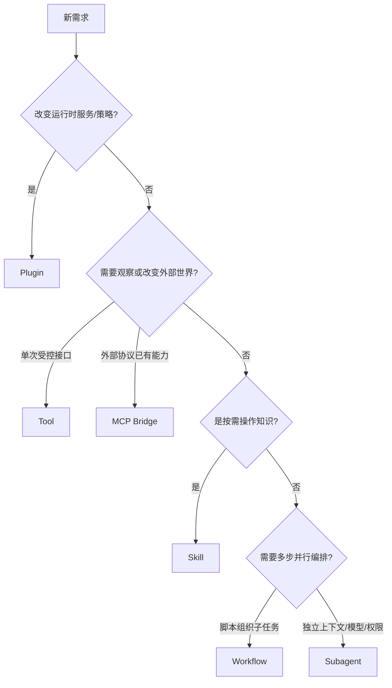
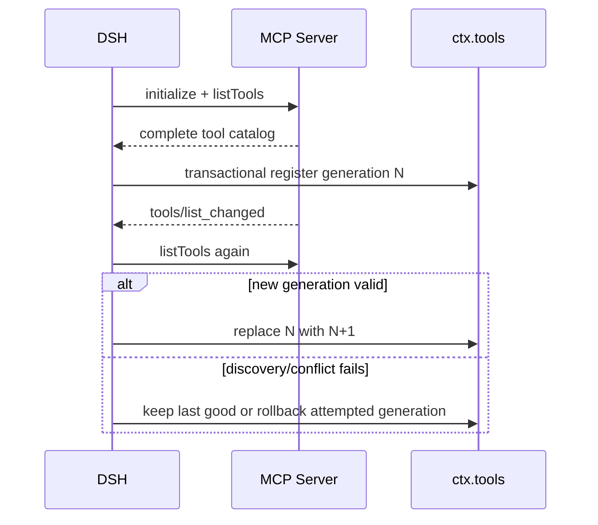
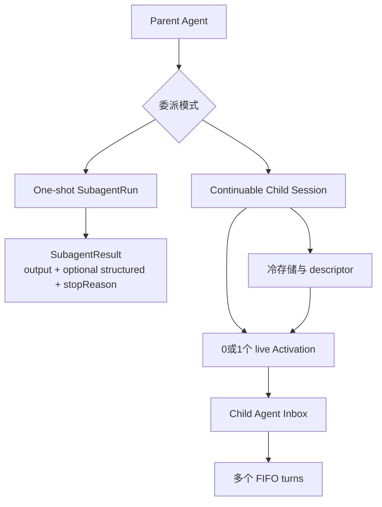

# 第 7 章　扩展机制：Skill、MCP、Workflow 与 Subagent 的边界

DSH 提供多种扩展方式。面对“让 Agent 理解医院指标口径”这样的需求，有人会写 Plugin，有人会创建 Skill，有人会接 MCP Server，也有人会委派 Subagent。它们都可能跑通演示，却把完全不同的生命周期、安全边界和正确性责任混在了一起。

本章不把扩展机制当功能清单，而是围绕一个选择问题展开：**这项能力究竟是运行时行为、按需知识、跨进程接口、多步编排，还是独立的 Agent 工作？**

## 学习目标

完成本章后，你应当能够：

1. 区分 Plugin、Tool、Skill、MCP、Workflow 与 Subagent 的责任；
2. 解释 Skill 的渐进式披露、来源优先级和调用策略；
3. 评估 MCP 工具发现、命名、重连与供应链边界；
4. 理解 DSH Workflow 是隔离运行的动态编排脚本，而不是普通业务 BPM；
5. 区分一次性 Subagent 与可继续子 Agent，以及 spawn、fork、远程 Provider 的语义；
6. 为企业知识层、语义层和确定性流程选择最小合适机制。

## 7.1 六种机制解决六类问题

| 机制 | 核心职责 | 生命周期 | 模型是否直接选择 | 强制性 |
|---|---|---|---:|---:|
| **Plugin** | 改变 DSH 运行时服务、策略、UI 或组合 | 随 Fiber/Scope | 间接 | 可以强制 |
| **Tool** | 给模型一个受治理的观察/行动接口 | 每次调用 | 是 | 执行边界可强制 |
| **Skill** | 按需加载操作知识、SOP 和资源说明 | 发现目录 + 单次加载 | 通常是 | 不能保证调用 |
| **MCP** | 跨进程/网络桥接外部工具 | 连接世代 | 是 | 取决于本地策略与远端 |
| **Workflow** | 用隔离脚本组织多次 Subagent 调用 | 单次 WorkflowRun | 模型可生成/启动 | 引擎限制可强制 |
| **Subagent** | 将独立工作委派给另一个 Agent 上下文 | one-shot 或可继续会话 | 是/由编排器决定 | 受 Provider 与作用域约束 |



这棵树是初筛，不是互斥规则。一个成熟能力经常组合多种机制，但每层责任仍要清楚。

## 7.2 Skill：把“怎样做”按需交给模型

如果每个 SOP、领域说明和脚本用法都放进系统 Prompt，skill 数量增长会让每次请求重复承担大量 token，模型也更难在一堆无关指令中找到当前规则。Skill 采用渐进式披露：

```text
会话先看到：name + description 的简短目录
  → 模型判断某 Skill 相关
  → 调用 skill({name})
  → 加载完整 SKILL.md
  → 仅按明确引用继续读取 scripts/references/assets
```

### 7.2.1 Skill 目录也是模型上下文

`dsh-tool-skill` 在第一次得到非空、完整目录时，把名称和描述作为持久 user-role reminder 注入 Session。后续目录 digest 改变时追加完整替换；若发现暂时不完整，则保留上一份可信目录，不把瞬时 Provider 故障误解为“所有 Skill 都被删除”。

这遵循第 4 章的不变量：模型曾经看到的 Skill 目录必须可回放。当前文件系统里有哪些 Skill，不能直接替换历史请求中模型当时看到的目录。

### 7.2.2 来源、作用域与重名优先级

锁定版本的本地 Provider 按 rank 扫描：

| Rank（小者优先） | 来源 | 典型路径 |
|---:|---|---|
| 100 | project-dsh | `<project>/.dsh/skills` |
| 200 | project-agents | `<project>/.agents/skills` |
| 300 | custom | 配置目录 |
| 400 | user-dsh | `<dshHome>/skills` |
| 500 | user-agents | `<agentsHome>/skills` |
| 600 | bundled | 随部署提供 |

注册表先合并全局与 scope 链，最近作用域的同名 Skill 直接胜出；rank 只在同一层内裁决。于是项目可以覆盖用户 Skill，某个 Agent preset 也可以提供自己作用域内的同名版本。

### 7.2.3 Skill 身份与调用策略

名称必须是 kebab-case。每个 Skill 分别声明：

- `modelInvocable`：模型目录和加载工具是否可见；
- `userInvocable`：人类命令目录是否可见。

两者不是同一个开关。一个维护操作可以只允许用户显式调用，防止模型自主选择；一个内部 Skill 也可以对两者都隐藏，只供受信代码通过 Registry 加载。

### 7.2.4 Skill 不适合保存什么

- 必须强制执行的权限和合规规则；
- 高频变化且需要事务一致性的业务事实；
- 唯一权威的指标定义与版本关系；
- API Key 和患者数据；
- 模型无论如何都必须执行的固定步骤。

模型可能不加载 Skill，也可能错误理解正文。Skill 适合**指导策略**，不适合**承担强制边界**。

## 7.3 Skill 的内容工程

一份好 Skill 不是超长 Prompt 文件。建议结构：

```text
SKILL.md
├── 适用条件与不适用条件
├── 最小工作流程
├── 关键检查点和停止条件
├── 对工具/脚本的引用
├── 失败与升级路径
└── 必要参考资料路由
```

### 7.3.1 Description 决定是否被发现

目录只显示 name 和 description，因此 description 是路由接口。它应说明任务触发条件和边界，不能只写“数据分析技能”。正文再详细，如果目录描述无法让模型在正确时机选择，也不会产生价值。

### 7.3.2 正文加载不等于资源全部加载

Skill 可以提供 `resourceBase`，正文引用 scripts、references 或 assets。Consumer 应按需解析明确引用，不枚举整个目录，避免把无关资料和敏感文件塞进上下文。

### 7.3.3 Skill 更新与可复现性

目录内容变化会追加新目录快照，但 Skill 正文每次 `get()` 可重新读取当前版本。严格复现实验应额外记录 Skill 文件 hash 或版本；仅靠目录消息无法证明后来加载了哪一版正文。

## 7.4 MCP：把外部工具接进 DSH，而不是自动建立信任

MCP Client Plugin 为每个外部 Server 建立连接，发现工具并注册到 `ctx.tools`。模型看到的公开名称为：

```text
mcp__<serverName>__<rawName>
```

当前锁定实现只桥接 MCP Tools；Resources 和 Prompts 尚无 Harness Consumer。不要根据 MCP 协议整体能力推断 DSH 已接入所有原语。

### 7.4.1 两种传输

| 传输 | 进程边界 | 主要风险 |
|---|---|---|
| stdio | Host 启动本地子进程 | 安装脚本、环境变量、宿主文件/网络权限 |
| streamable-http | 连接远程 URL | 认证、TLS、租户隔离、远程可用性与数据外发 |

stdio Server 虽然“本地”，仍可能读取宿主环境和凭据；远程 Server 虽然不在本机执行代码，却会收到工具参数和业务数据。两者需要不同威胁模型。

### 7.4.2 稳定命名与工具世代

公开工具名是 `(serverName, rawName)` 的确定函数。过长或非法名称经过规范化，并追加确定性 hash 避免碰撞。同 serverName 的存活实例重复会失败；同一 Server 返回重复 rawName 时整份列表无效。

工具列表重新同步采用世代替换：新列表完整注册成功后替换旧世代；冲突时回滚本次世代，不能留下半套新旧工具。这样模型 schema 不会因同步中途失败进入混合状态。



### 7.4.3 断线与重连

Supervisor 使用指数退避与失败预算。中断期间最后一个正常世代保持注册，但调用会在连接恢复前失败；连续失败耗尽上限后注销工具并停止自动重连，等待 HMR 或重启。连接稳定超过阈值才重置预算，避免崩溃循环因短暂连接成功而无限重启。

### 7.4.4 MCP 安全检查表

- Server 软件与依赖从哪里安装，是否固定版本/commit？
- stdio 命令是否经过 Shell，环境是否最小化？
- HTTP 是否校验证书、Host 和认证范围？
- 工具 schema 是否过宽或包含任意代码/SQL？
- 工具是否再经过本地 pre-execute、guard 和审批？
- 参数和结果包含哪些敏感数据？
- 超时、取消、重连和部分失败怎样表现？
- 返回大小与非文本块怎样处理？
- Server 更新工具列表时是否触发回归与审批？
- 卸载后子进程、连接、凭据和工具世代是否清理？

协议统一了接入形状，不能替代权限和供应链治理。

## 7.5 Workflow：DSH 的动态编排脚本是什么

这里必须纠正常见误解：锁定版本的 DSH Workflow 不是传统 BPMN，也不是一个声明式固定业务流程平台。它允许 Agent 运行一段**由模型编写的 JavaScript 编排脚本**，在 Worker Thread 的隔离 VM 中启动多个 Subagent，并返回 JSON 结果。

```text
Model tool call: {script, meta, args}
  → WorkflowEngine 校验 meta/args 与策略
  → 每个 run 启动独立 Worker
  → 脚本调用 agent() / parallel() / pipeline()
  → Host 通过 Subagent seam 启动子任务
  → 脚本 return JSON
  → WorkflowResult
```

### 7.5.1 WorkflowStartRequest 的信任边界

- `script` 是隔离执行的程序文本；
- `meta` 与 `args` 是普通 JSON，先做 schema 校验，不能通过执行 script 来“读取元数据”；
- `parent` 是必需 Agent，所有子任务归属于它；
- `subagentProvider` 与 `maxTotalAgents` 由 Consumer/策略选择，脚本不可观察或替换；
- signal 取消整个运行。

### 7.5.2 WorkflowRun 生命周期

`WorkflowRun.result` 始终 resolve 为 completed/cancelled/error，不用 rejection 表达普通脚本失败；Consumer 必须在所有路径调用幂等 `dispose()`。取消有有界宽限期，即使脚本永不结算，引擎也会强制终结 Worker，并等待子 Agent 清理。

### 7.5.3 Fatal 与普通子任务失败

脚本 API 使用错误、未知选项、非法 schema、超出 Agent 上限或启动能力不支持属于 fatal，组合器必须重新抛出并终止脚本；不能把拼写错误吞成一个普通 `null` 子结果。子 Agent 自身非 completed 则可作为成员失败，由脚本决定怎样汇总。

### 7.5.4 它与确定性业务工作流的关系

支付、报告发布、权限变更等强业务流程仍应由企业工作流引擎或领域服务固定顺序、事务和补偿。DSH 动态 Workflow 更适合：

- 并行调研多个主题；
- 把代码审查拆给多个角色；
- 汇总独立可验证子任务；
- 在明确总 Agent 预算内做临时编排。

若要用 DSH 触发确定性流程，推荐把审批后的流程封装为专用 Tool/MCP API，而不是让模型现场编写脚本控制财务状态。

## 7.6 Subagent：隔离上下文与委派所有权

Subagent 的价值不是“多几个模型一起聊天”，而是把一项任务放进独立 Session、Prompt、工具作用域或外部 Agent 产品中，并建立父子所有权。

DSH 的 `ctx.subagents` 是具名 Provider Registry。锁定版本有进程内 spawn、fork，以及 ACP、Codex、Claude Code、DSH SDK 等兄弟 Provider；它们在启动能力、上下文继承和持久化语义上并不等价。

### 7.6.1 One-shot 与 Continuable

| 模式 | 身份 | 输入 | 结果 | 是否可后续消息 |
|---|---|---|---|---:|
| **One-shot run** | 一次 SubagentRun | 一个 prompt | 一个终态 SubagentResult | 否 |
| **Continuable child** | 持久 child Session | 多个 FIFO followup turn | 每轮在自身 Session 中累积 | 是 |

One-shot Consumer await `result` 并总是 dispose；子任务失败以非 completed stopReason resolve，只有 seam 无法表达的基础设施故障才 reject。

Continuable child 由 continuation manager 持有 AgentHandle，可以驻留、等待或在无 Activation 时从持久化 Session 冷恢复。其 Agent Inbox 是唯一消息队列，后续消息不会维护第二套 Task 状态机。



### 7.6.2 Spawn 与 Fork

- **spawn**：新子 Agent 不继承父对话历史，父级应在 prompt 中提供最小必要背景；
- **fork**：用父 Session 截至最后完整 `turn/end` 的平衡前缀作为 seed，子 Agent 看见已完成历史；
- **远程 Provider**：可能只有父命名空间 run ID，没有本地 child Session，因此不出现在本地持久化子目录中。

`inheritsParentContext` 只描述是否注入父对话 seed，不表示继承父工具、服务或权限。每个进程内 child 获得新的扁平作用域，权限需要显式组合。

### 7.6.3 启动能力要 Fail Loud

Provider 声明是否支持 outputSchema、depthLimit、toolFilter 和 persona。请求使用未支持能力时，服务在启动前明确拒绝，不能接受后静默忽略。否则开发者以为子 Agent 已被限制工具，实际它仍拥有全部能力。

### 7.6.4 深度与递归预算

委派深度写入 SessionHeader，使冷恢复不会把深层 child 重新当作顶层。每次启动根据 parent 深度 + 1 与绝对 maxDepth 校验。仅在内存计数会让重启绕过递归限制。

### 7.6.5 父级权限

对 continuable child 发送后续消息，需要当前在线 Agent 正是持久 `parentSession` 记录的直接父级。MessageSource 记录谁提交消息，但不授予权限。身份字段与授权字段必须分开。

## 7.7 什么时候 Subagent 真正有收益

适合委派：

- 子任务有清晰输入、输出和验收；
- 需要不同工具、persona、模型或权限；
- 上下文很大且与主任务相对独立；
- 多个子任务可以并行且结果可独立验证；
- 需要把不可信探索隔离到受限作用域。

不适合委派：

- 任务只有几步且共享大量细粒度状态；
- 父子需要频繁来回确认；
- 无法判断子结果是否正确；
- 只是为了让架构图看起来“多 Agent”；
- 同一模型重复审查自己的错误，没有外部证据。

多 Agent 会增加 token、延迟、协调冲突和权限面。质量收益必须通过消融实验验证：同一任务在单 Agent 与委派方案下比较成功率、成本、时间和错误相关性。

## 7.8 企业知识层应该放在哪里

用户之前关注的“业务语义层抽取、定义与知识图谱化”不能由单一 DSH 机制包办。建议按知识性质拆分：

| 知识/能力 | 推荐载体 | 原因 |
|---|---|---|
| 稳定 SOP、分析步骤、工具用法 | Skill | 按需加载、便于审阅和版本控制 |
| 指标定义、实体关系、版本和负责人 | 独立语义/知识图谱服务 | 需要权威查询、事务和治理 |
| 搜索语义、解析实体等调用接口 | 本地 Tool 或 MCP | 给 Agent 受控访问服务 |
| 强制权限、审批和查询成本 | Plugin/Tool Guard/领域网关 | 必须执行，不能依赖模型是否读 Skill |
| 固定发布/审批流程 | 外部 Workflow + 专用 Tool | 确定顺序、补偿和审计 |
| 开放式语义资产梳理 | Subagent/动态 Workflow | 可并行探索，产出需人工/规则验证 |

DSH 社区可以提供接入组件，但企业自己的指标与知识图谱仍应保持 Harness 无关。这样未来替换 DSH、模型或 Web UI 时，业务真相不会一起迁移重写。

## 7.9 组合模式：一项能力怎样穿过多层

以“生成医院月度运营报告”为例：

```text
Skill
  说明报告适用场景、指标选择原则和异常解释方法

Semantic MCP / Tool
  查询版本化指标、维度、数据新鲜度和权限

Subagent / Dynamic Workflow
  并行完成数据质量检查、趋势分析和文字草稿

Deterministic Report Service
  固定模板、计算、图表和制品 hash

Approval Tool
  绑定收件人、报告 hash 和一次性审批

Plugin
  注册以上能力、作用域、审计与 UI 节点
```

每层都可以替换，但权威数据和审批不会因为模型选择不同 Skill 而改变。

## 7.10 选择机制的反例

### 反例一：把权限写进 Skill

“不得查询患者身份证号”写在 Skill 中，模型如果没调用或被提示注入影响就可能忽略。正确做法是数据库网关和 tool guard 强制字段策略，Skill 只解释规则和安全替代方案。

### 反例二：把固定财务流程写成动态 Workflow

模型每次生成不同脚本，难以证明付款前一定审批、失败后一定补偿。固定流程应由业务引擎拥有，Agent 只提交结构化请求。

### 反例三：把内部数据库通过通用 MCP SQL 暴露

协议接通很快，却绕过业务语义、查询成本和行列权限。更好的 MCP Server 应暴露 `query_metric(QuerySpec)` 等受控接口。

### 反例四：用 Subagent 代替普通函数

确定性的日期计算或 schema 校验交给另一个 Agent，只会增加成本和不确定性。能用程序准确完成的步骤优先程序化。

## 7.11 失败模式与诊断

| 表象 | 根因 | 首先检查 |
|---|---|---|
| 模型从不加载 Skill | description 无法路由、调用策略禁用、目录不完整 | 持久 Skill 目录与 invocation policy |
| 项目 Skill 没有覆盖用户版 | scope/rank 理解错误或项目根识别失败 | winner source、cwd、git root |
| MCP 工具重连后重复 | 世代没有事务替换或旧注册未 dispose | serverName、generation、工具数量 |
| MCP 工具仍显示但调用全失败 | 中断期间保留最后世代、连接尚未恢复 | reconnect 状态与预算 |
| Workflow 失败却返回空成功 | fatal 错误被组合器吞成普通成员失败 | stopReason、fatal flag |
| Workflow cancel 后仍占资源 | Worker/child 未有界清理 | result、dispose、Agent 活动 |
| 子 Agent 看见父历史却没有父工具 | 把 fork seed 误认为权限继承 | child tool scope 与 Provider 描述 |
| 冷恢复后突破深度限制 | 深度只在运行时保存 | SessionHeader delegationDepth |
| list_agents 显示 child 但无法 followup | 列表是发现，不证明 Provider/父权仍可用 | descriptor、直接父级、Activation |
| 多 Agent 成本翻倍但质量不升 | 子任务不可独立验证或上下文高度耦合 | 单/多 Agent 消融结果 |

## 7.12 评估扩展机制不能只看“能否调用”

### Skill

- 正确触发率、漏触发和误触发；
- 加载后任务成功率提升；
- 目录 token 成本；
- 不同来源覆盖是否可解释。

### MCP

- 工具发现/重同步一致性；
- 断线恢复时间与失败预算；
- schema 兼容与结果映射损失；
- 数据外发、权限和供应链证据。

### Workflow

- 任务成功率、Agent 数、取消收敛；
- fatal 错误是否响亮；
- 运行事件配对与中断记录；
- 相比单 Agent 的成本收益。

### Subagent

- 委派准确率和结果可验证性；
- one-shot/continuable 生命周期；
- 工具/Persona/深度限制是否真实生效；
- 父子取消、冷恢复和清理。

## 源码路标

以下链接固定到提交 `47f943859bef60e4160492346772ded9b24f765a`：

- [Skills 子系统：Provider、优先级、目录与工具](https://github.com/deepseek-ai/deepseek-harness/blob/47f943859bef60e4160492346772ded9b24f765a/docs/subsystems/skills.md)
- [`tool-skill`：模型目录与按需加载 Consumer](https://github.com/deepseek-ai/deepseek-harness/tree/47f943859bef60e4160492346772ded9b24f765a/packages/skill/tool-skill)
- [MCP Client：传输、命名、世代与重连](https://github.com/deepseek-ai/deepseek-harness/blob/47f943859bef60e4160492346772ded9b24f765a/packages/mcp/mcp-client/README.md)
- [Workflow 子系统：动态脚本与运行契约](https://github.com/deepseek-ai/deepseek-harness/blob/47f943859bef60e4160492346772ded9b24f765a/docs/subsystems/workflow.md)
- [`workflow-worker-thread` Provider](https://github.com/deepseek-ai/deepseek-harness/tree/47f943859bef60e4160492346772ded9b24f765a/packages/workflow/workflow-worker-thread)
- [Subagent 子系统：Provider、one-shot 与 continuable](https://github.com/deepseek-ai/deepseek-harness/blob/47f943859bef60e4160492346772ded9b24f765a/docs/subsystems/subagent.md)
- [`subagent/src/continuation.ts`：Activation 与冷恢复](https://github.com/deepseek-ai/deepseek-harness/blob/47f943859bef60e4160492346772ded9b24f765a/packages/subagent/subagent/src/continuation.ts)
- [`dsh-base` 组合：哪些扩展能力默认挂载](https://github.com/deepseek-ai/deepseek-harness/blob/47f943859bef60e4160492346772ded9b24f765a/packages/bundle/base/cordis.patch.yml)

## 配套实验

完成一个“同一需求、四种表达”的边界实验。选择“生成项目质量报告”任务：

1. 用 Skill 只提供审查 SOP，记录模型是否正确加载；
2. 用 MCP 或本地 Tool 提供确定性的测试结果与仓库元数据；
3. 用 Workflow 并行启动安全、测试、架构三个 one-shot Subagent；
4. 用 continuable child 接收一次后续追问；
5. 分别移除 Skill、断开 MCP、限制 Subagent 深度和取消 Workflow；
6. 比较成功率、step、token、总耗时、错误可恢复性和权限面。

验收不是“全部机制都用上”，而是写出哪些层有净收益、哪些应删除，并给出事件或结果证据。实验模板将在实验索引的扩展机制边界练习中维护。

## 本章小结

Plugin 改变运行时，Tool 提供受治理行动，Skill 提供可选知识，MCP 跨进程桥接工具，Workflow 用隔离脚本组织多次 Subagent，Subagent 则创建独立的 Agent 工作上下文。它们可以组合，却不能互相冒充。

Skill 的目录和正文采用渐进披露，但模型可能不调用，因此强制权限必须留在策略和领域服务。MCP 稳定了工具接入与命名，却引入本地进程或远程数据边界；工具世代、重连和结果映射都要验证。

DSH Workflow 是模型编写的动态编排脚本，不是企业确定性 BPM。Subagent 分为 one-shot 和 continuable；fork 继承历史不代表继承权限。企业知识图谱与语义层应保持独立权威，通过受控 Tool/MCP 接入 DSH。

## 思考题

1. ★ 为什么“请始终遵守此 Skill”仍不能把 Skill 变成权限边界？
2. ★★ Skill 目录完整性暂时失败时，为什么保留上一可信目录优于注入空目录？
3. ★★ MCP stdio 与远程 HTTP 各自最重要的攻击面是什么？
4. ★★★ 工具列表重同步为何需要世代式替换，而不能逐个先删后加？
5. ★★ DSH 动态 Workflow 与企业 BPM/工作流引擎有哪些根本不同？
6. ★★★ 什么错误必须在 Workflow 中 fatal，为什么不能映射为普通 `null`？
7. ★★ Fork Subagent 继承父会话历史后，为什么仍需重新配置工具与权限？
8. ★★★ 可继续 child 的 followup 授权为什么依据持久 direct parent，而不是消息 source？
9. ★★ 哪类任务使用 Subagent 会比普通函数或单 Agent 更差？
10. ★★★ 为医院指标知识层划分 Skill、语义服务、知识图谱、MCP 和 Tool Guard 的责任。

## 求职面试题

### 基础题

给出 Plugin、Tool、Skill、MCP、Workflow 和 Subagent 各一个适用与不适用场景。

### 故障题

一个 MCP Server 重连后模型仍看见工具但调用失败，同时项目 Skill 覆盖没有生效。请分别说明诊断证据和恢复策略。

### 系统设计题

设计一个“自动生成并审批医院月报”的 Agent 系统，要求合理使用 Skill、语义 MCP、动态 Subagent 调研、确定性报表服务和人工审批，并说明哪些步骤绝不能交给模型动态 Workflow。
