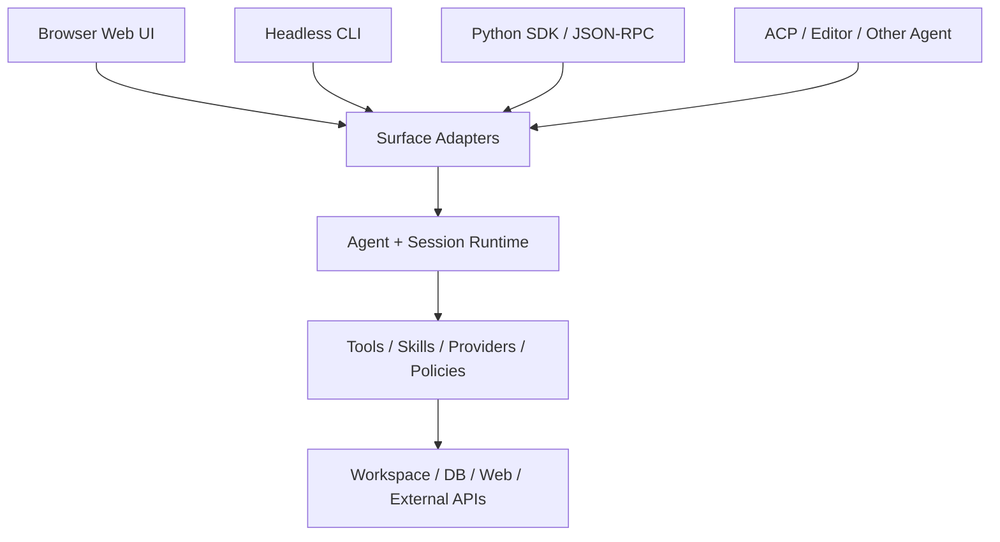
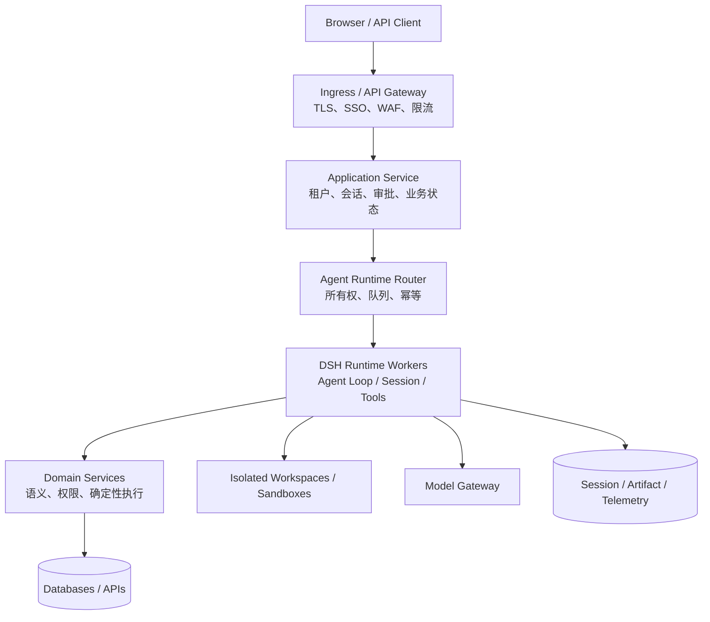

# 第 8 章　Surface 与部署：从本地 Web 到可运营服务

“做成 Web UI 会不会更容易迁移？”这个问题只有一半在 UI。浏览器确实降低了客户端安装和集中升级成本，但真正决定可迁移性的，是 Agent Runtime、业务服务、状态、工作区和权限是否被稳定接口分开。把本地进程的端口暴露到局域网，并不会自动得到一个企业 Web 系统。

DSH 通过不同 Surface 复用同一插件化 Harness：Web 面向交互用户，Headless 面向一次性任务，Python/JSON-RPC 面向程序集成，ACP 等协议面向其他 Agent 产品。Surface 负责接入与呈现，不应重新拥有领域真相。

## 学习目标

完成本章后，你应当能够：

1. 区分 Web、Headless、SDK/JSON-RPC 与协议 Surface 的控制语义；
2. 说明为什么本地 Web Server 不是现成的多租户服务；
3. 为消息、事件流、投影、审批、取消和文件产物设计 API；
4. 规划单机、院内多用户、集中 SaaS 与桌面壳部署；
5. 设计运行所有权、状态存储、工作区隔离与横向扩展；
6. 建立部署可观测性、升级回放、灰度和灾难恢复门禁。

## 8.1 Surface 是同一 Runtime 的不同控制面



Surface 的差异不只在视觉：

| Surface | 输入方式 | 输出/进度 | 交互能力 | 典型用途 |
|---|---|---|---|---|
| Web | 多轮消息与 UI 操作 | 流式节点、投影、审批卡片 | steering、取消、审批、浏览历史 | 人机协作 |
| Headless | 一个命令行任务 | stdout/stderr + 退出码 | 无交互 followup | CI、批处理、脚本 |
| Python/JSON-RPC | 程序方法调用 | 结果对象与通知 | 由 SDK 协议定义 | 服务嵌入、自动化 |
| ACP/外部 Agent | 标准协议消息 | 协议事件/结果 | 取决于 Provider | IDE 或多 Agent 互操作 |

同一个任务不能简单假设在所有 Surface 上行为一致。例如工具策略返回 ask 时，Web 可以显示审批，严格 Headless 没有应答者，应 fail closed；需要澄清的 Data Agent 在一次性 Surface 中应返回结构化 `clarification_required`，而不是永久等待输入。

## 8.2 Web Bundle 实际装配了什么

`dsh-web-app` 在 `dsh-base` 之上加入：

- Web Server 与静态前端；
- Connection、API Gateway 和 API Proxy；
- Workspace、存储和 Session Projection Cache；
- Client Module Registry 与浏览器插件图；
- Web runtime、Surface Context 和开发期 HMR；
- Web 自有启动参数，如 host、port 与 trusted hosts。

它不是把 Agent Loop 改成 Web 专属实现。Web Host 通过服务和事件驱动同一 Agent Registry 与 Session Runtime。

### 8.2.1 Web Server 的边界

锁定版本的 `ctx.webServer` 是基于 `node:http` 的浏览器载体：

- 具名 exact/prefix 路由；
- 最长前缀匹配；
- 一个 SPA fallback owner；
- index.html 转换；
- 激活时立即监听并在失败时拒绝启动。

它本身不了解 Agent，也没有 TLS、用户认证或 Origin 策略。配置支持 loopback 和 all-interfaces 两种 Host 语义；绑定非回环会暴露给网络，不能因此称为“生产部署”。官方 Web Bundle 的 CLI 还会拒绝直接使用 `--host 0.0.0.0`，强调默认产品姿态不是任意网络发布。

### 8.2.2 为什么 SSE/长连接影响拆除

Web 路由可能长期保持 SSE 或流式响应。只调用普通 `server.close()` 会等待连接自己结束，HMR/关机会卡住；Web Server disposal 还需关闭现有连接。生产反向代理也要配置连接耗时、心跳、Drain 和发布时的优雅终止。

## 8.3 Client Module：Web 插件不是打进一个巨型前端包

声明 `dsh.client` 的包可以贡献浏览器 Bundle。Host 扫描已装配插件，生成 `window.__DSH_BOOT__` 图，并通过 `/plugins/<id>/client.js?rev=<hash>` 提供每个模块。

```mermaid
flowchart LR
    Loader[Cordis Loader Entries] --> Scan[Client Module Registry Scan]
    Scan --> Graph[WebBootGraph<br/>id/url/rev/inject]
    Graph --> Index[index.html 注入 manifest]
    Graph --> Routes[/plugins/* bundle routes]
    Index --> Browser[Browser Module Runtime]
    Routes --> Browser
```

每个 Bundle 的内容 hash 是缓存一致性锚点，整个图也有组合 rev。插件增删或内容重建会改变图；浏览器先校验 manifest，再按依赖与 eager/lazy 策略加载。

这套机制带来 Web 插件生态，但也引入前端供应链风险：Client Bundle 在用户浏览器上下文执行，可以读取该页面授予的 API 和状态。第三方插件审查不能只看 Host `apply()`，还要审查 `./client` 导出、依赖和跨端数据流。

## 8.4 Headless：一次任务、持久证据与进程退出

Headless Bundle 不挂载 HTTP、Web runtime 或浏览器插件。它创建一个新 Agent，将命令行任务作为普通用户消息提交，等待 Agent 完全停稳，flush Session，再输出最后一条非空助手文本。

退出语义：

- 最终 turn 正常完成：退出码 0；
- 错误、取消等非完成：退出码 1，并按情况写 stderr；
- 任务为空：在 runner 激活前 fail loud；
- 没有交互 followup Surface。

### 8.4.1 stdout 不是完整 API

CI 只读取最终文本会丢失工具证据、成本、产物和结构化结束原因。实际集成应同时保存 Session/运行报告，并将机器结果与人类摘要分开：

```json
{
  "run_id": "...",
  "session_id": "...",
  "status": "completed",
  "final_response": "...",
  "artifacts": [],
  "usage": {},
  "evidence_uri": "..."
}
```

Headless 的“等待 idle”也不是天然支持多条并发业务请求；每次独立任务应使用独立 Session ID 和隔离 Workspace。

## 8.5 Python SDK 与内置 Runtime

锁定版本的 Python SDK 通过上下文管理器启动并复用内置 Runtime：

```python
with DeepSeekHarness(
    provider="deepseek-official",
    model="...",
    cwd="/workspace/job-001",
    session_root="/sessions",
    cordis="/config/minimal.cordis.yml",
) as harness:
    result = harness.run("Inspect and fix tests", session_id="job-001")
```

它让 Python 服务无需自己实现 Loop，但仍要理解组合内容。官方 minimal JSON-RPC 示例只挂载持久 Bash 与编辑器，关闭 compaction，使用裸本地文件系统和 `danger-full-access`；它适合可丢弃 checkout 或容器，不应因为“官方示例”就直接运行在生产宿主。

### 8.5.1 Session ID 同时关联对话和持久 Shell

复用同一 Harness 与 Session ID 会保留会话及其 Bash 进程状态，包括 cwd、环境变量和 Shell 函数。独立任务误用同一 ID，可能发生上下文污染和权限串线。只有确实要延续同一任务时才复用；服务端应由系统生成并校验租户归属，不能直接信任客户端传入任意 Session ID。

### 8.5.2 平台与版本约束

锁定文档中的发布 SDK 支持 Python 3.10+，内置 Runtime 有明确 OS/架构要求；示例持久 PTY 不支持 Windows Agent。部署设计必须以实际锁定版本的 wheel 支持矩阵为准，不能从“Python 跨平台”推断内置 Agent Runtime 同样跨平台。

## 8.6 API 不应退化成“发字符串、收字符串”

Agent 产品至少有四种通信类型：

| 类型 | 示例 | 合适协议 |
|---|---|---|
| 一元命令 | 创建 Goal、修改设置、批准一次操作 | Typed Remote/RPC |
| 增量事件 | assistant chunk、工具进度、Agent status | Event stream/SSE/WebSocket |
| 状态投影 | Todo、Plan、审批状态、会话摘要 | Snapshot + change feed |
| 大型产物 | 文件、图像、报告、完整查询结果 | Artifact API/对象存储 |

DSH Typert API Gateway 的 Remote 方法只处理一元请求/结果。带 `@Remote`/`@RemoteScope` 的 Host 方法经过生成器产生严格 Client codec；未标记方法不暴露。流式 SessionEvent、分页、Projection 和实体子流不应伪装成 Remote 方法，即使它们复用同一 Connection。

### 8.6.1 为什么严格生成比运行时猜类型可靠

构建阶段从 Host TypeScript Program 分析方法、参数、返回、lookup 和 Context，生成 Host 与 Client 契约。Gateway 在业务代码前校验字段集合与 wire 值，解析 Agent/Session 身份，调用实时 Service，再校验返回。

源码开发回退只能解析简单参数名，不能读取完整 TS 类型；Client 仍依赖最近一次生成产物。新增 Remote 或改签名后只重启前端 watcher不够，必须重新执行 Host→Client 有序构建。

### 8.6.2 Agent/Session Lookup 是安全边界

Client wire 传 `agentId`，Host 解析为真实 Agent。Lookup 策略决定是否复用 live Agent、自动恢复冷会话、拒绝 Subagent 所有权身份。业务方法不能只把 ID 当普通字符串，然后在内部任意查 Map；身份解析、租户和所有权应在 Gateway/应用层统一完成。

## 8.7 本地 Web 与企业 Web 的差距

| 能力 | 本地单用户 Web | 企业多用户服务需要 |
|---|---|---|
| 身份 | 本机操作者隐式可信 | SSO、用户生命周期、服务身份 |
| 会话 | 本地 Session | 租户隔离、所有权、共享/转移策略 |
| 工作区 | 本机目录 | 每任务隔离卷/沙箱、配额、清理 |
| 网络 | loopback HTTP | TLS、网关、Origin/CSRF、可信代理 |
| 工具 | 用户本机权限 | RBAC/ABAC、参数级策略、审批 |
| 状态 | 单进程内存 + 本地持久化 | 多实例协调、数据库、锁与恢复 |
| 模型 | 单一凭据 | 租户路由、配额、成本与合规区域 |
| 插件 | 本机安装 | 集中签名制品、准入、灰度与回滚 |
| 运维 | 手动启动 | SLA、监控、备份、DR、容量规划 |

把 Host 改成 `0.0.0.0` 只完成了网络暴露，没有完成其中任何治理能力。

## 8.8 推荐的企业分层



### 8.8.1 为什么要有应用服务

应用服务拥有用户/租户、审批票据、业务状态和 API 稳定性。DSH 可以升级或替换，客户端不需要直接绑定全部内部事件类型。应用层将 DSH 事件映射为版本化公共协议，并保存外部操作幂等关系。

### 8.8.2 为什么要有 Runtime Router

同一 Session 在任一时刻应有一个活动执行所有者。多实例都收到“继续会话”请求时，需要租约、队列分区或一致性路由，防止两个 Loop 同时修改同一 Inbox/工作区。

一种常见策略：

```text
partition_key = tenant_id + session_id
消息进入持久队列
→ 分区消费者取得租约
→ 加载 Session 与 Workspace
→ 执行至稳定 checkpoint
→ flush + 释放/续租
```

这不是 DSH 本地 Registry 自动提供的集群能力，需要部署平台实现。

## 8.9 四种部署形态怎样选择

### 8.9.1 个人桌面/本地 Web

优点：接近本地文件、低基础设施成本、数据不必上传。风险：环境差异大、升级分散、宿主权限容易过宽。适合开发者工具和个人助手。

### 8.9.2 院内单节点 Web

浏览器免安装，模型/数据库可留在院内，运维集中。需要反向代理、SSO、备份和按用户工作区隔离。适合有限用户试点，但单节点故障和容量要有明确接受度。

### 8.9.3 企业多实例私有化

Runtime Worker 无状态化到一定程度，Session、Artifact、Queue 和 Workspace 外置；需要 Session 粘性、分布式所有权和版本兼容。适合并发高、SLA 明确的组织。

### 8.9.4 中央 SaaS

升级最快，但数据出域、模型区域、租户隔离、客户密钥、审计导出和网络连接器最复杂。领域数据最好通过受控网关查询，不把数据库直连凭据放进通用 Agent Worker。

### 8.9.5 桌面壳与 Web 不必二选一

Electron/原生壳可以加载 Web 前端并通过 IPC 接入本地能力；浏览器 Web 通过 HTTP/Connection 接入远程 Host。若业务协议和 Runtime 边界稳定，两者可以共享前端组件和领域服务。

## 8.10 工作区与文件产物

Agent Session、Workspace 和 Artifact 是三种不同身份：

- Session 保存决策轨迹；
- Workspace 保存可变执行世界；
- Artifact 是用户或系统要保留、下载和审计的结果。

不能只用 Session ID 直接拼文件路径。服务应维护受验证映射，并防止路径穿越、符号链接逃逸和跨租户引用。Workspace 有容量、文件类型和生命周期；Artifact 有不可变 hash、MIME、来源 Session/Tool、扫描状态和保留策略。

```text
Tool 生成临时文件
→ 病毒/格式/敏感检查
→ 提升为 Artifact（hash + metadata）
→ Session 记录 artifact reference
→ Client 通过授权下载 API 获取
```

## 8.11 认证、授权与委托

至少区分四个主体：

1. 登录用户；
2. 代表用户运行的 Agent；
3. Runtime 服务身份；
4. 下游 Tool/MCP/数据库身份。

Agent 不应继承 Runtime 的全部服务权限。下游访问最好使用用户委托 Token 或范围受限的任务凭据，并在工具策略中绑定 tenant/session/approval。Subagent 再委派时不能自动复制父级所有凭据。

### 8.11.1 审批时的连接身份

Web UI 回答 approval 必须证明它拥有该 Agent/Session，并防止另一个浏览器标签或租户提交同 callId。审批 API 应校验 CSRF/Origin、用户、租户、会话、call、计划 hash、有效期和一次性状态。

## 8.12 可观测性：从请求到工具的关联链

建议统一关联：

```text
trace_id
└── http/request_id
    └── tenant + session_id
        └── turn
            └── step
                ├── llm_call_id
                └── tool_call_id / workflow_run / subagent_run
```

### 8.12.1 核心指标

- 任务最终成功率，而不仅是 HTTP 200；
- 首 token/首动作延迟、总耗时；
- turn/step/tool 分布和重复调用；
- 模型 token、缓存命中、费用；
- 工具错误按策略拒绝/业务失败/基础设施失败分组；
- 审批请求、拒绝、超时和无人应答；
- cancel 到真正 quiescence 的时间与残留进程；
- Session flush 延迟、恢复和 interrupted 数；
- Workspace/Artifact 容量与清理失败；
- 版本、Profile、模型和语义定义维度的回归差异。

日志不应默认记录全部 Prompt/Result 明文。结构化标识和敏感字段分类先于“为了排障全打出来”。

## 8.13 升级、灰度与回滚

DSH 仍是 Developer Preview。生产集成应固定版本/commit，并把内部类型封装在应用适配层后。

### 8.13.1 升级验证集

- 保存的 Session 回放与恢复；
- Profile `--dump-config` diff；
- 工具 schema、Prompt 与 Skill 目录 diff；
- API/Client 生成契约；
- Web Client Module Graph；
- 真实生产 bad case 的脱敏轨迹；
- 取消、审批、沙箱与持久化故障注入；
- 模型路由与成本对比。

### 8.13.2 灰度单位

尽量以“新 Session”作为版本灰度单位，避免同一长会话中途切换 Prompt、工具 schema 和 Provider。需要迁移已有会话时，先验证日志格式、Agent preset 和外部 Workspace 兼容。

### 8.13.3 回滚门槛

监控触发回滚时，先停止给新版本分配新 Session；允许安全的在途任务排空或取消；flush 证据；再恢复旧版本。若新版本写入旧版本不认识的事件，必须使用前向修复/迁移，而不能直接启动旧 Worker 读取。

## 8.14 灾难恢复与业务连续性

至少定义：

- Session Persistence 的 RPO/RTO；
- Workspace 是否可重建，是否需要快照；
- Artifact 是否跨区/跨机备份；
- 外部 operation 的幂等与对账；
- 模型 Provider 不可用时的降级；
- 插件/语义版本仓库恢复；
- 活动租约丢失后怎样避免双执行；
- 备份恢复演练频率和证据。

只备份 Session 不一定能继续任务：如果 Workspace、Skill 版本和外部数据快照已经变化，恢复出的模型世界并不相同。应明确哪些任务支持继续，哪些只能解释并重新开始。

## 8.15 常见失败模式

| 表象 | 根因 | 首先检查 |
|---|---|---|
| 局域网能访问，出现越权 | 把监听地址当认证，缺少用户/租户边界 | 网关、Session ownership、Tool policy |
| 两个 Worker 同时推进同一会话 | 无租约/粘性路由，重试重复投递 | queue key、owner lease、Inbox IDs |
| Web 与 Headless 结果不一致 | 审批/澄清 Surface 能力不同、Profile 不同 | 有效配置与 policy snapshot |
| SDK 任务互相污染 | 复用 Session ID 或 Workspace | id 生成与租户映射 |
| 前端插件 404 却返回 HTML | Bundle Route 被 SPA fallback 吞掉 | Client Module named route |
| 发布时一直无法退出 | SSE/工具/子进程未 quiesce | connection drain、disposer |
| Remote 方法前端调用类型旧 | 只跑前端 watcher，未重建 Host/Client Typert | 生成产物与 rev |
| 恢复会话后工具集不同 | Agent preset/Profile 变化 | SessionHeader 与 config snapshot |
| “任务成功率”很高但业务失败 | 只统计 HTTP/turn completed | 领域验证和外部状态 |
| 回滚后无法读会话 | 格式或插件事件向前不兼容 | version/migration plan |

## 源码路标

以下链接固定到提交 `47f943859bef60e4160492346772ded9b24f765a`：

- [Web UI 使用指南](https://github.com/deepseek-ai/deepseek-harness/blob/47f943859bef60e4160492346772ded9b24f765a/docs/user/guide/index.md)
- [Python SDK 快速上手与 minimal 组合边界](https://github.com/deepseek-ai/deepseek-harness/blob/47f943859bef60e4160492346772ded9b24f765a/docs/user/guide/python-sdk.md)
- [`dsh-web-app` Bundle](https://github.com/deepseek-ai/deepseek-harness/blob/47f943859bef60e4160492346772ded9b24f765a/packages/bundle/web-app/README.md)
- [`dsh-headless` Bundle](https://github.com/deepseek-ai/deepseek-harness/blob/47f943859bef60e4160492346772ded9b24f765a/packages/bundle/headless/README.md)
- [HTTP Web Server 边界](https://github.com/deepseek-ai/deepseek-harness/blob/47f943859bef60e4160492346772ded9b24f765a/docs/subsystems/web-server.md)
- [Client Module Graph 与 Web 插件装载](https://github.com/deepseek-ai/deepseek-harness/blob/47f943859bef60e4160492346772ded9b24f765a/docs/subsystems/client-modules.md)
- [Typert API Gateway](https://github.com/deepseek-ai/deepseek-harness/blob/47f943859bef60e4160492346772ded9b24f765a/docs/api-gateway.md)
- [官方 JSON-RPC Agent 示例](https://github.com/deepseek-ai/deepseek-harness/tree/47f943859bef60e4160492346772ded9b24f765a/examples/jsonrpc-agent)
- [官方 ACP 示例](https://github.com/deepseek-ai/deepseek-harness/tree/47f943859bef60e4160492346772ded9b24f765a/examples/acp-demo)

## 配套实验

完成一个三 Surface 对照实验：使用 Web、Headless 和 Python SDK 对同一个只读仓库执行“定位失败测试并给出原因”，固定模型、Prompt、工具和 Workspace 快照。

记录：

1. 三个 Profile 的有效配置和工具 schema diff；
2. 输入提交、事件流、最终状态和退出码/结果对象；
3. 触发一次需要审批的动作，验证无 UI Surface fail closed；
4. 对 Headless 发送取消，测量真正 quiescence；
5. 复用与更换 Session ID，观察持久上下文差异；
6. 形成“业务公共 API 不应直接暴露哪些 DSH 内部类型”的清单。

## 本章小结

Surface 决定谁怎样控制 Agent，但不应拥有领域真相。Web、Headless、Python/JSON-RPC 与 ACP 可以复用同一 Agent、Session 和 Tool Runtime，却具有不同交互能力与失败语义。

本地 Web Server 只提供浏览器 HTTP 载体，没有自动完成 TLS、认证、多租户、分布式所有权和灾难恢复。企业部署需要在 DSH 外增加网关、应用服务、Runtime Router、领域服务、隔离 Workspace 与外置状态。

Agent API 不能退化成字符串问答。一元命令、增量事件、状态投影和大型产物需要不同协议。真正的迁移性来自稳定领域接口、可重放状态和可替换 Provider，而不只是从桌面窗口换成浏览器。

## 思考题

1. ★ 为什么 Web UI 提升交付便利，却不自动提升多租户安全？
2. ★★ Headless 中工具策略返回 ask 时，为什么默认允许会破坏安全模型？
3. ★★ Python SDK 复用 Session ID 为什么可能同时复用对话和 Shell 状态？
4. ★★★ Typert Remote 为什么只适合一元调用，而 SessionEvent 流应使用独立协议？
5. ★★ Client Module 的 Host 插件通过审查后，为什么仍要单独审查浏览器 Bundle？
6. ★★★ 多实例怎样保证一个 Session 只有一个活动执行所有者，同时允许故障转移？
7. ★★ Session、Workspace 和 Artifact 的身份与保留期为什么应分离？
8. ★★★ 医院院内部署中，哪些组件必须留在院内，哪些可以连接外部模型网关？依据是什么？
9. ★★ 为什么升级最好按新 Session 灰度，而不是在长 turn 中热换全部 Provider？
10. ★★★ 只备份 Session 日志为什么可能无法真正恢复一项长任务？

## 求职面试题

### 基础题

比较 DSH Web、Headless 与 Python SDK 的输入、输出、审批和生命周期语义。

### 故障题

多实例部署后，同一用户问题产生两次外部写入。请从 API 重试、队列幂等、Session 所有权、工具幂等和租约失效分析。

### 系统设计题

设计一个院内部署的多用户 DSH Web 平台，覆盖 SSO、租户、Runtime Router、工作区、审批、事件流、Artifact、可观测性、升级和灾难恢复。
