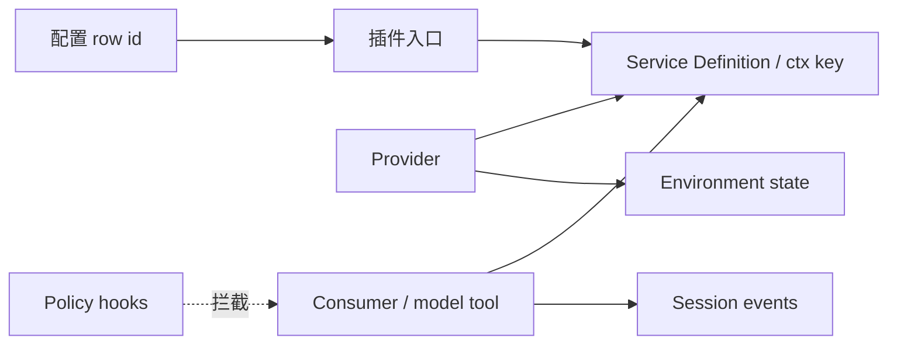

# Lab 01：从产品能力到源码接缝

本实验不是让你浏览 DSH 的全部目录，而是训练一种可迁移的源码阅读方法：从机器实际启动的配置出发，沿着一项用户可见能力，追踪到插件、服务、消费者、事件和环境状态，再用一次反事实修改检验理解是否正确。

## 实验主张

本实验验证第 1 章的三项主张：

1. 运行中的 DSH 是 Profile、Bundle 与 patch 共同合成的插件树，不等于仓库全部源码；
2. 可替换能力应能识别 Definition、Provider 与 Consumer 三种角色；
3. 一项模型可见能力若影响后续请求，其结果应能在会话事实或投影中找到可重建来源。

## 难度与预计时间

- Starter：30～45 分钟，完成基线与配置定位；
- Builder：60～90 分钟，完成一条能力链追踪；
- Maintainer：额外 45～90 分钟，完成反事实修改与生命周期检查。

## 前置条件

- Git；
- 满足官方仓库要求的 Node.js 与 pnpm；
- 能够克隆 DeepSeek Harness；
- 可选：一个可用模型 Provider。只做静态源码追踪不需要 API Key。

本书锁定基线：

```text
版本：0.1.0-rc.5
提交：47f943859bef60e4160492346772ded9b24f765a
```

如果官方安装要求与本实验冲突，以锁定提交中的 README 和 `package.json` 为准，并在报告中记录差异，不要静默切换到最新分支。

## 目录与证据约定

建议在实验工作目录中新建：

```text
evidence/lab01/
├── environment.md
├── config-tree.txt
├── capability-map.md
├── source-notes.md
├── counterfactual.md
└── logs/
```

不要提交 API Key、用户对话正文、真实业务数据或包含本机密钥路径的完整环境变量。命令日志至少保留命令、时间、退出码和经过脱敏的关键输出。

## 阶段 A：建立可重现基线

### A1. 固定源码

```bash
git clone https://github.com/deepseek-ai/deepseek-harness.git
cd deepseek-harness
git checkout 47f943859bef60e4160492346772ded9b24f765a
git rev-parse HEAD
```

验收：最后一条命令必须输出完整锁定提交。将操作系统、Node、pnpm 与 Git 版本写入 `environment.md`。

### A2. 安装并构建

```bash
pnpm install
pnpm run build
```

记录退出码。安装成功不等于实验完成，它只证明本地可以进入下一阶段。

### A3. 导出实际插件树

```bash
pnpm dsh --profile web --dump-config > evidence/lab01/config-tree.txt
```

若该提交的 CLI 启动方式不同，先阅读 `apps/cli/package.json` 与官方启动文档，记录你采用的等价命令。

回答以下问题：

1. `web` Profile 声明了哪些 Bundle？
2. `dsh-base` 与 `dsh-web-app` 分别贡献哪些用户可见能力？
3. 是否存在 Profile、本机 Harness Home 或命令行 overlay？
4. 你选择的配置行 ID 是什么，最终配置来自哪一层？

阶段验收：别人仅使用 `environment.md` 和命令即可得到同类有效配置，而不是只能看你的屏幕截图。

## 阶段 B：追踪一项能力

从以下三条路线中任选一条。第一次建议选择文件读取或 Shell，因为 Definition、Provider、Consumer 和 Environment 边界比较直观。

| 路线 | 用户可见起点 | 重点问题 |
|---|---|---|
| 文件能力 | 读取或写入工具 | `ctx.fs` 由谁定义、谁实现、路径策略在哪介入？ |
| Shell 能力 | Bash/PowerShell/终端工具 | shell、subprocess、sandbox 如何共享 execution world？ |
| Session 能力 | Web 中的一轮对话 | 哪些是持久事件，`deriveMessages()` 如何形成模型历史？ |

### B1. 从配置行定位插件

在 `config-tree.txt` 中找到相关行，记录：

- row id；
- 插件包名与入口；
- 配置参数；
- 来自哪个 Bundle/patch；
- 是否在 isolate 或 Agent scope 中。

不要从 `packages/` 目录猜测“应该加载了什么”。若源码包存在但有效配置没有加载，应明确写成“实现存在、当前组合未启用”。

### B2. 找到 Definition、Provider 与 Consumer

对所选能力分别回答：

```text
Definition：接口在哪里声明？ctx 服务键是什么？
Provider：哪个插件提供实现？拥有哪些资源？
Consumer：谁调用服务？是否包装成模型可见工具？
Policy：哪些 capability events 或 hook 能够拦截？
Environment：真实状态保存在哪里、由谁改变？
```

推荐搜索顺序：

```bash
rg "ctx\.<服务键>|provide\(|inject\(" packages apps
rg "<工具名>|defineTool|tools/register" packages apps
rg "session/event|tool/call|tool/result" packages/core
```

请根据实际服务键替换占位符，不要把示例搜索结果直接当成结论。

### B3. 追踪一次运行轨迹

如果已有可用模型 Provider，执行一个只需一两次工具调用的小任务；如果没有，使用相关包的测试或 mock adapter 追踪相同路径。记录至少以下节点：

```text
输入进入 inbox
→ turn/start
→ agent/pre-step
→ step/start
→ 模型请求
→ tool/call
→ tools/pre-execute / execute / post-execute
→ tool/result
→ step/end
→ turn/end
```

实际任务不一定恰好只有一个 step，也不要求把所有流式 chunk 打印出来。重点是说明：哪些节点是持久事实，哪些只是实时协调事件。

### B4. 画出能力图

在 `capability-map.md` 中至少包含下图元素：



把占位名称替换成真实包、类型、服务键、工具和事件。每个节点旁附文件路径或固定提交链接。

阶段验收：另一位读者能够只看这张图，说清楚配置、插件、服务、工具、事件和外部状态之间的方向，而不是只得到一串文件名。

## 阶段 C：做一次反事实验证

源码阅读最容易产生“我好像懂了”的错觉。反事实实验要求改变一个变量，并预测系统会如何变化，再用输出验证预测。

任选一种可安全恢复的修改：

1. 通过上层 patch 移除或替换所选 Provider；
2. 修改工具的非敏感展示配置，观察 schema 或结果展示是否变化；
3. 在测试上下文中卸载插件，检查服务/监听器是否消失；
4. 为 `agent/pre-step` 添加仅测试用拒绝监听器，验证零-step turn；
5. 使用 mock adapter 产生一次工具调用，比较 Session 重放前后的 `deriveMessages()`。

在执行前先写预测：

```markdown
## 预测

- 修改变量：
- 预期不再出现的配置/服务/工具：
- 预期仍然保留的能力：
- 预期事件变化：
- 如果预测错误，最可能遗漏的层：
```

执行后记录实际结果与差异。不要为了让结论“正确”而修改预测文本；预测失败本身就是定位隐含依赖的证据。

### 生命周期附加检查

如果实验涉及动态加载或测试上下文，至少重复装载/卸载两次，检查：

- 工具没有重复注册；
- 事件监听器数量没有累积；
- 子进程、端口或临时目录得到清理；
- 第二次运行不会消费第一次留下的非持久状态。

## 最终报告模板

```markdown
# <能力名> 源码接缝报告

## 1. 运行基线
- 操作系统：
- Node / pnpm：
- DSH 版本与提交：
- Profile：
- 生效 overlay：

## 2. 用户可观察行为
- 输入：
- 期望输出：
- 完成证据：

## 3. 组合来源
- 配置行 ID：
- Bundle：
- 插件包：
- 配置来源层：

## 4. 能力接缝
- Service Definition：
- ctx 键：
- Provider：
- Consumer：
- 模型可见工具：
- Environment：

## 5. 生命周期与状态
- 持久事件：
- 实时事件：
- 取消/错误路径：
- disposal：

## 6. 反事实验证
- 修改前预测：
- 实际结果：
- 预测差异：

## 7. 结论
- 可替换点：
- 已验证限制：
- 尚未验证的假设：
- 生产化还缺什么：
```

## 评分标准

| 维度 | 0 分 | 1 分 | 2 分 |
|---|---|---|---|
| 可重现基线 | 无版本信息 | 有提交但命令不完整 | 环境、提交、命令、退出码齐全 |
| 有效配置 | 只看源码目录 | 找到配置行 | 解释 Bundle、Profile 与 overlay 来源 |
| 能力接缝 | 只找到工具文件 | 找到部分角色 | Definition、Provider、Consumer、Environment 齐全 |
| 状态与事件 | 无轨迹 | 罗列事件名 | 区分持久事实、实时控制及模型投影 |
| 反事实验证 | 未修改变量 | 修改但无预测 | 预测、证据、差异与解释齐全 |
| 生产判断 | 只说“可以用” | 罗列风险 | 明确边界、未验证假设和下一门禁 |

总分 10 分以上视为完成，满分 12 分。评分只判断证据是否完整，不要求你的预测第一次就正确。

## 常见误区

- **误区：** 找到包名就算找到运行能力。**纠正：** 必须回到 `--dump-config` 证明当前组合真的加载了它。

- **误区：** Tool 就是整个能力。**纠正：** Tool 往往只是 Consumer；继续追踪 Provider、策略和 Environment。

- **误区：** UI 上出现一行消息就属于持久历史。**纠正：** 检查它是否来自 SessionEvent，以及恢复后能否重建。

- **误区：** TypeScript 类型通过就证明 Provider 可以替换。**纠正：** 用反事实实验检查错误、取消、路径和生命周期语义。

- **误区：** 截图可以替代证据。**纠正：** 截图只能辅助展示，命令、退出码、结构化输出和源码链接才可复核。

## 延伸任务

1. 对同一能力分别追踪 `web` 与 `headless` Profile，解释 Surface 改变后哪些核心服务保持不变。
2. 设计一个企业 Provider 替换方案，列出除了接口类型之外必须通过的契约测试。
3. 将报告整理成求职作品：用一页架构图、一段反事实实验和三条生产判断说明你的源码阅读能力。
